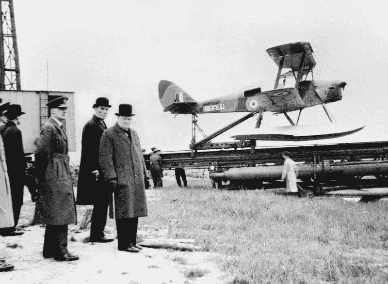
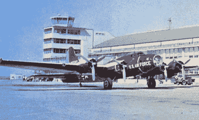
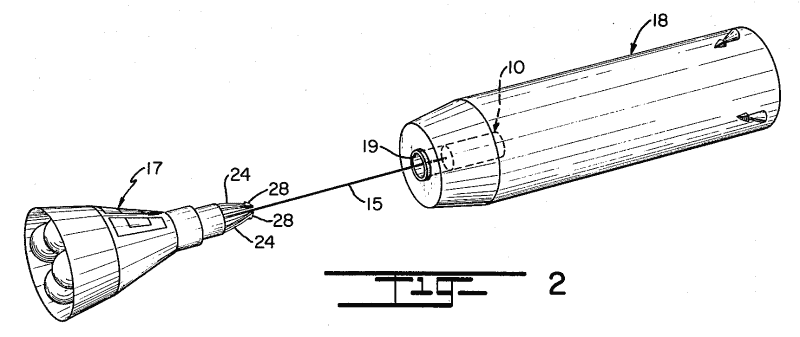
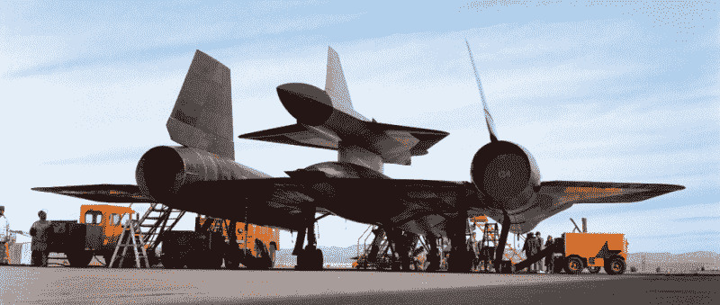
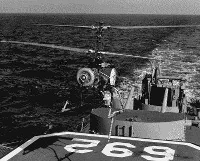
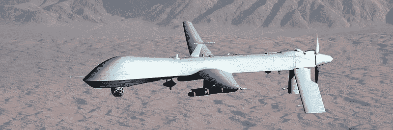

# “无人机”简史

> 原文：<https://hackaday.com/2016/09/26/a-brief-history-of-drone/>

20 世纪 30 年代初，住在洛杉机的英国演员莱吉纳德·戴尼偶然发现一个小男孩在驾驶一架橡皮筋动力飞机。在试图通过调整橡胶和操纵面来帮助男孩后，飞机旋转着坠入地面。丹尼答应为这个男孩再造一架飞机，并写信给纽约的一家模型制造商要一套工具。这第一个模型飞机套件发展成为他自己的爱好商店，位于好莱坞大道，是吉米·斯图尔特和亨利·方达经常光顾的地方。

业务发展成为无线电飞机公司，丹尼设计并制造了美国使用的第一架遥控军用飞机。1944 年，陆军航空兵电影部门的罗纳德·里根上尉想要一些这些新的飞行目标的胶片，并派摄影师大卫·科诺弗到范奈斯机场的无线电飞机工厂。在那里，科诺弗遇到了诺玛·珍妮·多尔蒂，并说服她从事模特行业。她后来被称为玛丽莲·梦露。从 1930 年到 1960 年，美国文化的核心是一家散发着轻木木屑和飞机胶水味道的业余爱好商店。那家爱好商店现在是 101 高速公路旁的一家 7-11 便利店。

科学历史学家詹姆斯·伯克在 90 年代早期有一个精彩的电视节目-*Connections-*在这个节目中，前面的段落是意料之中的。不幸的是，在过去的二十年里，公共话语的音色已经发生了变化，允许人们即时交换想法的全球通信革命只导致了人们即时交换意见。荷兰东印度公司如何导致橡皮筋导致 Jimmy Stewart 导致遥控器导致 Ronald Reagan 导致*推销员之死*的故事有一个现代错误:我不得不使用“无人机”这个词。

“宣传”这个词在 20 世纪 30 年代后期才获得了它的负面含义——现在是“公共关系”。‘全球变暖’这个说法在冬天对傻逼不起作用，所以现在叫‘气候变化’。同样，四轴飞行器飞行员不希望任何人认为他们的飞行器可以向附近地区发射地狱火导弹，所以“无人机”是被禁止的。首选术语是四轴飞行器、三轴飞行器、多轴飞行器、飞翼飞行器、固定翼遥控飞行器、无人驾驶航空系统或玩具。

这让我有点恼火，也让我有点恼火，每次我使用这个可怕的单词时，我都会收到收件箱里的提醒。“无人机”一词的词源与间谍活动、向医院发射导弹或非法杀害美国平民无关。然而，人们喜欢争论，当有人抱怨我滥用“无人机”这个词时，我需要一些东西来指出。你得到的不是一篇关于好莱坞小明星、第一个遥控系统和航空模型的文章，而是一篇关于一个词的词源的文章。互联网，你只能怪你自己。

### 介绍，以及为什么这篇文章存在

这篇文章纯粹是关于‘无人机’这个词的词源。无一例外，我在研究这个主题时阅读的每一篇文章和博客帖子都没有考虑到无人驾驶或遥控飞机在首飞之前或正在开发时是否被称为“无人机”。例如，许多文章将休伊特-斯佩里自动飞机称为第一架“无人机”。就本文而言，这显然是不真实的。“无人机”一词在 1934 年底或 1935 年初首次应用于无人驾驶飞机，一战时期的实验永远不能被同期资料视为无人机。把这篇文章看作是“无人机”一词随时间演变的概要。

为什么这篇文章属于 Hackaday 应该不需要解释。这是互联网上最大的语法爱好者社区之一，特别是来自一个鼓励语言游戏(和特别冷嘲热讽)的亚文化。老实说，我非常厌倦听到人们抱怨在提到四轴飞行器和其他遥控玩具时使用“无人机”这个词。对我来说，这篇文章仅仅是我在斥责被冒犯的四旋翼飞机飞行员时可以指向的东西。我正在考虑写一个机器人自动做到这一点。也许我会称这个机器人为“无人机”。

### “无人驾驶飞机”的来源大约在 1935 年

在这个词被用来描述飞机之前，“无人机”有两个意思。第一种是持续的低鸣声，第二种是雄蜂的声音。雄蜂不工作，不采蜜，存在的目的只是为了让蜂王受孕。不难看出为什么“无人机”是描述四轴飞行器的最佳词汇——幻影是无脑的，听起来像装满蜜蜂的袋子。那么,“无人机”的第三个定义是从哪里来的，一个没有飞行员的飞行器？

“无人机”最常被引用的定义来自 2013 年《华尔街日报》的一篇文章，作者是语言学家和词典编纂者本·齐默(Ben Zimmer)，该词的首次使用可追溯到 1935 年。在这一年，美国海军上将威廉·h·斯坦德利(William H. Standley)见证了英国皇家海军新型遥控飞机用于打靶练习的演示。所使用的飞机是基于德哈维兰虎蛾，一架在两次世界大战期间大量生产的双翼教练机，被重新命名为蜂王。齐默文章的言外之意是‘无人机’这个词来自德哈维兰蜂王。这个词源在第二次世界大战后出版的《纽约时报杂志》的一篇文章中重复出现[2]:

> 无人机并不新鲜；25 年前，发明家们就在用它们做实验。战前，专门制造的小型无线电遥控飞机被用于防空目的——在“无人机”这个名称起源的英格兰很普遍，在这里不太普遍。在试验阶段使用的无线电控制形式得到了发展和改进，几乎可以应用于任何类型的常规飞机。

我在《五分钟》中找到了本·齐默(Ben Zimmer)关于无人机词源的这个明显的主要来源，但它没有告诉任何人遥控双翼飞机的蜂王名称是来自“无人机”这个词，还是相反。这个词源并没有真正给出任何关于这些无人机的技术能力或战术用途的信息。《纽约时报》文章中讨论的无人驾驶飞机最好被称为巡航导弹，而不是无人机。蜂王是一种攻击性无人驾驶飞机，还是仅仅是一种用于打靶练习的装置？如果我们要告诉那些驾驶幻影的人让他们的无人机飞走，这些都是需要回答的问题。

The Queen Bee, with Churchill

生物学有时会反映语言学，那么，寻找“无人机”历史的最好地方就是研究蜂王的历史。蜂王——不是它的原名——诞生于英国空军 18/33 号规范。当时，空军部每年都会针对不同类型的飞机发布一些规范。超级海上喷火战斗机最初被军方称为 f . 37/34；一架战斗机，基于 1934 年出版的第 37 号说明书。因此,“无线电控制舰队射击靶机”的规范意味着“无人机”的概念是在 1933 年定义的。无人机，至少在军用飞机的原始意义上，不是进攻性武器。它们是打靶练习，类似的用法在 1936 年进入美国海军，在 1948 年进入美国空军。问题是,“无人机”是在蜂王之前出现的，还是相反？

第一架靶机于 1933 年末至 1935 年初在英国皇家空军范堡罗基地建造，将德哈维兰蛾的机身与德哈维兰虎蛾的发动机、机翼和操纵面结合在一起。这架飞机在空军基地进行了测试，后来从英国皇家海军“猎户座”号上发射出去进行打靶练习。炮兵注意到一个特别奇怪的现象。这架飞机从未转向，从未倾斜或翻滚，并且*从未改变它的油门位置:*这架飞机嗡嗡作响。它从头顶飞过时发出响亮而低沉的嗡嗡声。无人机因嗡嗡声而得名，蜂王只是一个巧妙的文字游戏。

“雄蜂”一词并非来自德哈维兰蜂王，因为蜂王最初是德哈维兰蛾和虎蛾。'蜂王'，其实来源于'无人机'，'无人机'来源于头顶上缓缓飞行的飞机发出的嗡嗡声。对你来说，词源有一点细微的改进:英国人带来了 bantz，而 de Havilland 被认为是无人机。

### “无人驾驶飞机”是用来打靶的，1936-1959 年

1936 年，美国海军上将威廉·h·斯坦德利(William H. Standley)从欧洲回来后不久,“无人机”一词就进入了美国海军的词典，他在英国皇家海军“猎户座”号(HMS Orion)上看到一只蜂王被枪手射杀。这将是美国海军使用这个短语的开始，这个术语在接下来的十年里不会正式进入美国陆军和美国空军的词典。

从 1922 年开始，美国海军将使用飞机命名系统来表示舰队中任何飞机的角色和制造商。例如，交付给海军的第四架战斗机是 F4U 海盗船。由联合公司(Y)交付的第一架巡逻轰炸机(PB)是 PBY Catalina。在这个系统中，“无人机”在 1936 年出现，但只是作为“TD”，目标无人机，一种设计用于射击练习的飞机。

A QB-17 drone at Holloman AFB, 1959.

在这个词被引入军事用语后的近二十年里，“无人机”仅指用于打靶练习的遥控飞机。B-17 和 PB4Y (B-24)轰炸机在“阿芙罗狄蒂行动”和“铁砧行动”中转为遥控，被称为“制导炸弹”。就在第二次世界大战后的几年，很可能使用相同的人员和阿芙罗狄蒂行动期间开发的相同的无线电控制技术，战争剩余的 B-17 将被重新用于打靶练习，在那里它们将被称为靶机。显然，在 20 世纪 50 年代末之前，“无人机”仅指打靶练习。

如果你正在寻找“无人机”一词最现代意义的恰当词源和定义，你已经找到了。这是为打靶训练设计的遥控飞机。对于四轴飞行器飞行员来说，他们涉猎词典编纂，对语言的纯洁性感兴趣，并且因为将他们的飞行相机平台称为“无人机”而完全被冒犯，这是有证据的。“无人驾驶飞机”与向居民发射武器或从四万英尺高空监视平民没有任何关系。在这个词的原始意义上，无人机只是一种被设计用来射击的遥控飞机。

然而，语言会发生变化，为了成功地抵御所有批评我将“无人机”一词用于所有遥控飞机的人，我必须追溯无人机一词的现代用法。

### “无人机”定义的变化，1960-1965

一个使用了四分之一世纪的词无疑会获得更多的定义，在 20 世纪 60 年代初，“无人机”的定义从英国军队在第二次世界大战中使用的空中目标扩展到一个可以追溯适用于德国 V-1 的词，这是英国军队在第二次世界大战中使用的空中目标。

“无人机”一词的下一个演变可以在 1964 年 11 月 19 日的《纽约时报》上找到，同样是来自普利策奖获得者作家汉森·W·鲍德温。毫无疑问，第一个在“无人机”巡逻的记者对这个词的语言学历史有更多的贡献。自鲍德温先生向公众介绍“无人机”一词以来的 20 年里，这些无人驾驶飞机又增加了一些功能:

> 无人机，或无人驾驶飞机，已被用于军事和实验目的超过四分之一世纪。
> 
> 自从第二次世界大战中引人注目的德国 V-1 或有翼导弹以来，电子和导弹制导系统的进步促进了无人机的发展，无人机在机动性上看起来几乎像有人驾驶的飞行器。

对无人机能力的描述继续到反潜战、战场监视和打靶练习的经典应用。即使在航空航天业，“无人机”的定义也在发生细微的变化，从一只非常复杂的粘土鸽子变成了稍微更有能力的东西。

20 世纪 60 年代初，美国国家航空航天局接受了把人送上月球的挑战。这个挑战需要对接航天器，在肯尼迪发出这个挑战的时候，没有人知道如何执行轨道力学的这一壮举。马丁·玛丽埃塔解决了这个问题，他们用无人机做到了。

美国专利 3，201，065 解决了两个航天器对接的问题，并用无人机来完成。

轨道对接是美国宇航局在登月之前需要解决的问题，解决方案来自双子座计划。从双子座计划开始，宇航员将与几小时或几天前发射的无人飞船进行轨道会合和对接。后来的任务使用阿金纳上的发动机将他们的轨道提升到世界海拔记录。人造重力的第一个实验来自于将双子座太空舱拴在阿金纳号上，并让太空船绕着一个公共点旋转。

双子座计划中使用的无人飞船“阿金纳”目标飞行器不是无人机。然而，在这些会合和对接任务为登月铺平道路的几年前，马丁·玛丽埃塔公司的工程师们设计了一种方法，用一种他们称为“无人机”的设备将两个航天器连接在一起。

马丁·玛丽埃塔的专利 3，201，065 使用了一个自主的遥控航天器，拴在双子座航天器的机头上。装载着一箱加压气体、几个推进器和一个电磁体，宇航员将驾驶这个“对接无人机”进入目标飞行器的容器，激活电磁体，并收回将两个航天器连接在一起的系绳。这里的无人驾驶飞机，就像二战中的靶机一样，是遥控的。这架无人驾驶飞船从未飞行过，但它确实显示了“无人机”一词的使用范围正在扩大，尤其是在航空航天业。

如果你正在寻找一架难以想象的酷到实际上已经起飞的无人机，你只需要看看洛克希德 D-21，这是一架设计用于以 3 马赫的速度飞越红色中国的侦察机。

The M-21 carrier aircraft and D-21 drone. The M-21 was a variant of the A-12 reconnaissance aircraft, predecessor to the SR-71 reconnaissance aircraft.

' D-21 '中的' D '是'女儿'的意思，这种无人侦察机的舰载机是 M-21，' M '是'母亲'的意思。然而，D-21 在当代资料中被称为无人驾驶飞机。D-21 可能是第一架被称为纯粹的侦察机的无人驾驶飞机，意在侦察敌人。

20 世纪 60 年代不仅仅赋予了无人机在敌人上空拖动摄像机的能力。1960 年见证了第一架攻击性无人机——第一架能够在敌方潜艇上方的海洋中投放寻的鱼雷的无人机。

Gyrodyne QH-50——也被称为 DASH，无人驾驶反潜直升机——是美国海军对一个问题的答案。当时，苏联建造潜艇的速度快于美国建造反潜护卫舰的速度。旧的船是可用的，但是这些船对于一架全尺寸的直升机来说不够大。解决方案是一架无人机，它可以从甲板上发射，飞行几英里到声纳上的一个有趣的 ping，然后投下一枚鱼雷。解决方案是第一架进攻性无人驾驶飞机，第一架能够运送武器的无人驾驶飞机。

QH-50 是一种相对较小的同轴遥控直升机。它足够大，可以把一枚鱼雷从一艘船上拖到 20 英里之外，让这枚自导鱼雷来处理其余的。

QH-50 是源于两个现实的历史珍品。美国海军拥有能够探测几十英里外苏联潜艇的反潜舰。这些反潜舰没有那种射程的鱼雷，也没有发射更大直升机的飞行甲板。结果是 QH-50，但新的舰艇和更强大的鱼雷使这种无人机在不到十年内过时。QH-50 是一个完全不起眼的武器平台，但它有一个名声:它是第一架可以发射武器的无人机，在当代资料中被称为无人机。这是第一架进攻性无人机。

### 唐格的困惑，约 1965-2000 年

1963 年 6 月 13 日，路透社的一篇文章报道了英国和加拿大合资建造无人驾驶间谍飞机，具体称为“无人驾驶飞行器”[7]。这位记者对过去 20 年的无人航空航天成就了如指掌，他说这个新项目“通常被称为无人机”。到了 60 年代中期,“无人机”这个词有了完全现代的定义:它只是任何一种无人驾驶的飞行器，用于任何目的，表面上以任何方式控制。这个定义正被几个相互竞争的术语所取代，包括“无人驾驶飞行器”和“遥控飞行器”。

“无人机”这个术语将被一个更新、更笨拙的术语“无人机”所取代。这个词曾经指从飞行目标到航天器子系统的一切，现在将被取代。“无人驾驶飞行器”一词将在 1972 年国防部拨款报告中首次公开出现。相关术语“遥控飞行器”或 RPV，在 20 世纪 80 年代末首次出现在政府文件中。从 drone 这个词，在 60 年代、70 年代和 80 年代诞生了一千个略有不同的术语。即使在今天，“无人驾驶航空系统”仍是美国联邦航空局的首选术语。这个短语是在不到十年前创造的。

工程师们制造无人机以 3 马赫的速度监视中国共产党。工程师们申请了一架无人机的专利，将两个航天器对接在一起。工程师们制造无人机来搜寻和击沉潜艇。空军把旧飞机漆成橙色，称之为目标无人机。于是耶和华使他们分散在全地上，他们就不再称自己的飞行器为无人机了。

在 20 世纪 70 年代、80 年代和 90 年代，术语“无人机”仍然适用于靶机，甚至今天仍然是用于打靶练习的无人驾驶军用飞机的首选术语。在军事的其他领域，无人驾驶飞机升降的大量新的和新颖的应用意味着新的术语已经出现。

为什么这些新术语被创造出来是有争议和解释的。军事和航空航天公司从未回避首字母缩写词的困扰，在报告中加入令人眼花缭乱的随机字母是确保运营安全的最简单方式。如果我们不了解自己，敌人怎么知道我们在做什么？令人怀疑的是，无人机能力的提高，如投掷鱼雷或转播视频，是否可以解释大量的缩写词——这些新的缩写词似乎只是五角大楼或十几家航空航天公司中的几个机长、少校和工程师创造的。到了 20 世纪 90 年代，无人机这个词已经被废弃不用了，取而代之的是“UAV”、“RPV”、“UAS”以及其他十几个与无人机同义的短语。

### 现代无人驾驶飞机的时代，2001 年 10 月 21 日至今

现代无人驾驶飞机的决定性形象是通用原子公司的 MQ-1 捕食者，每个机翼上都装有地狱火反坦克导弹。“掠夺者”是一架明显的飞机，它有一个球根状的机头，大小刚好能容纳下面的卫星天线。它的下巴上挂着一个小相机舱。细长的翅膀看起来好像是从滑翔机上偷来的。一个小型螺旋桨直接安装在尾部，独特的倒 v 型尾翼给人的感觉是这种飞机永远无法着陆，以免被摧毁。

“捕食者”计划始于 20 世纪 90 年代中期，从一开始就被称为无人驾驶飞行器，简称 UAV。2001 年 10 月 21 日，鲍勃·伍德沃德《华盛顿邮报》的一篇文章改变了这一点。在这篇文章中，*中情局被告知“尽一切可能”杀死本·拉登*，伍德沃德将“无人机”一词重新引入了日常用语中。问题中的无人机是一架由中央情报局操作的捕食者，配备有“地狱火反坦克导弹，可以向机会目标发射”。伍德沃德，要么通过与军事官员的谈话，记住了这种类型飞机的旧术语，需要一个新词来描述这种武器运载系统，要么就是受够了字母缩写词的汤，选择使用“无人机”这个词。

如果你对“无人机”这个词被用于幻影四轴飞行器感到愤怒，你要怪两个人。第一个是《纽约时报》的军事编辑汉森·W·鲍德温。在四十多年的职业生涯中，他引入了“无人机”一词来描述从目标飞机到巡航导弹的一切事物。第二位是《华盛顿邮报》的鲍勃·伍德沃德。打破水门事件的人也将“无人机”这个词重新引入了美国人的意识。

### “无人驾驶飞机”的简短历史，以及使用它的理由

1934 年末或 1935 年初,“无人机”一词首次用于无人驾驶飞机，因为双翼飞机在头顶低空飞行听起来像一群蜜蜂。二十五年来，“无人机”只适用于作为目标飞行器的飞机。从 20 世纪 50 年代末和 60 年代初开始，“无人机”的定义扩大到包括所有无人驾驶的飞机，从巡航导弹到宇宙飞船。大约在 1965 年，缩写词如“UAV”和“RPV”被认为是更具描述性的，或者是军事航天工业对缩写词的痴迷。20 世纪 90 年代末，美国空军和中央情报局开始试验捕食者无人机和地狱火导弹。这种武器平台的首次使用仅仅是在 911 袭击后的几周。由于鲍勃·伍德沃德，这个武器平台在 2001 年末被称为“捕食者”无人机。通俗地说，“无人机”一词现在适用于从无人驾驶的军用飞机到手掌大小的四轴飞行器的所有东西。

不使用“无人机”这个词来描述从赛车四轴飞行器到围绕一个点飞行数小时的遥控固定翼飞机的一切事物，最常引用的原因是语言的纯洁性。话是有意义的，所以这个观点认为，用精确的语言来描述单个飞机要好得多。四轴飞行器就是四轴飞行器。用于检查管道的自主飞机是一种无人驾驶飞机系统。

语言纯粹性的论点立即失效，因为在历史上的某个时期,“无人机”一词适用于所有能想到的飞机。在 20 世纪 60 年代,“无人机”可以指宇宙飞船或间谍飞机。在 20 世纪 40 年代,“无人机”仅仅意味着一种与今天的轻木、气体动力遥控飞机没有什么区别的飞机。即使接受语言纯洁性的论点也有后果:“无人机”最初的意思是“目标无人机”，一种只用于打靶练习的飞机。当然，继续飞，我去拿我的 12 口径。

不使用“drone”这个词来应用于实际上是玩具的东西，因为语言是由普通说法定义的，这一论点因同义反复而失败。批评者说，无人机只适用于用于侦察或向敌人发射地狱火的军用飞机。自 2001 年以来一直如此，由于语言是由常见用法定义的，因此“无人机”一词不应用于幻影四轴飞行器。这种说法没有考虑到“无人机”这个词自从引入以来就被用于幻影，如果语言是由通常的用法定义的，那么四轴飞行器肯定可以被称为无人机。

我选择在哲学基础上论证“无人机”的应用，而不是语言上的诡计。你现在正在 Hackaday 上阅读这篇文章，三十年来,“黑客”指的是闯入计算机系统、从银行偷钱、向暗网泄露密码以及其他非法活动的人。许多其他负面称谓适用于这些活动；“黑客”是那些简单地破坏东西的人，“脚本小子”对最近的 DDOS 攻击负责。不过，总的来说，“黑客”是造成最大损害的群体，至少字典上是这么定义的。

显然，我们不接受“黑客”只是非法或不道德的形象。这个词就在每一页的顶部，这里写的每一个词都散发着我们想要的定义。对我们来说,“黑客”是固件的愚蠢行为，是对应该有可能但公众无法获得的东西的电子探索。我们赞美独立研究和发现的优点，在我们发表的每一个词中都有“黑客”这个词。

这里的每个人很久以前就知道，卖弄学问不会给人留下好印象。仅仅通过告诉他们，你不会让任何人从相信黑客窃取了梅宝阿姨的身份转变为相信“黑客”是一个固有的中性术语。成为你想在这个世界上看到的改变，或者是励志海报上的一些愚蠢的短语，但重点依然存在。拥有一个术语总比不可容忍地否认它好。这是我们在过去十年里学到的一课，希望无人机社区很快会学到。

* * *

[1][http://www . wsj . com/news/articles/sb 10001424127887324110404578625803736954968](http://www.wsj.com/news/articles/SB10001424127887324110404578625803736954968)

[2]“无人驾驶飞机”:按钮战争的预兆*纽约时报杂志**1946 年 8 月 5 日 10:*

 *[3]德哈维兰·菲利普·比特莱斯——简氏出版社，1984 年

[4] *美国海军通信电子学的历史*，林伍德·s·豪思上尉，美国海军，1963 年。

[5]无人机的多种用途，鲍德温，汉森 W. *《纽约时报》19*1964 年 11 月:2。

[6]美国专利 3201065。

[7]英国和加拿大计划一架“间谍飞机”，(路透社)，*《纽约时报》*，1963 年 6 月 13 日:5

[8]中央情报局受命采取“一切必要措施”杀死本·拉登、伍德沃德和鲍勃。华盛顿邮报，2001 年 10 月 21 日。*