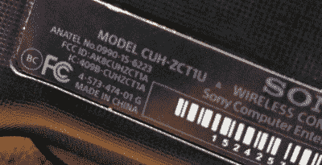
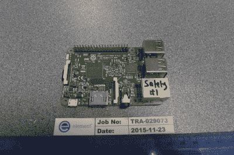
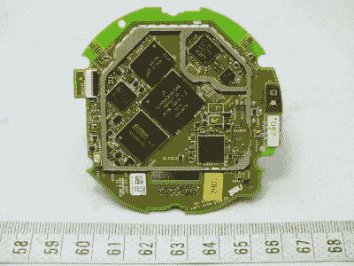
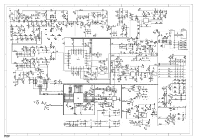

# 利用联邦通信委员会的广告来娱乐和获利

> 原文：<https://hackaday.com/2016/10/10/using-the-fcc-eas-for-fun-and-profit/>

当消费电子设备在美国销售时，特别是如果它具有无线功能，它必须接受符合 FCC 法规的测试，并将测试结果提交给 FCC(参见[准备您的产品进行 FCC 测试](http://hackaday.com/2016/09/19/preparing-your-product-for-the-fcc/))。然后，这些文件可以在工程和技术局(OET)实验室设备授权系统(EAS)上在线查看。事实上，正是在这个和其他 FCC 数据库中的这种发布导致了许多关于新产品发布的泄漏，其中一些我们已经报道过，而其他的我们在提交文件之前已经有幸知道，但[的破坏是在文件提交时被迫的，比如《覆盆子 Pi 3](http://hackaday.com/2016/02/28/introducing-the-raspberry-pi-3/) 。事实证明，通过研读 FCC 文件可以完成许多有用的事情，我们将探索其中的一些。

首先要知道如何使用 EAS 工具。如果你搜索，你需要搜索 FCC OET EAS(因为 FCC EAS 是紧急警报系统。感谢 FCC 对您的所有帮助。或者直接前往 [FCC OET 东亚](https://apps.fcc.gov/oetcf/eas/reports/GenericSearch.cfm)。现在你在那里，你会看到许多搜索领域。前四行可能就是你所需要的全部。每个在 FCC 注册的公司都将获得一个授权码，这是一个代表该公司的唯一的 3 或 5 位数代码。他们注册的任何产品都有自己的产品代码。很简单。

如果你也不知道(你手里拿着的任何有 FCC ID 的产品都需要在包装上、设备上和用户手册中注明)，只要在申请人姓名中输入公司名称，你就可能找到你要找的东西。日期范围有助于限制结果，但也提供了另一个有趣的选项。只需在“从”到“到”字段中输入今天的日期，您就会看到今天归档的所有文件的列表。泄漏就是这样发生的。一上市，有帮助的人就会看到并举报。

为了好玩，让我们找一些我们亲近的东西；树莓派 3。在申请人名称中搜索 Raspberry Pi，会有一些条目，有些是 2016 年的，有些是 2014 年的。2016 年的显然是 Pi 3，它们唯一的区别似乎是频率范围；不清楚为什么会有三份独立的文件。

Image from Raspberry Pi 3 FCC Filing.

在其中任何一个上面，我们都可以看到备案的详细信息。这给了我们各种好东西，包括外部和内部照片、用户手册和测试数据。这些照片对于寻找动机非常重要，因为它们将包括无线模块防护罩下面的图片。这可以让你看到一个产品，并准确地确定里面有什么，他们使用了什么技术，他们如何布置组件，等等。，而且一旦备案就完全免费，很容易获得，这通常是在产品上市销售之前。有没有你喜欢的产品，你想了解他们是怎么做到的？查一下联邦通信委员会的数据库。想在不购买竞争对手产品的情况下击败他们吗？在这里！

Guts of Nest, filed with FCC 8/14/2015

Raspberry Pi 的结果并不是一个很好的例子，因为你已经可以看到电路板上有什么，所以搜索 Fitbit 或 Nest 之类的东西。Nest 设备的内部照片文档是 10 页里面所有东西的详细图像！这是学习专业人士如何进行产品开发的大量信息。一些公司会模糊照片中的芯片标签，使其更难弄清楚里面是什么。

可能最不激动人心但仍然有用的是检测报告本身。这可能是每个产品中 90%相同的样板文件，但它会告诉您它使用的频率，并让您了解它输出信号的强度。大概就是这样。回到照片和用户手册中寻找所有的好东西。

Want to learn radio design? Here’s a schematic for one that passed FCC approval.

每个联邦通信委员会的文件都包含许多文件，并且有可能要求对其中一些文件永久保密。这意味着你提交的文件，要求其中一些保持机密，这些将不会在网站上列出。有些文件不能保密，如用户手册、测试报告、内部和外部照片，但其他文件可以保密，如框图、操作说明、零件清单(BOM)和原理图。不是每个人都会提交这份保密请求，所以有时候，如果你非常幸运，你可以获得比你想象的更多的产品信息。例如，搜索被授权人 ZP5 和产品代码 BF-82。他们没有为这个特定的产品提交保密信(但他们为其他产品提交了)，所以你可以看到一切，包括显示零件号的原理图！

如果你准备自己的产品进行 FCC 测试，找几个你喜欢的产品，看看他们对自己的文档做了什么，这样你就可以节省一些准备类似文档的时间。没有理由不这样！如果你想了解一个特殊的设计挑战是如何解决的，或者想在发布日期之前获得硬件的内幕消息，FCC EAS 是一个很好的起点。

[主图像来源，iPhone 6s FCC ID BCG-e 2946 a]