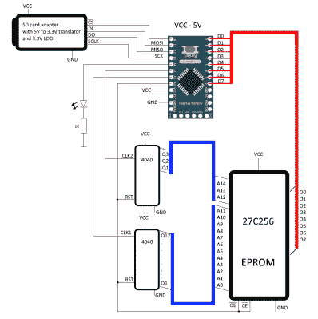

# 凝视太阳:擦除 EPROM

> 原文：<https://hackaday.com/2016/09/14/staring-at-the-sun-erasing-an-eprom/>

闪存是当今的王者。我们的微控制器将它嵌入在芯片上。手机、平板电脑和电脑都是通过闪存运行的。如果您需要可重写的长期存储，闪存是一个不错的选择。不过，事情并不总是这样。就在几年前，EPROM 还是镇上唯一的展览。EPROM 通常在编程夹具中被烧出电路。到了擦除 EPROM 的时候，只要把它放在紫外线灯泡下 30 分钟，你就可以再次开始了。EPROM 的石英窗口允许紫外光照射硅片，擦除记忆。

当你想用 EPROM 进行长期存储时，问题就出现了。EPROM 橡皮擦并不是清空芯片的唯一方法。太阳会在几周内完成。甚至荧光也能做到——尽管这可能需要几年时间。

【TechEkspert】想了解用太阳擦除 EPROM 的本质，[于是他拿出一个旧的 EPROM，开始黑](http://www.elektroda.pl/rtvforum/topic3236341.html)。([翻译链接](https://translate.google.com/translate?sl=auto&tl=en&js=y&prev=_t&hl=en&ie=UTF-8&u=http%3A%2F%2Fwww.elektroda.pl%2Frtvforum%2Ftopic3236341.html&edit-text=&act=url))【TechEkspert】用一个已知的 1 和 0 的模式给 EPROM 编程。一对 74HC4040 计数器将寻址 EPROM 的整个 32 KB 存储器。Arduino Mini 读出数据，存储在 SD 卡中。一点 python 代码将数据翻译成 PNG 文件，然后组合成一个[视频](https://www.youtube.com/watch?v=Yth1MWHMpDA)。

整个装置放在阳光充足的屋顶上。然后等待开始了。两个星期没发生什么事情。然后一些位开始闪烁。这意味着有时他们会读为 0，而其他时候是 1。太阳开始破坏存储的数据。就在第三周的时候，所有剩下的数据很快开始消失。最后，整个芯片被擦除。

虽然[TechEkspert 的]芯片可以重新编程，但 EEPROM 和闪存并非总是如此。看看这个 EEPROM 杀手 T1，它计算了破坏 Atmel ATmega328 中的电子可擦除存储器需要多少周期。

 [https://www.youtube.com/embed/Yth1MWHMpDA?version=3&rel=1&showsearch=0&showinfo=1&iv_load_policy=1&fs=1&hl=en-US&autohide=2&wmode=transparent](https://www.youtube.com/embed/Yth1MWHMpDA?version=3&rel=1&showsearch=0&showinfo=1&iv_load_policy=1&fs=1&hl=en-US&autohide=2&wmode=transparent)

