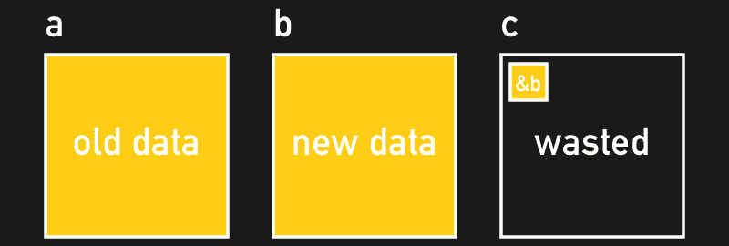

# 检修 ESP8266 的闪存处理

> 原文：<https://hackaday.com/2016/09/09/overhauling-the-esp8266s-flash-memory-handling/>

如果您曾经在电源故障时损坏过闪存，您会很高兴听到 ESP8266 SDK 为其闪存实现了非常安全且几乎可靠的读/写管理。问题是:这也非常浪费。对于存储数据的单个存储块，占用物理闪存的三个存储块。[彼得·斯卡吉尔] [用一个更好的解决方案启发了我们](http://tech.scargill.net/espressif-save-to-flash-an-alternative/)。

当 ESP8266 将数据写入其外部闪存时，例如在 OTA 更新期间，它不能简单地覆盖保存当前运行程序的块，它需要将该数据写入第二个块。一旦写操作完成，它必须跟踪哪个块保存当前数据。为此，ESP8266 SDK 使用了第三个块，其中存储了指向当前块的指针。然而，除了块指针之外，第三个块没有存储任何有用的数据。

这是一种故意浪费的技术，对于防弹固件更新非常有用，但对于在闪存中存储额外的数据，你会想要一种更有效的方法。[Peter]通过在每个存储的数据块中仅使用两个数据块，成功实现了相同的数据完整性。他的方法为每个数据块添加了一个 8 字节的版本计数器:当读取一个数据块时，会比较版本计数器以检索当前数据-当写入数据时，版本计数器允许您确定哪个数据块是较旧的，可以被覆盖。

最初将版本计数器放在一个块的最末端，所以在块的其余部分被成功写入后，它自然会被写入。不幸的是，闪存实际上要求您在新数据写入之前清除整个块，因此[Peter 的]方法在写操作期间会使版本计数器处于擦除状态。最后，他使用闪存专用的技巧将版本计数器放在了块的最开始:当写入数据时，他用 1(0x ffffffff)填充前四个字节。这与 flash 存储器的擦除状态一致，允许他返回到前四个字节，并在整个块成功写入后写入版本计数器。在他的博客上可以找到一个【彼得的】针对 ESP8266 的全面更新的 flash 读/写方法的[可运行测试实现](http://tech.scargill.net/espressif-save-to-flash-an-alternative/#highlighter_574086)。还是开销太大？请在评论中告诉我们！