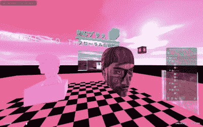

# Hackaday 奖参赛作品:美学地狱

> 原文：<https://hackaday.com/2016/09/11/hackaday-prize-entry-aesthetic-as-hell/>

微软鲍勃是革命性的。通常你会从一个白痴博主那里听到这样一句话，但在这种情况下，可以提出一个好的论点。Bob 抛弃了虚拟现实最初的“文件”和“文件夹”范式。文字处理器只是坐在书桌前写一封信。你的名片夹就是名片夹。所有的抽象都被移除了，你比以往任何时候都更接近于生活在你的计算机中。如果微软 Bob 今天发布，让多个用户在虚拟环境中相互交互，那就太超前了。这将是威廉·吉布森最明显的继承人，而不是梅林达盖茨唯一的失败。想象一个不是反乌托邦的赛博朋克世界，你会想到微软鲍勃。

Metaverse Lab is aesthetic as hell.

不是所有人都会嘲笑上面那一段。事实上，有些人正试图让一个由真人居住的巨大虚拟 3D 空间成为现实。在过去的几年里，[alusion]一直在元宇宙实验室进行 3D 扫描、虚拟网络浏览器的实验，并将互联的 3D 空间变成技术人员的栖息地。[这个名字来源于*雪灾*，在过去的二十年里，许多项目涌现出来复制这种数字和物理的融合。通过将这一想法与最新的虚拟现实耳机相结合，元宇宙实验室是我见过的最接近 80 年代科幻小说的梦想的东西。](https://en.wikipedia.org/wiki/Metaverse)

实际上，我有过几次使用元宇宙实验室并与之互动的经历。描述它的唯一方式是，如果人们对技术的唯一接触是观看 1992 年的电影《剪草人》。然而，它作为一个完全虚拟的环境工作，在那里潜力是显而易见的，人类的思维不受其物理体现的限制。

The [HackadayPrize2016](https://hackaday.io/prize) is Sponsored by:   