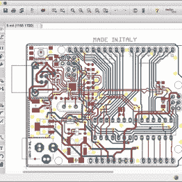
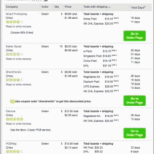

# 这个 EAGLE 脚本为您的板获取报价

> 原文：<https://hackaday.com/2016/09/11/this-eagle-script-gets-quotes-for-your-boards/>

厌倦了在 PCBShopper 的 web 表单中手动输入制造参数，[Jeremy Ruhland]创建了一个非常棒的快捷方式:[他的 ULP 脚本](https://github.com/JeremyRuhland/pcbshopper)让您可以直接从您的 EAGLE board 布局中获得来自全球 26 家 PCB 制造商的报价。

该脚本从您的布局中提取所有相关数据，包括电路板尺寸、层数、最小走线宽度和孔径。然后让你在一个整洁的对话中指定更多的几个，然后将你发送到 PCB 制造价格比较网站[PCBShopper.com](http://pcbshopper.com/)进行电路板报价的定制查询。

  Have a board layout.. [![..run [Jeremy's] ULP script..](img/e1569b1e406c1a6399dc8c53ab4d373c.png "pcbshopper-dialog")](https://hackaday.com/2016/09/11/this-eagle-script-gets-quotes-for-your-boards/pcbshopper-dialog/) ..run [Jeremy’s] ULP script..  ..get quotes!

它像一个魔咒一样工作，并且[Jeremy]还计划在 EAGLE 布局编辑器的工具栏中添加一个快捷按钮。由于该脚本实现了整个 PCBShopper API，为此[杰瑞米]与[PCBShopper.com](http://pcbshopper.com/)的所有者[鲍勃·亚历山大]合作，它也是开发与其他电路板布局工具一起工作的脚本的一个很好的起点。

感谢【Matthew Venn】的标题照片(via [Flickr](https://www.flickr.com/photos/matthewvenn/4343486692/) )！