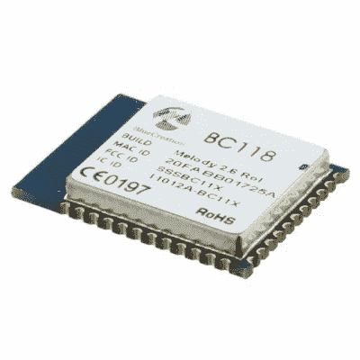
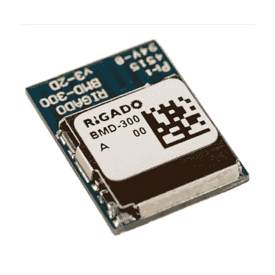
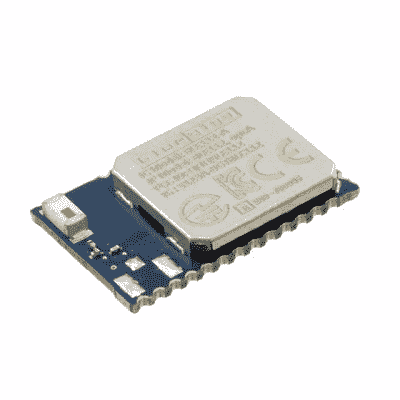
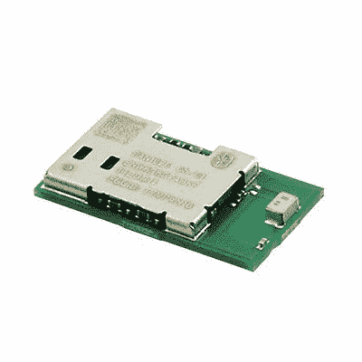
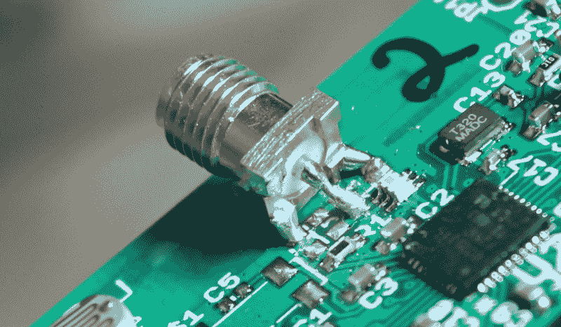

# 为 FCC 准备您的产品

> 原文：<https://hackaday.com/2016/09/19/preparing-your-product-for-the-fcc/>

在某个时候，你决定要在美国销售你的无线产品(或任何时钟频率高于 8kHz 的产品)。祝你好运！你必须通过 FCC 才能在 FCC OET EAS(工程和技术办公室，设备授权系统)上注册。嗯……也许吧。

与 FCC 相关的一切一样，它非常复杂，到处都有 tla 和令人困惑的术语，并且它将花费您比您想要的更长的时间来弄清楚它对您意味着什么。无论你是否经历过这一切，顺利度过，或者从未计划过要经历这一过程，FCC 舞蹈都是一个有趣的故事，所以让我们开始吧！

### 你是想传送那个信号吗？

有两种东西正在接受测试:有意辐射者和无意辐射者。故意是指他们故意发出射频信号，如 WiFi、蓝牙或任何其他发射无线电。在你开始销售甚至营销你的产品之前，这些必须经过测试并在 FCC 备案。你现在看到的很可能是 CFR 47 第 15 部分第 247 节。

然后就是无心散热器。这可能是来自电源的开关噪声、来自不良接地的意外天线或长时钟走线。您需要对您的产品进行无意辐射测试(如果您是有意发送者，您还必须进行无意辐射测试)，但您不一定需要将报告发送给 FCC。根据产品的[类型，你要么需要进行验证(你不需要官方测试实验室，你自己保存报告以防被询问)，符合性声明(你需要官方测试实验室，但你自己保存报告以防被询问)，以及认证(在认证中，你使用经认可的测试实验室，FCC 审查提交的文件)。FCC 指南的相关部分是 CFR 47，第 15 部分，第 109 节。](http://www.ecfr.gov/cgi-bin/text-idx?SID=a092166fd4fcf98a314626fa85b933c5&mc=true&node=se47.1.15_1101&rgn=div8)

还有一点需要考虑，那就是 FCC 模块化审批。如果您想避免有意排放测试的所有麻烦和费用，您可以使用具有模块化认证的无线模块。有很多公司为 BLE、WiFi、Zigbee、GSM 和几乎任何无线技术制造这些模块。他们为您经历痛苦的 FCC 过程，然后向您出售他们的模块，其中包含芯片、巴伦、天线、晶体和屏蔽，所有这些都在一个漂亮的封装中，您可以将其焊接到 PCB 上。这将避免有意的辐射测试，并为您提供一个优化的发射机。你仍然要对你的全板无意辐射负责，但这要便宜得多，也容易得多，甚至可能不需要备案。

对于小批量的产品，模块是快速启动产品开发和扩大规模的好方法，当你证明了市场和经济对转换有意义时(通常是成千上万的数量)，你就可以开始自己的设计了。

### 进入测试设备

让我们假设你在卖一个 WiFi 牙刷，它会记录你刷牙的时间并上传到云端，这样父母就可以以另一种方式关注他们的孩子。你必须让你的产品接受 109 和 247 两项测试。联邦通信委员会没有自己的测试设施来做这件事；他们认可其他测试机构，这些机构分布在世界各地。他们甚至有一个工具可以帮你找到他们。

要求一些测试机构报价，以及他们将你的产品送到他们的测试机构进行测试的时间表。你填完一些表格后，他们一般会处理你的申请。有意发射机的报价可能包含以下部分(粗略的大概数字。您的结果可能有所不同):

*   CFR 47 第 15 部分第 247 节——有意辐射测试约 5k 美元
*   CFR 47 第 15 部分第 109 节——非故意辐射测试约 1，000 美元
*   测试报告文档约 1，000 美元
*   FCC 表格 731 和其他一些文件归档工作约 2000 美元
*   IC 文书工作——2000 美元

IC 是什么？这是加拿大工业部，如果你想在加拿大销售，你必须通过几道额外的关卡，但最好是同时进行，而不是以后再重新进行测试。您的测试工具将帮助您浏览您需要创建的所有帐户和要归档的文档。

### 做家庭作业

一旦你选择了你的设备，你需要准备你的被测设备(EUT)和大量的文件。文件可能需要一个月或更长时间来准备和解决。他们想知道一切，包括标签看起来会是什么样子，以及它将如何永久贴在产品上。

照片、用户手册、操作说明、原理图和框图(您在 [FCC EAS 网站](https://apps.fcc.gov/oetcf/eas/reports/GenericSearch.cfm)上看到的文档只是准备好的文档总数的一部分)并没有结束准备工作。您还必须准备一份测试程序文件，并确保您的固件已准备好处理您必须将其置于的所有奇怪模式，并且您发送的其他硬件(如您安装软件以控制或重新编程受试设备的任何计算机)已准备好并易于使用。在试验箱中的时间是非常昂贵的，您希望您的测试人员尽可能轻松，而不需要因为疏忽导致的简单问题与您联系。

### 各种口味的测试

有了受试设备，他们会想在所有可能的配置中进行测试，所以你需要测试你的 WiFi 牙刷，当它用电池运行时，以及当它插在墙上充电时。如果你包括一个充电器，你将不得不在测试中包括这个充电器，即使它说它已经通过了 FCC 认证，因为它是你销售的必须符合标准的组合。

您将在正常操作模式下测试它，但也可能在每个通道上以连续传输模式测试它，因此您需要包括固件(或某种控制方法)它在哪个通道上，并将其置于允许连续传输的特殊模式。有时，制造商会让你更容易做到这点。例如，如果你使用 TI 芯片，有 [SmartRF Studio](http://www.ti.com/tool/smartrftm-studio) ，这使得这真的很容易。

### 修复你的过度行为

FCC 指南允许特定频率范围内的特定功率，因此您的设备在最高或最低频道可能会稍微超出范围。您要么必须更换 PCB，要么可以编写固件来限制这些极端情况下的功率(您必须对此进行测试)，或者编写固件来防止设备使用这些通道。

测试设施还希望直接测量输出功率，这意味着将 SMA 连接器连接到天线。很多时候，您的产品没有 SMA 连接器，而是直接连接到走线天线或芯片天线。这就是你发挥创意的地方，切断走线，将一根短线连接到牢牢粘在 PCB 上的 SMA 连接器。这是一个黑客，但它是你能得到的最好的输出功率测量方法。

The trace antenna is cut and an SMA connector is added for emissions testing.

设计第一次失败并不罕见。这很糟糕，但这不是世界末日。测试机构可能会暂停测试，告诉你他们认为什么可能是错误的，并让你在继续之前修复它。在发射机和天线之间的路径上，您经常会看到额外无源元件的空间。这些是为了进行任何必要的微调，以使 PCB 符合要求。

### 练习你的耐心

来自个人经历的笔记；与您的测试机构保持联系。我很不幸，因为我的公司需要不断的督促，有几个月它没有回复电子邮件或电话，从签署合同到向联邦通信委员会备案花了十个月的时间。通常你可以期待一两次，但作为一个小家伙，你可能要更加努力。

FCC 测试可能会令人生畏，尤其是如果你是第一次。测试设施习惯于 FCC 处女，会做一些手握，但大量的准备工作是耗时的，需要你来做。然而，这个认证对于打开你的产品的巨大市场是至关重要的。与选择正确的组件、外壳设计、制造流程和包装一样，在规划产品开发时间表和整个设计流程时，需要考虑 FCC 测试。

【FCC 测试图片来源:[某硬件家伙](http://electronics.stackexchange.com/a/42614)