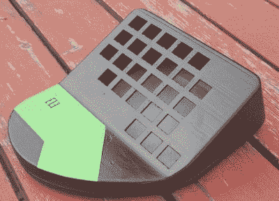

# 使用 PSoC 和 Fusion 360 开发的定制游戏键盘

> 原文：<https://hackaday.com/2016/09/15/custom-gaming-keypad-developed-with-psoc-and-fusion-360/>

曾经有一段时间，你自己做的东西可能意味着它看起来不太像商业产品。这并不总是一件坏事。我们已经看到了许多几乎是艺术作品的定制版本。我们也看到了许多——咳咳——让我们说是“黑客时尚”的版本。

[AlexanderBrevig]决定使用他挑选的 PSoC 开发板开展一个项目。特别是，他想制作一个定制的游戏键盘。他用电路板制作了一些开关的原型，并让[的固件](https://github.com/AlexanderBrevig/DIYGamingPad)开始工作，这样这个设备看起来就像一个 USB HID 键盘。

 然而，【亚历山大】也用 Fusion 360 摆出了一个[非常好看的案例](http://a360.co/2c9mL0j)，并在 Ultimaker 2 上打印出来。用一点颜料，结果看起来非常专业(见照片，右)。他仍然需要合并两个部分(电子和机械)，但最终，他应该有一个很棒的产品。

我们以前见过其他有吸引力的 [3D 打印外壳](https://hackaday.com/2014/04/30/a-masterpiece-of-3d-printed-case-modding-with-an-ouya/)。我们甚至已经覆盖了[一个教程](https://hackaday.com/2012/12/06/tutorial-designs-3d-printed-cases-for-your-projects/)来帮助你自己做这件事。如果你喜欢黑客时尚，总有[这种情况下模式](https://hackaday.com/2012/09/13/ugly-upgrade-keeps-the-tunes-playing-longer/)。