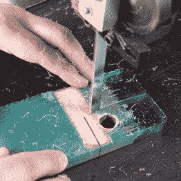

# 揭开木环的秘密

> 原文：<https://hackaday.com/2016/09/13/lifting-the-secret-of-the-wooden-rings/>

用环氧树脂和木材制作漂亮的东西恰好是[彼得·布朗]的专长领域。最近，他被要求对加拿大制造商[秘密木材](http://mysecretwood.com)的戒指设计进行逆向工程，这是一种由碎木和环氧树脂组成的独特组合，他取得了令人印象深刻的成果。

事实证明，故意以正确的方式劈开木头比不在切口上贴胶带要困难得多。[Peter]试着在他的膝盖上把木板掰成两半，在老虎钳里，他锯木头使它裂得更直，他试着用薄木板和厚木板。最终，他在一台简易压弯机中折断了一块较厚的山毛榉木板，得到了他想要的结果。

    

然后，他用环氧树脂填充裂缝，只加入几滴蓝色染料，并故意加入一些气泡。嵌入的雾效果是通过将两种不同的色调连续倒入模具中实现的。有了秘方，彼得可以开始研究神秘材料的环形形状。他钻了一个中心孔，在带锯上切出粗略的形状，并在砂带磨床上完成切割。

      

在手工打磨环氧宝石穿过所有网格并在抛光轮上旋转后，它们变得和原来的一样漂亮。请欣赏下面的视频，其中[Peter]详细介绍了这些戒指的制作过程:

 [https://www.youtube.com/embed/poNzkmOAL4k?version=3&rel=1&showsearch=0&showinfo=1&iv_load_policy=1&fs=1&hl=en-US&autohide=2&wmode=transparent](https://www.youtube.com/embed/poNzkmOAL4k?version=3&rel=1&showsearch=0&showinfo=1&iv_load_policy=1&fs=1&hl=en-US&autohide=2&wmode=transparent)

