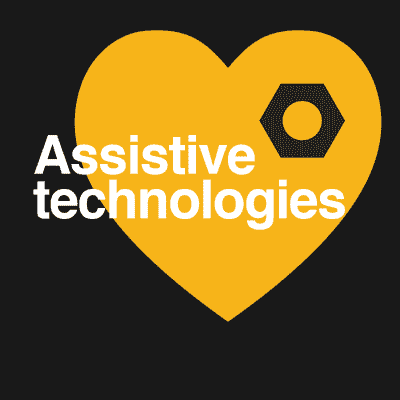

# 衡量你对世界影响的更好方法

> 原文：<https://hackaday.com/2016/09/16/a-better-way-to-measure-your-impact-on-the-world/>

闭上眼睛，想象电动轮椅。你看到了什么？它是否时尚、前卫、优雅……配得上 iChair 这个绰号？不不不是的。这是一个四四方方的坦克状东西，有灰色的圆形轮子，由铅酸电池供电。这是为什么呢？

显然还有其他选择。就在昨天，我偶然发现了 [UPnRIDE](http://upnride.com/) (这个名字很难听，但大声说出来，你就会明白了)。这是一个可以变成站立姿势的电动轮椅。它看起来比较时尚和现代。我以前也不是第一次看到这个想法了。这些年来，我最喜欢的文章之一仍然是我们对[泰克 RMD](https://hackaday.com/2012/03/21/robotic-assist-helps-paraplegic-stand-and-move-around/) 的报道，这是一种类似的站立机器人轮椅设计。为什么我在野外看不到这些？为什么我只记得在四年内见过这个概念两次？

原因有很多——人们不像购买手机那样购买旗舰轮椅，购买它们的钱不是可支配收入，而是被锁在医疗保健-工业综合体中的钱。这是一个棘手的问题。例如，当你考虑到人们可以拥有蹩脚的手机，但不可以拥有蹩脚的轮椅时，这个类比就站不住脚了。为了遍历这个特定的细节，我们只能说，一旦一项医疗技术被大型医疗保健实体批准，制造商就不愿意再通过研发并重新开始整个批准过程。

所以在我看来，我们可以通过对电动轮椅进行广泛的研究来对很多人的生活产生巨大的影响。不仅仅是在那里，而是跨越所有的辅助技术。事实上，这就是为什么我们选择[辅助技术作为当前 Hackaday 奖](https://hackaday.io/prize/details#five)的挑战。

 我认为我们作为黑客、设计师和工程师的一个主要问题是对我们应该称之为成功的东西抱有狭隘的看法。是将产品推向市场，在你的演示视频上获得 100 万次点击，还是赢得 Hackaday 大奖？当然可以。但是小成功很重要。真的，生活中最好的东西是很难衡量的——我想留给你一个利他的观点。

也许我们没有 12 家不同的公司用新的和创新的机器人轮椅打入市场，(每个公司都有不同的选择)，因为十年前我们还没有看到足够多的机器人轮椅。10 年前有个黑客，高三，学机电，准备上大学。现在那个人已经休学工作四年了。凭借一点经验(或者口袋里可能有工程硕士学位)，他们正在寻找一个好主意来创办一家公司。

也许我们和那个人错过了机会。如果我们真的用一个有趣的想法给他们留下了深刻的印象，他们可能会接受它，解决学生项目中的问题，现在准备好带着一个真正伟大的想法突然出现。所以我们需要更多的想法。我们需要更多的概念验证，以及更多失败的原型(以及成功的原型)。我们需要对相同的问题进行多次迭代。我们需要展示我们的工作，从而激励他人。

当然，你可以为你的辅助技术设计赢得 15 万美元的大奖。我们看到一个眼控轮椅赢得了比去年更多的奖项当他们被授予 Hackaday 奖时。但更有潜力改变世界的是灵感，一个想法的核心，以及人们在业余时间创造惊人事物的例子。这导致了更多像凯特·里德和纳撒尼尔·童[这样的年轻人，他们知道自己可以改变世界](https://hackaday.io/project/7221-hand-drive)，并为此而努力。

这就是了。加入比一个人或一个项目更重要的事情。通过[使用你的辅助技术](https://hackaday.io/project/add?light&tag=2016HackadayPrize)让生活变得更美好，让我们看看它会把我们带向何方。

The [HackadayPrize2016](https://hackaday.io/prize) is Sponsored by:   