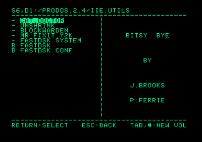

# 苹果 II 型电脑的新操作系统

> 原文：<https://hackaday.com/2016/09/16/a-new-os-for-apple-ii-computers/>

虽然这类工作通常是留给 KansasFest 和其他高技术和非常熟练的苹果爱好者的论坛，但[约翰·布鲁克斯]发布新版本的 ProDOS 操作系统也同样重要。毫无疑问，这是未来几年 Apple II 平台最伟大的发布。苹果 II 平台的绝唱就是 ProDOS 2.4，它是苹果 ProDOS 的最新版本的升级版，上一次发布是在 1993 年。

从历史的角度来看，ProDOS 并不是苹果在 1977 年发布的操作系统。那个操作系统就叫做 DOS。1983 年发布的 ProDOS 包括对新的 3.5 英寸软驱的支持，允许分层目录，支持硬件中断，并使苹果系列一直持续到 90 年代。尽管有这些改进，但并不是所有的 Apple ][系统都受支持。原版的[和][+被冷落了。现在，有了给苹果电脑添加闪存和 USB 设备的能力，即使是最新版本的 ProDOS 也过时了。

[约翰]发布的 ProDOS 2.4 解决了所有这些问题。这一发布是苹果生态系统近年来最重要的发展，而且至少在十年内都将如此。[唯一一个还在用苹果的人【作为日常司机】同意](http://ascii.textfiles.com/archives/5054)，ProDOS 2.4 [现在被永远珍藏在档案里](https://archive.org/details/ProDOS_2_4)。

 新功能比比皆是，尽管其中大部分都是面向如今已有三十年历史的苹果公司 IIGS。这些功能包括 GS/OS 中增强的实用性——相当于苹果的 Commodore GEOS——插槽重新映射，以及更小、加载更快的操作系统。旧机器没有被排除在外，ProDOS 包括了 ProDOS 2.x 中常见的功能和改进，这些功能和改进在苹果][，苹果][+和未增强的苹果//e 中没有

这个版本的杀手锏和*还有一点*是 BitsyBye 实用程序，一个小的( *$300！)*允许你引导各种 Apple II 设备和程序的系统程序。可以把这想象成 Apple II 生态系统的诺顿指挥官，允许选择插槽，引导最近使用的 ProDOS 设备，以及基本的文件系统探索。BitsyBye [还包括一个复活节彩蛋](https://twitter.com/JBrooksBSI/status/776603157082234880)。ProDOS 2.4 磁盘映像中还包含一些实用程序，包括 ADTPro、Shrinkit archive expander 和磁盘实用程序。

在[【约翰】的网站](http://www.callapple.org/uncategorized/announcing-prodos-2-4-for-all-apple-ii-computers/)和【Archive.org】的[上有一个 140k 的 ProDOS 2.4 磁盘镜像。由于你可能不会直接下载到 Apple II 磁盘上，](https://archive.org/details/ProDOS_2_4)[抓取 ADTPro](http://adtpro.sourceforge.net/configserial.html) 并通过音频加载。