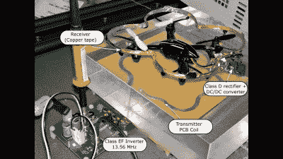

# 无人机靠无线电能飞 12 厘米

> 原文：<https://hackaday.com/2016/09/17/drone-flys-12-cm-on-wireless-power/>

[Sam M]写了一个让我们大吃一惊的快速概念验证演示:通过无线传输足够的能量让一架小型四轴飞行器飞行。对我们来说，任何真实距离上的无线电力传输仍然像魔术一样。看看下面嵌入的视频，你会明白我们的意思。

这个演示值得注意的是，发射器和接收器都不是特别难制作。发射回路蚀刻在 PCB 上，接收器由铜箔带制成。转到更高的频率有助于这一点；[Sam M]使用的是 13.56 兆赫，而不是大多数电力传输项目使用的千赫。这意味着所有的部件都可以更小更轻，这在微型四旋翼飞行器上显然很重要。

 然而，高频电源开关对晶体管提出了真正的要求，而[Sam M]正在使用的晶体管是尖端的，专门为这种应用而设计。在高频率下，你用垃圾箱部件是走不远的。事实上，驱动线圈的整个逆变器是一种定制设计，在[Sam]的研究论文中有非常详细的描述，可在这里获得[。(PDF)](http://ieeexplore.ieee.org/stamp/stamp.jsp?arnumber=7445230)

高功率和高频率仍然可以受益于[有一根电线沿着](http://hackaday.com/2016/08/24/hf-powered-drone-antenna/)运行，但像这样在稀薄的空气中传输几瓦是一个很好的演示。感谢分享，[Sam]！

 [https://www.youtube.com/embed/uylHY8abhIQ?version=3&rel=1&showsearch=0&showinfo=1&iv_load_policy=1&fs=1&hl=en-US&autohide=2&wmode=transparent](https://www.youtube.com/embed/uylHY8abhIQ?version=3&rel=1&showsearch=0&showinfo=1&iv_load_policy=1&fs=1&hl=en-US&autohide=2&wmode=transparent) 
 [https://www.youtube.com/embed/LLfG16wj_Hg?version=3&rel=1&showsearch=0&showinfo=1&iv_load_policy=1&fs=1&hl=en-US&autohide=2&wmode=transparent](https://www.youtube.com/embed/LLfG16wj_Hg?version=3&rel=1&showsearch=0&showinfo=1&iv_load_policy=1&fs=1&hl=en-US&autohide=2&wmode=transparent)

