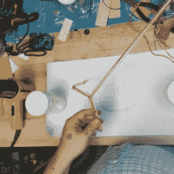
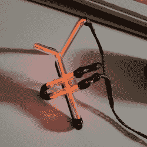
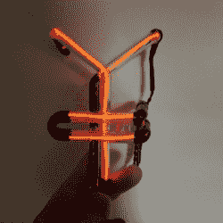
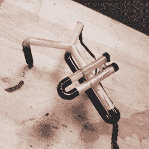

# 用 EL 线打造你自己的霓虹灯

> 原文：<https://hackaday.com/2016/09/18/forge-your-own-neon-signs-with-el-wire/>

霓虹灯管标志散发着不可抗拒的魅力，这种魅力一直使它们保持至今。复古的橙色光芒很难用现代照明手段替代，但永远不要相信不是你自己伪造的霓虹灯。向你展示如何用塑料管和 EL 线制作非常逼真的人造霓虹灯管标志。

在从宠物店购买了一些聚碳酸酯管(在水族馆中更常用)后，[NPoole]简单地在管中插入了一些橙色的 EL 线。他用热风枪加热管子的一端，并将其扭断，密封管子的一端，并将 EL 线焊接到位。然后继续将他的霓虹灯管弯曲成型，用热风枪反复加热，小心翼翼地弯曲，并向管的开口端吹气以防止管扭结。

他最终得到了一个整洁的形状，他用黑色锐器处理了不需要的部分，并用黑色热缩管覆盖了末端。一旦连接到逆变器上，结果在白天看起来已经很有说服力了，但是[Npoole]发现在黑暗中，伪造太明显了，只有细 EL 线亮着。为了增加一些光亮，他用丙酮冲洗管子，使其内部结霜。这种溶剂给透明的管子增加了一层雾，完成了这种错觉。[NPoole]建议您在插入 EL 电线并将其弯曲之前冲洗管道，但提到退火也可能会消除弯曲处的结霜。观看他第一次尝试建立一个 EL 线霓虹灯标志如下:

 [https://www.youtube.com/embed/35e5bD4gq9c?version=3&rel=1&showsearch=0&showinfo=1&iv_load_policy=1&fs=1&hl=en-US&autohide=2&wmode=transparent](https://www.youtube.com/embed/35e5bD4gq9c?version=3&rel=1&showsearch=0&showinfo=1&iv_load_policy=1&fs=1&hl=en-US&autohide=2&wmode=transparent)

