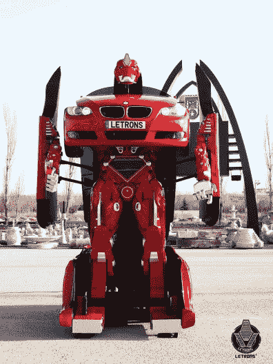
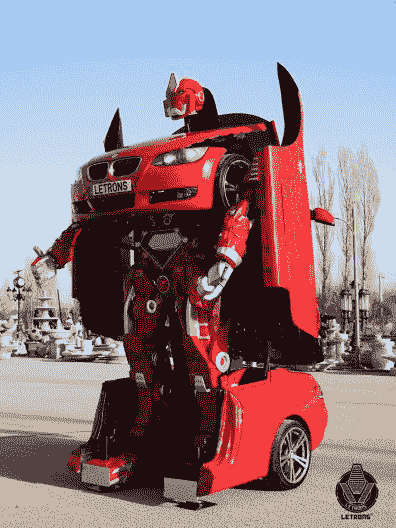

# 真实的真人大小的变形金刚

> 原文：<https://hackaday.com/2016/09/19/real-life-sized-transformers/>

曾经梦想过在你的车库里有一个真实大小的变压器吗？土耳其初创公司 Letrons [现在为你提供的正是这种](http://www.letrons.com/index_eng.html):他们的电子动画*汽车人*像汽车一样驾驶，像*变形金刚*一样变形，据说还能通过内置的烟雾机和音效抵御太空威胁。

Letrons 的*变压器*似乎是基于宝马 E92 coupé底盘打造的。据该公司称，这种野兽装有强大的液压系统和伺服电机，使它能够快速变形和移动。底盘周围的传感器为它提供了一些交互性，并防止它在远程控制模式下碾压无辜的旁观者。有趣的是，它的可移动手臂并不附着在身体上，而是附着在可延伸的侧翼上，并具有带驱动手腕和手指的手。*汽车人*也可以移动它的头，它会从引擎盖里弹出来。

    

不可否认，在他们发布一个工作和抛光的原型之前，Letrons 肯定在月球的黑暗面花了很多时间并秘密工作。尚不清楚乐龙的*变形金刚*是否会与美国军方合作解决武装冲突，但它们肯定是一部好剧。欣赏下面的视频！

 [https://www.youtube.com/embed/qWx2viSOjAs?version=3&rel=1&showsearch=0&showinfo=1&iv_load_policy=1&fs=1&hl=en-US&autohide=2&wmode=transparent](https://www.youtube.com/embed/qWx2viSOjAs?version=3&rel=1&showsearch=0&showinfo=1&iv_load_policy=1&fs=1&hl=en-US&autohide=2&wmode=transparent)

感谢[Itay]的提示！