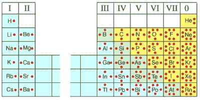
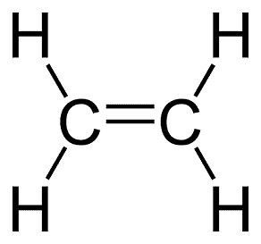

# 化学式 101

> 原文：<https://hackaday.com/2016/09/28/chemical-formulas-101/>

似乎每隔一天，我们就能听到一些黑客、修补者、制造者、程序员或许多其他自己动手的工程师涉足一个曾经只为少数人保留的复杂领域。成本已经下降，使普通人能够用 3D 打印机、激光切割机、数控铣床和许多其他曾经非常昂贵的设备来装备自己。制作 PCB 板实际上非常便宜，而且便宜的 Linux 单板计算机比我们目前所能追踪的还要多。降低硬件成本与互联网上不断增长的知识财富相结合，为 DIY 者进入更具体的科学领域创造了一个完美的环境。

其中一个领域是生物医学研究。在世界各地的实验室里，你会发现许多不同的机器用于研究和创造生物和化学化合物。这些机器包括 DNA 和蛋白质合成仪、质谱仪、紫外光谱仪、冻干机、液相色谱仪、馏分收集器……我可以举不胜举。

这些机器对 DIY 者来说太贵了。但他们不必如此。如果我们愿意，我们有能力在自己的车库里制造这些机器。那我们为什么不是呢？我们很少看到生物医学黑客的原因之一是，制造和操作这些机器所需的化学知识通常不在典型的 DIYers 工具箱中。这是我们认为需要改变的事情，我们从今天开始。

在本文中，我们将介绍如何将基本化学式(如 C9H804(阿司匹林))转换为其分子结构(T1)，反之亦然。这些知识可能是初级的，但对于任何希望开始生物医学黑客的人来说，这是一个要求，对于我们当中的好奇者来说，这是一个很好的起点。

## 刘易斯点

[Source](http://kaffee.50webs.com/Science/activities/Chem/Activity.Lewis.Diagrams.html)

化学家的目标之一是了解元素和分子如何相互作用。原子总是会结合形成更稳定的电子结构，并与惰性气体[等电子](https://www.google.com/#q=isoelectronic)。在成键过程中相互作用的是最外层的价电子，许多化学家发现在绘制化学式时，将这些价电子描绘成原子符号周围的点是有用的。人们可以在[周期表](http://sciencenotes.org/wp-content/uploads/2015/01/PeriodicTableMuted.png)中找到原子的符号，但也可以通过查看原子数来了解元素中价电子的数量。对于主族元素(A 族)，族号与价电子数相同。过渡金属(B 族)通常不用路易斯点表示。看一下右上方的图像，就可以清楚地理解这些点是如何代表一个元素最外层的电子的，以及这个数字是如何与元素周期表中的族号相对应的。请注意，除非绝对必要，否则这些点不会配对。

## 共价结合

原子之间主要有两种结合方式——共价键和离子键。离子键发生在电子从一个容易放弃它们的原子移动到另一个容易接受它们的原子的时候。这导致它们之间存在静电荷，从而使它们粘在一起。盐(NaCl)是离子键的一个例子。

当原子为了变得更稳定而共享电子时，就发生了共价键，就像惰性气体一样。因为惰性气体有八个价电子，这种趋势被称为[八重态规则](https://www.google.com/search?q=octet+rule&rlz=1C1KMZB_enUS593US593&oq=octet+rule&aqs=chrome..69i57.2696j0j7&sourceid=chrome&ie=UTF-8)。这一规则适用于生物化学中的许多元素(如碳、氮和氧)，并允许我们预测它们将如何结合。观察路易斯点有助于想象这些元素之间的共价键是如何通过八隅体规则发生的，这使得我们可以将它们绘制成结构。

## 路易斯结构

水(H2O)可能是共价键最著名的例子。如果我们看一下氧的路易斯点符号，我们看到它有 6 个价电子(或点)。氢有一个。从氧的角度来看，它想要实现惰性气体氖的惰性气体结构，并且它需要两个电子来实现。所以它和两个氢原子成键。从氢的观点来看，它想达到氦的电子态。所以它与氧原子结合。每个原子都处于最稳定的状态——惰性气体状态。当两个原子共享一个电子时，点就被一条直线代替。请看左边的图片。

Source via [Study.com](http://study.com/academy/lesson/ethylene-properties-uses-quiz.html)

代表共享电子的单线被称为单键。也可能有多重债券的情况。考虑乙烯(C2H4)。碳有四个价电子，氢有一个价电子。这两个碳原子各共享两个电子，而每个碳原子与两个氢原子共享另外两个电子。这种配置使每个原子处于氖惰性气体电子态。乙烯的路易斯结构见右图。

碳是生物化学中的一种独特元素，因为它可以与自身形成几乎无穷无尽的化学键。事实上，有机化学的整个分支致力于碳及其衍生物的研究。你会经常听到化学家将自己描述为有机或无机的——每一种都分支到自己独特的研究领域。

## 苯–c6h 6

我们都以这样或那样的方式接触过苯。它是汽油气味的来源。但更重要的是，它是有机化学中的关键分子。它呈环状，被称为[芳香分子](https://en.wikipedia.org/wiki/Aromaticity)。这意味着电子可以在环周围自由移动，赋予它独特的属性，如增强的稳定性。而是与路易斯结构保持一致；我提到苯是因为它经常以一种速记的方式出现，这会让那些没有意识到的人感到困惑。右边是一个苯分子。但它通常是用下图所示的速记来绘制的。

![[via ChemSpider]](img/bb32bbb907e5292147d11bb1829613ee.png)

【via[chem spider](http://www.chemspider.com/Chemical-Structure.2157.html)

注意[阿司匹林](http://www.chemspider.com/Chemical-Structure.2157.html) (C9H8O4)含有一个苯环。现在你知道它是什么了，你会在许多化学公式中看到它。

观察非简写的路易斯结构，我们看到六个碳相互形成一个键，每个碳与一个氢原子形成一个单键。碳原子之间的六个键中有三个是双键。同样，所有这些都是为了使每个原子处于最稳定的惰性气体状态。

## 逐步地

让我们看一个例子，把一个化学式转化为一个路易斯结构。我们将以 H2O 为例

1.  画一个骨骼结构。使用你对路易斯点的新知识来排列原子，使它们成键以满足八隅体规则。在每个键合的原子之间画一条线(代表一个共享的电子)。对于较大的分子，通常带最小负电荷的原子是中心原子。对于水，这看起来像是:H—O—H
2.  求价电子总数。对于水，这是 8。
3.  对于由单线表示的每个键，减去 2。对于水，8–4 = 4。
4.  使用步骤 3 中获得的值填充与中心原子键合的原子的价层。对于水，氢原子已经有一个全价层，所以我们会有剩余的电子。
5.  如果还有电子，把它们放在中心原子上(像点一样)。水的氧原子上有 4 个点。
6.  如果最后中心原子上的电子少于 8 个，则从一个外层原子上去掉两个，使中心原子变成双键。

我知道对一些人来说，这是高中化学的回顾，但是在我们进入蛋白质和碳水化合物之前，理解这些基本概念是必要的。虽然我们没有触及所有的内容，但现在你应该对如何将一个简单的化学式转化为路易斯结构有了一个基本的概念，反之亦然。为了更深入地了解元素的电子结构和它们的来源，请看我们的[元素周期表帖子](http://hackaday.com/2015/09/16/dont-know-much-about-the-periodic-table-2/)。