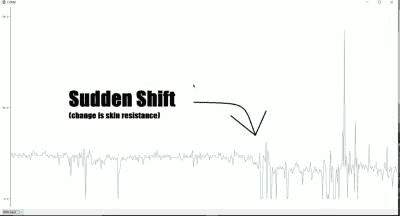

# Arduino 检测到裤子着火

> 原文：<https://hackaday.com/2016/09/21/arduino-detects-pants-on-fire/>

很难想象，测谎仪已经作为儿童玩具销售了很多年。一个简单的电池驱动装置夹在你的手指上，可以显示你皮肤的导电性。这个概念——可能不太可靠——观察到说谎会让你不知不觉地出汗，从而导致皮肤电导率突然增加。这些便宜的玩具会有一个计量器，你会注意到计量器的偏移来确定受试者是否在说谎。

你可能会争论询问你的朋友的娱乐价值，但是它们很常见并且仍然存在(包括一些如果他们发现你在撒谎会让你震惊的)。17 岁的[BuildIt]对这款经典设备有了自己的现代诠释——还能有什么？一个 Arduino。你可以在下面看到这个设备的视频。

 感兴趣的是他如何使用最新版本的 Arduino IDE 以图形方式可视化数据(见右图)。这比解释串行终端上滚动的一串数字或者将数据导入电子表格要容易得多。您可以在工具菜单下找到列为串行绘图仪的图形。

这个项目不需要很多外部零件，虽然手指夹和纸板盒需要一点机械技巧才能完成。

我们之前已经研究过[皮肤电反应](https://hackaday.com/2015/07/17/hacklet-56-brain-hacks/)和其他生物信号处理。如果你给[多造一点硬件](https://hackaday.com/2011/05/25/arduino-based-biofeedback-unit/)，你可以做得更多。

 [https://www.youtube.com/embed/8ogMm94AH80?version=3&rel=1&showsearch=0&showinfo=1&iv_load_policy=1&fs=1&hl=en-US&autohide=2&wmode=transparent](https://www.youtube.com/embed/8ogMm94AH80?version=3&rel=1&showsearch=0&showinfo=1&iv_load_policy=1&fs=1&hl=en-US&autohide=2&wmode=transparent)

