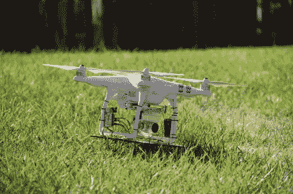

# 现实生活中有无人机和激光的太空入侵者

> 原文：<https://hackaday.com/2016/09/19/real-life-space-invaders-with-drones-and-lasers/>

最近我们已经看到了现实生活中视频游戏的激增，但这一个是令人惊讶的！[Tomer Daniel]和他的十二名黑客、焊工和编码员[为 GeekCon 2016 制作了一款太空入侵者游戏](https://geekcon-prod.herokuapp.com/projects/312)。

[Tomer]等人在这个项目上花的时间比写文章的时间还多，所以你只能满足于下面嵌入的视频和他们发给我们的大量照片。([Tomer]写道，他想指名道姓地感谢你们每个人和他的赞助商，但那将是几段单独的内容。谢谢大家！)

  The Team (Credit: Tal Durek)  Drone at Rest (Credit: Saron Paz)  Making Invaders (Credit: Yariv Geller)  Coders coding (Credit: Yariv Geller)  Assembling (Credit: Yariv Geller)  RGB coding (Credit: Yariv Geller)  A Toast to Invaders (Credit: Saron Paz)  Testing Gunnery (Credit: Avi Ostfeld)

[Tomer]的公司生产协调无人机群的软件，所以他有八架 DJI 幻影并且有能力驾驶它们，这不是巧合。该团队将 RGB LED 矩阵、激光传感器放在一起，并为每个入侵者配备了自己的 Arduino。

焊工们建造了一个轨道和手推车，这样运动员就可以在 20 米长的轨道上来回滑行。视频展示了枪支的使用情况。(桶效应让人想起我们刚刚报道过的 Seb Lee-Delisle 的这个黑客。)当然，炮塔不会让你只是垃圾激光，而是在短暂的延迟后关闭它，以迫使你实际瞄准。

记录到击中后，四轴飞行器关闭灯光，返回地面。多酷啊。欣赏视频。

 [https://www.youtube.com/embed/-4XsSa0z-DU?version=3&rel=1&showsearch=0&showinfo=1&iv_load_policy=1&fs=1&hl=en-US&autohide=2&wmode=transparent](https://www.youtube.com/embed/-4XsSa0z-DU?version=3&rel=1&showsearch=0&showinfo=1&iv_load_policy=1&fs=1&hl=en-US&autohide=2&wmode=transparent)

既然你已经读完了这篇博文，那就去看看 GeekCon 的其他项目吧。其中一些几乎同样令人惊叹。