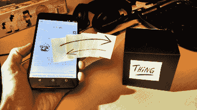

# 网络蓝牙:新热点及其危险

> 原文：<https://hackaday.com/2016/09/23/web-bluetooth-the-new-hotness-and-its-dangers/>

谷歌最新的 Chrome 浏览器，版本 53，包括对[网络蓝牙](https://webbluetoothcg.github.io/web-bluetooth/)的试用支持，就像狂野西部一样！提供给你的浏览器的 JavaScript 代码，现在可以直接连接到你的蓝牙 LE (BTLE)设备，有一大堆的警告，我们将在下面说明。

一方面，这是很棒的功能。浏览器是世界上有史以来最普遍的跨平台操作系统。你可以为运行 Windows、Linux、Android、iOS 或 MacOS 的用户提供一个网站，并在他们的机器上运行代码，而不必知道矩阵中是手机、台式机还是虚拟机。将这种无处不在与控制蓝牙设备的能力结合起来将会很有趣。这是物联网拼图中缺失的一块。

另一方面，这是一个安全噩梦。当恶意网站可以从驻留在你电脑上的文件中提取信息时，这已经够糟糕了，但当它们直接连接到你的灯泡、你的 FitBits 或你的 BTLE 增强型起搏器时，这就为恶作剧提供了新的可能性。好消息是网络蓝牙的开发者似乎意识到了风险，并致力于将风险最小化，但仍然存在真正的担忧。安全性如何在平衡中产生？请继续阅读。

## 没有新的，一切都在改变

 当然你也可以只写一个蓝牙 LE 应用。但是你的用户必须能够把它安装在他们的电脑上，手机上，以及三年后人们将会使用的任何其他平台上——也许是他们飞行汽车的仪表板上。只需轻轻一点，Web 应用程序就会在那些有趣的<脚本>标签之间被交付并部署到您的浏览器上。它们可以在任何你可以安装浏览器的地方运行，没有比这更简单的了。

对于家庭自动化应用，这是巨大的。同样的应用程序，一个网页，将部署在你的手机和电脑上。我们可以想象反应式网站和酷酷的本地控制器。当然，相反的，现实世界会对网站做出反应。Web Bluetooth 将在物联网场景中提供一个我们甚至没有想到的集成水平，Web 设计人员对将他们的比特放到现实世界中的前景垂涎三尺。

### 对于黑客:仍然需要一些组装

对我们来说，现在，新版本的 Chrome 附带了一个方便的 BTLE 设备调试控制台。如果你会写 JavaScript，并且愿意通过一些安装程序，你现在就可以[利用这一点](https://developers.google.com/web/updates/2015/07/interact-with-ble-devices-on-the-web?hl=en)。(页面底部有大量示例和演示。)看起来浏览器将成为最友好的 BTLE 开发环境。

目前最大的限制是[仍然没有 Windows 操作系统支持](https://medium.com/@urish/is-now-a-good-time-to-start-using-web-bluetooth-hint-yes-yes-it-is-99e998d7b9f6)，尽管这在不久的将来会有所改变。( [iOS 支持不被官方支持](https://github.com/pauljt/BleBrowser)，Linux 上的[安装](https://acassis.wordpress.com/2016/06/28/how-to-get-chrome-web-bluetooth-working-on-linux/)需要 Linux 用户。)这是新东西。

## 什么会出错？

 人们对网络蓝牙将带来的新型威胁有很多想法。如果你真的感兴趣，你应该亲自通过网络蓝牙[阅读起草小组报告的安全部分](https://webbluetoothcg.github.io/web-bluetooth/#security-and-privacy)。

显而易见的威胁已经是旧闻了。像[跨站点脚本](http://hackaday.com/2016/03/23/the-dark-arts-cross-site-scripting/) (XSS)这样一直存在的攻击将被赋予新的武器库。如果你的浏览器信任易受 XSS 攻击的服务器，互联网上的任何人都可能连接到你的设备。然而，由于物理设备的特殊敏感性和能力，网络攻击将成为现实世界的攻击。

### 隐私

Not very subtle, Google.

Web Bluetooth 将向互联网暴露更多的用户信息，而充当其看门人的大型垄断公司将以牺牲我们的隐私为代价来获利。当你有了新的 Gmail 时，建立一个 BTLE 发光二极管？你必须给谷歌许可。由于蓝牙设备有一个唯一的、持久的设备 ID，你可以相当肯定谷歌将使用这些信息来在线跟踪你，因为这是他们的商业模式。

我们很容易担心脸书，特别是考虑到他们上个月在 Whatsapp 上虚伪的(和可预见的)大转变。想用你的 FitBit 增强你的 Oculus VR 体验吗？现在，脸书可以将你的心跳与你正在阅读的新闻报道或正在浏览的朋友照片联系起来。他们会做的——不需要阴谋论。

如果我们没有输掉(或者完全放弃)网上隐私之战，这将会很重要。你将通过网络蓝牙被采集指纹并被跟踪，比以往任何时候都更加精确和持久:在匿名窗口运行或拒绝 cookies 不会改变你电脑上的物理令牌。网络蓝牙双向运行，将现实世界与网络连接起来。

### 设备本身

最后，我们认为假设许多 BTLE 设备不安全并不过分。该协议仍然是相当新的，它明显比 USB 更复杂，这仍然让我们感到头晕。BTLE 的安全模型在开发时只考虑了本地攻击者，因为它是一种短程无线电协议。网络蓝牙让 BTLE 向互联网上的所有坏人敞开大门，这是一种明显不同的威胁。这是一个很好的赌注，廉价的设备不会为它而设计。甚至[一些贵的](http://hackaday.com/2016/02/06/reverse-engineering-a-wifi-security-camera/)也会倒闭。

以一个基于 IP 的儿童监控摄像头为例，当它被限制在家庭路由器的防火墙内时，它是相对安全的。我们都知道当他们跳到更广阔的互联网上时会发生什么。有人可以[对你的 BTLE 前门门锁](http://hackaday.com/2016/08/08/the-terrible-security-of-bluetooth-locks/)进行重放攻击，这可能没什么大不了的——当你使用发射器破坏它时，他们必须在附近。当每个访问网站的人都被扫描时，这完全是一件大事。(注:此处假设 XSS 或其他网络漏洞。)

### 解决办法？

Web Bluetooth 小组提出的解决方案基本上是确保浏览器让用户知道哪些设备正在配对，以及它们正在提供哪些服务。这意味着点击弹出对话框。虽然授权给用户可能是最好的方式，但它仍然不完善。

将设备限制为已知服务是很好的，但是如果设备本身有问题，入侵者可能会找到解决方法。当 BTLE 设备请求未知服务时，会有一个弹出窗口，用户可以拒绝它。当他们真的想要控制他们的(恶意的)BTLE 灯泡时，有多少人会选择“不”呢？有多少用户会担心他们的隐私被侵犯，因为没有弹出窗口？

毫不夸张地说，大多数用户对网络蓝牙新的攻击面一无所知，因此无法理性地做出决定。见鬼，一周前我们还不知情。而这一切都是假设浏览器不会有 bug，在授权中充当用户代理。将所有责任推给用户似乎有点像推卸责任。他们只会一直点击“确定”。太糟糕了，但是我们想不出更好的了。

### 未知的未知

以上都与恶意网页利用浏览器接管你的蓝牙有关。坏的蓝牙设备会损害浏览器的想法还没有出现。我们甚至不确定这种攻击是如何进行的——也许是处理 BTLE 数据时的缓冲区溢出？—但我们确信，一些有事业心的黑客会找到一种方法，并编写必要的固件。完成这件事，你会赢得一个真正的黑客日的表扬，或者在一家三字母机构的工作。你的选择。

## “权力越大，责任越大。”

网络蓝牙应该会在一年左右成为主流。我们将看到 BTLE 变得更加有用，因为编写与 BTLE 设备交互的应用程序变得更加简单，因为它们是 web 应用程序。如果你愿意克服一些小困难，你现在就可以尝试一下。听起来很有趣。

那些有安全意识的人也应该和 Web BTLE 一起玩一天，坦白地说，现在关注它的人越多越好。(谷歌支付高额的 bug 奖金。)它在旧的功勋上增加了很酷的新武器，所以你可以发挥创造力。我们还没弄明白的一件事是如何找回我们的隐私。