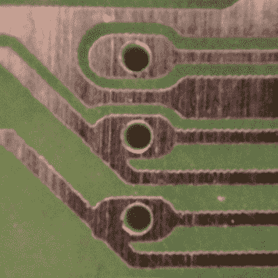
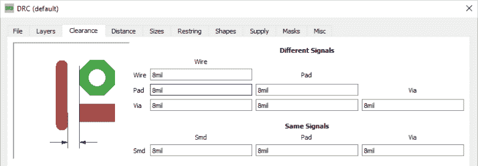
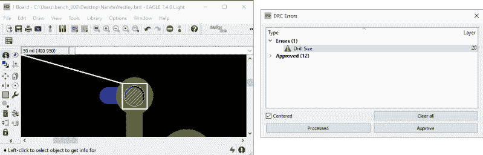
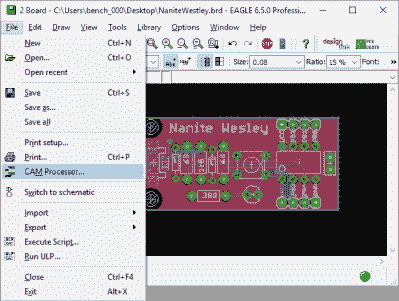

# 在一切事物中创建 PCB:Eagle DRC 和 Gerber 文件

> 原文：<https://hackaday.com/2016/09/29/creating-a-pcb-in-everything-eagle-drc-and-gerber-files/>

在创建 PCB 系列的下一篇文章中，我们将继续探索 Eagle。在第 1 部分中，我讲述了如何在 Eagle 中从头开始创建零件。[在第 2 部分](http://hackaday.com/2016/09/23/making-a-pcb-eagle-part-2/)中，我们用这部分创建了来自[简介](http://hackaday.com/2016/09/21/creating-a-pcb-in-everything-introduction/)的小样板。

这一次，我将检查设计规则检查(DRC)，或者确保你的板房能够真正制造出你设计的东西。我还将介绍 Gerber 文件的创建(这样你就可以在任何你想要的地方制作 PCB)，并把真正的艺术融入到你的电路板的丝网印刷和阻焊层中。

本系列的理念是探索不同的 EDA 套件和 PCB 设计工具，在每个套件和工具中设计相同的电路。你可以在这里查看本系列[的其余文章。](http://hackaday.com/2016/09/21/creating-a-pcb-in-everything-introduction/#series-of-posts-box)

### DRC–设计规则检查

What happens when you don’t run a DRC. Image credit: [Quinn Dunki](http://quinndunki.com/blondihacks/?p=1507)

板房生产不出无限分辨率的 PCB。它们的工艺有局限性，设计 PCB 时，走线不能靠得太近。每个板房的限制应可在其网页上找到，但一般来说，你看到的最小走线宽度为 6 至 8 密耳，最小走线间距为 6 至 8 密耳，最小钻孔尺寸为 0.3 至 0.5 毫米(约 12 至 20 密耳)。OSHPark 是较好的板房之一，宽度为 5 密耳，间隙为 5 密耳，钻头为 10 密耳。

设计规则检查(DRC)是如何发现过小、过密或简单重叠的走线。这就是你在把你的电路板送到工厂之前检查错误的方法。这并不是说当前版本的 Eagle 中的 DRC 是好的；KiCad 有实时 DRC 不断检查你的董事会。老鹰乐队需要你按几个按钮。不过，在接下来的几个版本中，这种情况会有所改变。

在纸板窗口中选择“工具”->“DRC”进入 DRC。会弹出这样的内容:

在 DRC 窗口中，您可以设置项目的最小走线宽度。默认值是 800 万，这在任何板房的能力范围之内。如果你在家里蚀刻，你可能想把这个调高一点。就目前而言，8 密耳的间隔就足够了，其余的默认设置也是如此。点击标签，看看你有什么选择。在这个窗口的底部有一个“检查”按钮。点击它，你就会看到你犯的所有错误。

当我在这个项目板上运行 DRC 时，我只有一个与本教程相关的错误。我用来连接 USB 连接器上的 VCC 引脚的过孔太小了。这次演习仍然在 OSHPark 和 Seeed 的能力范围之内，所以我只是点击了“批准”。如果你的走线靠得太近，或者离焊盘太近，DRC 会告诉你。

在将纸板文件发送到工厂之前，必须进行 DRC 检查。这不仅有助于你保持在你正在使用的晶圆厂的规格范围内，而且有助于你在布局过程中发现一些愚蠢的错误。

### Gerbers 将 PCB 送往工厂

如果你只是制作两层纸板，然后把它们送到 OSHPark、Seeed 或 DirtyPCBs，那么就没有必要做其他事情来制作你的纸板。所有常见的在线板房都接受鹰。brd 文件。如果您正在使用这些服务中的任何一种，您可以在订单页面上拖放您的纸板文件。这非常简单，几乎万无一失。

但是鹰。brd 文件不是制造电路板的行业标准方式。如果你需要 1000 块 PCB，正在制作 6 层(或更多)PCB，或者只是有一些奇怪的要求，你会想考虑先进电路，Gold Phoenix，和许多其他制造选择。这意味着你将不得不把你的板变成一个装满了 [Gerber 文件](https://en.wikipedia.org/wiki/Gerber_format)的 Zip 存档。

“Gerbers”是定义电路板每一层的文件集合。最上面的铜层是自己的文件，最上面的丝印层是自己的文件，最上面的阻焊层是自己的文件，如果你非常优秀，Gerber 允许你创建一个层来告诉机器人在哪里应用焊膏。

幸运的是，因为这个指南已经太长了，OSH Park 有一个很棒的指南以及生成 Gerber 文件所需的 CAM 文件。我强烈建议使用 OSH Park 的 CAM 文件来生成 Gerbers。它将生成以下文件:

*   **顶层**文件名。GTL
*   **顶部阻焊膜**文件名。全球电信系统(Global Telecommunication System)
*   **顶部丝印**文件名。矩形脉冲断开
*   **底层**文件名。GBL
*   **底部阻焊膜**文件名。GBS
*   **底部丝印**文件名。货物损坏
*   **电路板轮廓**文件名。GKO
*   **钻取**文件名。文本文件（textfile）

把所有这些文件放进一个文件夹，然后压缩。用十几种不同的在线 Gerber 浏览器[中的一种来检查你的 Gerber。关于从 Eagle 板生成 Gerber 文件，这就是您需要了解的全部内容。](http://gerblook.org/)

### 那是老鹰。

在几千字的篇幅和三篇文章中，我们讲述了如何在 Eagle 中创建新的定制器件，绘制原理图，将这些器件放置在电路板上，绘制走线，然后将电路板发送到工厂。这是对 Eagle CAD 最起码的介绍。现在我们可以把 Eagle 从[如何在一切](http://hackaday.com/?p=219469)中创建 PCB 的列表中剔除。

在本系列接下来的几篇文章中，我们将看看 Fritzing。如果您一直在阅读本系列，那么您已经知道在 Eagle 中制作 PCB 的正确方法。Fritzing 会教你错误的方法。像往常一样，我们在寻找关于我们接下来应该涵盖哪些软件的建议。如果你有想法，请在评论中留言。