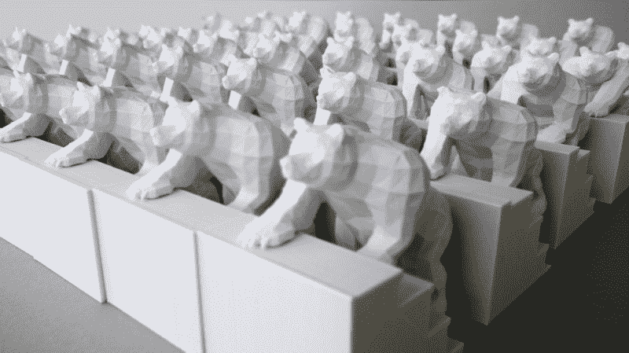

# 3D 打印定格动画

> 原文：<https://hackaday.com/2016/09/29/3d-printing-a-stop-motion-animation/>

你对 3D 打印机有多少权限？如果你有几个星期的空闲时间和几个线轴，你会做什么？或许你可以制作一个两秒钟的定格动画，名为[楼梯上的熊](http://www.thisiscolossal.com/2014/04/bears-on-stairs-dblg/)。

伦敦 DBLG 创意设计工作室的一项内部开发展示了一只熊爬上楼梯的流畅动画，乍一看似乎是动画。事实上，50 个印刷雕塑每个都展示了一个熊盘旋上升的例子。整个过程花了四周的时间进行印刷、雕塑修整，以及制作定格电影所需要的特别勤奋。

这个项目的核心是实验、创造，最重要的是享受乐趣。因此，虽然这些楼梯看起来并没有延伸到任何地方，但实际上它们会弯曲并考验任何制造者固有的创造精神。此外，3D 打印和定格的融合带来了愉悦的视觉享受。如果你想看一个相对“特征长度”的定格动画，看看[兔子的洞](http://hackaday.com/2013/11/09/the-rabbits-hole-creative-reuse-and-stop-motion-animation/)。