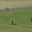

# 幻觉机器产生微小的视频片段

> 原文：<https://hackaday.com/2016/09/29/hallucinating-machines-generate-tiny-video-clips/>

幻觉是对实际上不存在的东西的错误感知——或者换句话说:对训练数据的一种可能解释。来自麻省理工学院和 UMBC 的研究人员开发并训练了一个生成机器学习模型，该模型学习随机生成微小视频。这种幻觉般的 64×64 像素的小剪辑看起来有些可信，但也有点怪异。

这些人工剪辑背后的机器学习模型能够从未标记的“野外”训练视频中学习，并且主要依赖于后续帧的时间一致性以及静态背景的存在。它学习将前景物体从背景中分离出来，并从场景中提取整体动态。然后，训练好的模型可以用于随机生成新的剪辑(如上所示)，或者从静态输入图像生成新的剪辑(如下成对所示)。

目前，该团队将剪辑的分辨率限制为 64×64 像素，持续时间为 32 帧，以减少所需的训练数据量，目前仍为 7 TB。尽管在真实感方面存在明显的缺陷，但在该团队进行的心理物理学研究中，约 20%的参与者认为这些小片段比真实片段“更真实”。该项目的代码(Torch7/LuaJIT)已经可以在 GitHub 上找到[，还有一个预先训练好的模型。该项目还将于 12 月在](https://github.com/cvondrick/videogan) [2016 NIPS 会议](https://nips.cc/)上展示。