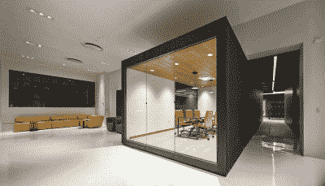
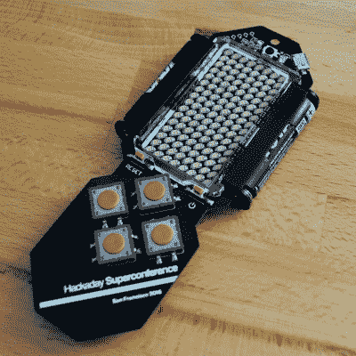

# 你在超级会议上能找到的一切

> 原文：<https://hackaday.com/2016/10/03/everything-youll-find-at-the-superconference/>

[2016 Hackaday 超级大会](https://hackaday.io/superconference/)是终极硬件大会，将于 2016 年 11 月 5 日至 6 日在加州帕萨迪纳举行。SuperCon 是关于硬件创造的——这个会议上的一切都是为了分享构建尖端电子产品的知识、兴奋、经验和动机。

我们为您提供 48 小时的时间，其中包括 21 场讲座、5 场研讨会、闪电讲座、4 顿饭、Hackaday 奖励派对、硬件徽章黑客竞赛、加密挑战赛，以及一个最优秀的黑客村。有一个周末帕萨迪纳将成为宇宙的硬件中心。[立即获得 Hackaday 超级大会的入场券](https://www.eventbrite.com/e/hackaday-superconference-2016-tickets-27343845177?aff=1003post)。

想了解更多？完整的演讲、作品和其他细节列表如下。当我们收到尚未列出的演讲者的最终确认时，我们期待着增加这个庞大的讲座和研讨会列表。

## 21 名发言人

*   ### 夸贝纳·w·阿杰曼//OpenMV 的故事

    夸贝纳·w·阿杰曼是 OpenMV 的联合创始人兼首席执行官。他曾就读于卡内基梅隆大学，拥有电子和计算机工程硕士和学士学位。Kwabena 开始从事 OpenMV 的工作是因为他热爱计算机视觉和微型计算机，而 OpenMV 项目就在这个交叉点上。

*   ### 秋叶 //小规模制造

    Akiba 总部位于日本，活跃于国际硬件黑客社区。他专门从事产品设计和制造，并教授如何在深圳的工厂生态系统中导航。不在深圳的时候，他会花时间在 Hackerfarm，这是他和一些朋友在日本农村创建的一个专注于农业和环境技术的黑客空间。他经营自己的公司 FreakLabs，是麻省理工学院媒体实验室的研究附属机构，也是联合国、国际原子能机构、谷歌和其他各种组织的设计顾问。

*   ### 女性消费科技不仅仅是凯蒂猫手机壳

    2015 年，阿曼达在伯克利完成了她在 IEOR 的工程硕士学位，她是创新技术和社会利益研究中心的班级项目团队的一部分，该团队开发了一个卫生棉条监控器的早期原型。这变成了我的。Flow 于 2016 年初被 HAX 收购，在那里，她和她的团队致力于开发一种全功能设备，该设备将以前所未有的方式为世界各地的女性聚合数据。

*   ### 史蒂夫·柯林斯当太空中出现问题时

    史蒂夫·柯林斯是美国宇航局喷气推进实验室的制导和控制工程师。史蒂夫是火星好奇号漫游车的巡航控制系统工程师，曾在许多美国宇航局/JPL 任务中工作，包括黎明、深度撞击、海洋、DS1 和伽利略。在飞行中，史蒂夫的工作包括保持飞船指向正确的方向，进行轨迹修正并弄清楚“到底发生了什么?”？?"

*   ### 克里斯塔尔·戈登 //生物感应

    克里斯塔尔·戈登博士是一名工程师和教育家。她在理工大学获得了电气和计算机工程双学位，在佐治亚理工学院获得了电气工程硕士和博士学位(辅修神经科学)。她的专长包括设计、原型制作和编程。她设计了生物启发和生物接口系统、高速电子设备和复杂系统模型。她的工作围绕着创建供公众、工程师和神经科学家使用的系统。这些系统的应用包括低功耗消费电子产品和神经假体。她热衷于将科学带给大众。

*   ### Bil Herd //制造一台家用电脑:前进的前沿阵地

    比尔·赫德是一名自学成才的硬件工程师。在 20 世纪 80 年代为 Commodore Business Machines 工作期间，他是至少七款家用计算机的首席工程师和设计师。他是一名仪器仪表设计师，精通 EMI/RFI、模拟、FPGA、高速数字、DSP，并且是 Hackaday 的视频制作人。

*   ### Samy Kamkar //开发(低成本)开发工具

    Samy Kamkar 是一名安全研究员，因创建了 MySpace 蠕虫病毒而闻名，这是有史以来传播速度最快的病毒之一。他(试图)用游戏来说明可怕的弱点。他展示了篡夺典型硬件的秘密手段，如 KeySweeper，将标准 USB 壁式充电器变成一个隐蔽的无线键盘嗅探器，以及 SkyJack，一个定制的无人机，它可以接管附近的任何其他无人机，使它们可以被控制为一个大规模的僵尸群。他揭露了隐私方面的问题，比如开发了 Evercookie，它出现在爱德华·斯诺登(Edward Snowden)披露的一份绝密的 NSA 文件中，展示了政府和企业用于秘密网络跟踪的技术，并发现和发布了围绕苹果、谷歌和微软移动设备进行的非法 GPS 和位置跟踪的研究。他继续以开源和开放硬件的形式为公众提供新的研究和工具。

*   ### Toshiro Kodera //通过电路元件的组合产生电磁回转特性

    小寺俊郎获得了工程学博士学位。2001 年从京都技术学院毕业。他加入了大阪理工学院，并于 2005 年加入了 ATR 国际京都，在那里他从事 60g Hz GaAs MMIC R&D。2008 年，他加入了蒙特利尔理工学院，在那里他开发了独特的微波设备。自 2014 年起，他一直是东京明成大学的副教授。Kodera 博士获得了多项学术奖项，是 IEEE 的高级成员。

*   ### 本·克拉斯诺 //以低成本快速建造先进的科学仪器

    Ben 在 Verily(谷歌生命科学)工作，创建高级原型，之前在 Valve 开发虚拟现实硬件。下班后，他花时间在各种项目上，这些项目通常涉及电路设计、机械加工和化学。你可以在本的 YouTube 频道“应用科学”上关注他的项目。

*   ### 大卫·克鲁姆 //重燃虚拟现实

    David Krum 博士是人机交互、虚拟现实、3D 交互和可穿戴计算领域的研究人员。他的工作将构建技术人工制品的工程方法与实验和用户评估的科学方法结合起来。他目前是南加州大学创新技术研究所混合现实实验室的副主任。克鲁姆博士拥有加州理工学院、位于亨茨维尔的阿拉巴马大学和佐治亚理工学院的学位。

*   ### Tod E. Kurt //利用电子/节点桌面应用解决物联网“最后一英里”问题

    Tod E. Kurt 经营着位于帕萨迪纳的物联网设备工作室 ThingM。他是流行的 USB 闪光灯和智能 LED 原型设备 BlinkM 的发明者。他是《黑客 Roomba》的作者，也是《MAKE》杂志的撰稿人。

*   ### Lia Martirosyan //通过众包和先进的基因测序进行医疗诊断

    Lia Martirosyan 是一名古典歌手、演员和创作作家。作为一名抒情女高音，她在美国演唱，并在中国、意大利、约旦和亚美尼亚演出。她的作品涵盖了个人在世界范围内为将残疾人融入犹豫不决的社会所做的工作，如中东、亚洲和南美洲；她的作品可以在《能力》杂志上看到。她也是能力团队的共同创始人，该团队的目标是通过音乐、录像、艺术和志愿者机会，为残疾人创造一个包容和关注的世界。Lia 的事业包括促进未诊断疾病和基因组测序的教育。

*   ### 莎拉·佩特库斯 //品尝脚:机械系统的行为怪癖

    萨拉·佩特库斯是来自内华达州拉斯维加斯的运动艺术家和机器人专家。她关注的领域是开发展示生物行为细微差别的机械系统。Sarah 拥有绘画和版画等传统艺术媒介的背景，并通过写作和说明系列艺术、平面设计和宣传来锻炼自己在这些领域的兴趣。她目前正与电子工程师马克·科赫合作，组建艺术团体“机器人军队”。

*   ### 凯特·里德 //不要忘记人民，为人类而设计

    凯特·里德是来自马萨诸塞州多佛的艺术家和发明家。她是一个社区思想家，在每个转折点思考人类的经验，用简单和经济的方式解决现实世界的问题。凯特的设计和发明已经在白宫、波士顿和纽约时装周、亚特兰大设计博物馆、Hackaday Superconference、麻省理工学院博物馆和波士顿儿童博物馆展出。凯特是布朗 RISD 大学双学位项目的学生。

*   ### Avidan Ross//45 秒披萨和其他食物

    Avidan Ross 是 Root Ventures 的创始人，这是一家专注于工程公司的风险投资和私募股权公司。他是 Particle.io 的董事会成员，也是 Hackaday 社区熟悉的许多公司的投资者，如 Shaper、Prynt 和 Plethora。他有计算机科学和网络/硬件工程的背景。

*   ### 德里克·舒尔特 //运动控制的高效处理

    从卵泡植入器到太空飞行光纤，Derek 致力于创新技术解决方案以应对多学科挑战。在 New Matter，他负责所有硬件和固件。在过去的 20 年中，他在初创公司和全球巨头的电信、医疗、工业和国防产品领域工作，融合了力反馈机器人、工业规模的太阳能跟踪器和激光引发的烟火技术。

*   ### Ken Shirriff //内部集成电路:逆向工程模拟和数字芯片

    肯·希尔瑞夫写了一个很受欢迎的博客(righto.com)，内容是从充电器到微处理器的逆向工程。他为 Arduino 创建了非远程库。Ken 以前是谷歌的程序员，拥有加州大学伯克利分校的计算机科学博士学位。

*   ### 明星辛普森 //制作精美的艺术 PCB

    明星辛普森是一名电子设计师。她最大的乐趣是设计对他人有用的物品和工具，这些物品和工具能给她带来灵感和快乐。她之前的工作包括机器人研究、无人机工作和一个卡片大小的电气参考电路板(为电子公司 Octopart ),现在到处都是电气工程师的钱包。她最近的作品是 Circuit Classics，一个复兴的老式电子硬件品牌。

*   ### Sprite_TM //缩小 GameBoy 颜色

    Sprite_TM，又名耶鲁安·多姆伯格，一直对硬件和软件结合的地方发生的任何事情感兴趣。他是一个令人难以置信的熟练的硬件黑客，能够快速逆向工程电路和代码，尽管几乎任何级别的混淆。他在自己著名的网站 spritesmods.com 上分享了这个不可思议的作品。2015 年，Sprite 加入 Espressif——ESP8266 的创造者——以低成本开发高性能无线芯片；他在用于编程 ESP32 的 SDK 的基础上工作。

*   ### 杰西坦克 //三元计算

    Jessie Tank 是一名电子工程专业的学生，拥有 20 年的 IT 经验。她从事过大量的课题，从激光、机器人、CPU 架构、复古视频游戏和计算机系统。她最近在阿拉斯加大学成立了一个新的机器人俱乐部。Jessie 喜欢探索新技术，并在《大众机械》、几家小型期刊和 Hackaday 上发表过文章。

*   ### 艾伦·耶茨 //灯塔；蒸汽虚拟现实跟踪系统

    艾伦是多学科的工程师。他在 90 年代末开始从事软件和电信行业，经营自己的 ISP，然后在 web 和企业应用程序开发方面花了很多年，最后才回到他的电气工程领域，研究无线网络硬件和最近的精密室内定位。Alan 来自悉尼，目前居住在西雅图，在 Valve 公司从事虚拟现实技术工作。

## 5 次研讨会

*   ### 马特·博格伦 //利用 Eagle 进行 PCB 设计

    马特·博格伦是一名硬件工程师、系统架构师和产品经理，他在 Altium 从事了 15 年的产品管理和硬件开发工作。他最近加入了 Autodesk，担任 Autodesk Circuits 总监。Matt 还在旧金山经营着几个受欢迎的工作室，在那里他教企业家、黑客、制造商等开发电路和电路板，并为工程师举办聚会，讨论硬件开发和电子设计。他曾在美国、澳大利亚和中国工作，为全球市场制造电子产品，在美国和中国都有工程团队

*   ### Sam Bobrowicz//FPGA:用 Microblaze 和 Arty 超越数字逻辑

    Sam Bobrowicz 从西雅图塔科马地区搬到了华盛顿州的普尔曼。他在华盛顿州立大学学习计算神经科学，后来被 FPGAs 的强大功能吸引住了，并为 Digilent 工作。现在，他是 Digilent 的应用经理，专门从事 Xilinx Zynq 开发。闲暇时，他喜欢玩滑板和背包旅行。Sam 坚信任何人都可以学习和使用 FPGA 技术，并继续制作和创建帮助用户加入的内容。

*   ### 艾琳·肯尼迪 //现场测试——黑客版

    艾琳·肯尼迪是机器人制造商。通过火星探索区的 Y 工作室奖学金，她被认为是安大略省的最高领导人。她是机器人任务的创始人，让制造商和环保主义者合作应对重大挑战。艾琳是机器人派对的主持人。她的第一个产品 RoboBrrd 是由 100 多人创建的。她被公认为英特尔的新兴年轻企业家。艾琳在 Fab 学院学习数字制造。

*   ### 约翰·派克 //披萨盒 DJ——打造自己的导电墨水 MIDI 控制器

    约翰·派克是一名制作人和视频主持人/内容创作者，为阿达果工业公司制作项目和视频。他还为 Make: magazine 和 Boing Boing 写稿，并作为一名自由撰稿人制作逃生室道具和魔术。

*   ### 克里斯汀·苏努&理查德·惠特尼 //物联网快速原型制作

    Christine Sunu 是通用电气在 BuzzFeed 新闻、技术和艺术开放实验室的物联网研究员，她在那里发布了连接情感、设计、媒体和物联网的开源实验。Christine Sunu 是通用电气在 BuzzFeed 新闻、技术和艺术开放实验室的物联网研究员，她在那里发布了连接情感、设计、媒体和物联网的开源实验。

*   理查德·惠特尼是粒子公司的产品副总裁。他之前在 Lockitron 负责产品，从麻省理工学院媒体实验室获得硕士学位，与 OK Go 合作，在 MOCA 大学、拉克马大学和 V&A 大学安装了设备，在美国宇航局工作，并制作了一个应用程序控制的酒柜——尽管不是按照这个顺序。

## 令人惊叹的场地

The brand new Supplyframe Design Lab

2016 年标志着[供应框架设计实验室](http://supplyframe.com/designlab)在帕萨迪纳开业。这个创意空间充满了最新最好的快速原型制作工具。这是一个完美的聚会场所，可以进行会谈，与新老熟人交流，佩戴会议徽章(以及任何其他您想使用的硬件)，并在 Hackaday 颁奖晚会期间放松。

就在隔壁的洛杉矶音乐学院已经被预定举办讲座和研讨会。学习和表演空间对 SuperCon 来说是完美的，并为我们计划的所有事情提供了大量不同的空间。

## 硬件徽章；黑客和加密挑战

The prototype of the Conference Badge

Voja Antonic 为 2016 年超级大会设计了一个电子硬件徽章。徽章是徽章黑客大赛的目标——向我们展示你在 48 小时内可以完成的最好的硬件和固件黑客攻击，或者让这成为你第一次闪烁 LED。这也是完成[Voja]为这次活动准备的加密挑战的关键。从[我们的硬件实践](http://hackaday.com/2016/09/28/new-supercon-badge-is-40-lighter-and-a-work-of-art/)中了解更多关于徽章的信息。

## Hackaday 颁奖晚会

[Hackaday 奖](https://hackaday.io/prize)是我们的一项工程计划，旨在挑战来自世界各地的人们，让他们利用自己的技能来建造一些有意义的东西。奖金为 30 万美元的比赛于 3 月开始，分五轮进行。超过 1000 个条目的范围已经缩小到 100 个。前五名的参赛作品将在周六晚上的 Hackaday 颁奖晚会上揭晓。您的超级入场券包括奖品派对的入场券。Hackaday 奖由 Atmel、Microchip、Digikey 和 Supplyframe 赞助。

## 食物和餐后酒吧

你的会议票包括周六和周日的午餐和少量早餐。超级会议位于帕萨迪纳老城区，这是一个餐馆、咖啡店和各种酒吧的惊人中心。出去吃饭是满足任何渴望的简单方式。在正式的晚间庆祝活动之后，有啤酒馆、酒吧、威士忌酒吧、水烟吧，以及介于两者之间的一切，让欢乐持续到深夜

## 旅行和住宿

供应框架设计实验室距离金线车站仅一个街区。附近还有三个停车场。请查看[本常见问题解答](https://hackaday.io/event/12753-2016-hackaday-superconference/log/45365-faq)了解更多信息。

我们推荐 AirBnB 在该地区住宿。

## 赞助商

2016 Hackaday 超级大会由 [Adafruit](http://adafruit.com/) 、 [Autodesk](http://www.autodesk.com/) 和 [Supplyframe](http://supplyframe.com/) 赞助。

[https://player.vimeo.com/video/182249089](https://player.vimeo.com/video/182249089)