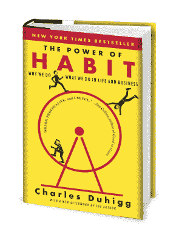

# 编程你的大脑，开辟你的生产力之路

> 原文：<https://hackaday.com/2016/10/14/program-your-brain-hack-your-way-to-productivity/>

大多数人都希望自己更有效率。一些人全力以赴，利用他们个性中的一些罕见的方面来迫使工作完成。他们中的一些人和朋友聊天。一些人进行视觉探索。对于不同类型的人有不同的方法。我注意到，大多数黑客都会寻找数据表。工程师参考。我们希望像解决技术问题一样解决问题。

It’s got the cover equivalent of click-bait, but the centimeter thick bibliography listing research sources at the back won me over.

有三本书给了我如何客观地看待我的大脑的初步提示，并开始对它进行一点点改造。这是查尔斯·杜希格的《习惯的力量》和米哈里·契克森米哈的《T2》和大卫·艾伦的《T4》。

我在一条偶然的道路上找到了这些书。我遇到的第一个是*习惯的力量，我发现这是一个小小的启示。它提出了习惯作为组成一个人的伟大计算机程序的功能的观点。大脑看到你在一遍又一遍地做一项任务，并学会去做。随着时间的推移，它不断优化和优化这个程序。一个人需要做的就是触发习惯循环，然后它就会运行。*

 *比如:打字。一开始，你要么参加一门课程，要么，如果你的父母让你一个人在电脑前呆上几个小时，你就通过搜索来达到一个像样的打字速度。这涉及到很多低头看键盘的动作。最终你会发现你根本不需要看键盘。根据你所处的阶段，你可能仍然是“t-h-i-n-k-i-n-g”，在你打字的时候，在头脑中放置每个字母。然而，最终你的大脑开始将它抽象化，直到它在某处储存了你通常使用的每个单词或组合键的手部动作组合。只有当你不得不拼写一个新单词时，你才会求助于旧的程序。

There are a few good youtube videos explaining how to pronounce his name.

但是“习惯的力量”更有启发性的部分是习惯在日常生活中的范围。从与朋友深入而有意义的谈话到系鞋带，一切都可能是你或你过去的某个人编写的程序。这也意味着可以写新习惯。一个人可以有意选择一种新的做事方式。所以我们表达感知的方式不是通过我们的日常生活，而是我们如何规划自己的行为。如果我们想停止一个坏习惯，我们只需要了解是什么触发了它，然后要么避免这些触发因素，要么让它们触发一段新的代码。这显然是一个黑客可以理解的概念。

这让我想到了第二本书。 [*流*](https://en.wikipedia.org/wiki/Mihaly_Csikszentmihalyi#Flow) 乘米哈里·契克森米哈。米哈里开始寻找让人们快乐的东西。不是那种“我刚听到一个有趣的笑话”的快乐，而是那种有人形容自己对自己在这个世界上的命运感到满足的快乐。现在，这不是一个写快速致富自助书的人。这是一个真正的科学家发表一生的研究，他提出了令人信服的论点。他发现人们对待工作的方式有一个共同点。我正在简化一本伟大的书和一篇伟大的论文，但这归结为将一项任务游戏化，并推动自己达到极限，以从工作中抽象出乏味并感受成就感。

“No no, make sure the power tie is hanging outside of the coat.” -1980s

这似乎也是一个积极的启示。这是一个工作算法。一种将一天有限的精力分配得更远的方法。

对我来说，最后一本书把这两个贬损的概念联系在了一起。完成任务:无压力生产的艺术 是一本完全不同的书。对 80 年代打着权力领带的商务人士来说，这是一个最佳的生产力公式。大多数概念对于现代工作流来说都有点过时了，但是它们可以被锤炼以适应现代工作流。然而，对我来说，这是一本代码食谱。这里有一种方法，一个人可以应用这些概念，挑选新的习惯，游戏化的工作，并理解工作的基本原则来建立一个系统。

最后，这些让我觉得，至少，我对自己脑子里在想什么有了某种高度的理解。为什么我比其他人更喜欢一些任务？为什么我在度假时更有条理而不是更少？一个高效的人如何安排他们的一天？所有这些都让我开始有能力真正控制自己的工作习惯。

我离大师还很远，但我正在取得显著的进步。我很有兴趣看看是否有任何读者有类似的启示或书籍推荐。*