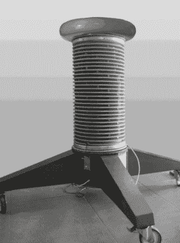

# 堆叠参考电压至高压极限

> 原文：<https://hackaday.com/2016/10/03/stacking-voltage-references-to-high-voltage-extremes/>

小时候，我们可能都有自己理想的职业道路。作为一个成年人，你是否仍然怀有成为宇航员或火车司机的秘密愿望？还是其他工作的持有者变成了你羡慕的人？

作为一名业余作家，承认对半导体应用笔记作者的潜在嫉妒可能没有太大争议。没错，他们的工作通常是对相关产品的常规用途进行枯燥的演示，但偶尔他们也会生产一些超出设备预期用途的产品，如此与众不同，以至于你会羡慕他们能够利用大型半导体公司的资源进行实验。

以德州仪器 2013 年 5 月的应用报告 SBAA203 为例。"[堆叠 REF50xx 用于高压基准电压源](http://www.ti.com/lit/an/sbaa203/sbaa203.pdf)(PDF)。一家专门从事高电压精确测量的实验室面临的问题是，他们用作基准电压源的齐纳二极管或雪崩二极管的堆叠缺乏精度和稳定性，因此研究了 [REF5010 10V 精密基准电压源](http://www.ti.com/product/REF5010)的特性。

You’ll never be satisfied with a mere Zener diode again.

他们发现，通过忽略器件的数据手册，直接将其输出引脚连接到电源引脚，REF5010 就相当于一个理想的齐纳二极管。在这种模式下，多个基准电压源可以像真正的齐纳二极管一样堆叠，并且可以用非常高的电压创建非常稳定和高精度的基准电压源。他们制作了一个 PCB，堆叠十个 REF5010s 用于 100V 基准电压源，然后堆叠十个用于 1000V 基准电压源。让它稳定 24 小时，他们实现了+/- 2.5ppm 的精度，3.5 个月后，他们建立的 10 个 1000V 基准的平均读数为 1000.022V

1000 伏的参考电压足够令人印象深刻，但他们还没有完成。他们构建了一系列电路板，容纳 500 个 REF5010s，用于 5KV 基准电压源，并将其中 20 个堆叠起来，构成 100KV 基准电压源。这些电路板被安装在一个塔上，看起来与我们有时在这里看到的特斯拉线圈没有什么不同。他们指出，这可能会打破在一台设备中同时使用 TI 零件的记录。

这很可能是 Hackaday 上第一个极高电压精密基准电压源，但我们当然也有关于 HV 的文章。今年早些时候，我们有一个来自[Steven Dufresne]的三人组:[一群高压源](http://hackaday.com/2016/05/26/a-cornucopia-of-high-voltage-sources/)寻找制造 EHT 的方法，[寻找高压，但不要忘记当前的](http://hackaday.com/2016/06/08/high-voltage-please-but-dont-forget-the-current/)寻找为应用选择正确的高压电源，[寻找高压](http://hackaday.com/2016/06/15/wrangling-high-voltage/)寻找施工技术。

谢谢[内森]的提示。