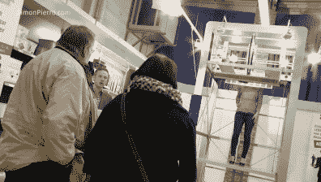
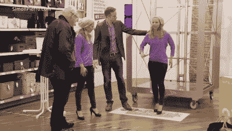

# 3D 打印真人很吓人

> 原文：<https://hackaday.com/2016/10/09/3d-printing-real-people-is-scary/>

创造一个人的两个完美复制品只有两种方法:3D 打印和双胞胎。3D 打印魔术师【西蒙】~~魔法师~~ 3D 打印师利用他的秘密知识创造出完美的幻觉:一个 [3D 打印真人恶作剧](https://www.youtube.com/watch?v=NMeODpNg_k8)。

你可能已经开始怀疑新型 3D 打印机背后的营销活动所做的声明，但百货商店中不精通技术的顾客相信任何事情。[西蒙]告诉他们，他可以扫描真人，并在几分钟内 3D 打印真人大小的副本。此外，复制品与原件几乎无法区分。它还能响应简单的语音命令，四处走动，做机器人。

    

恶作剧的受害者不愿意相信，但[西蒙]毫不害羞地通过模仿一名观众来展示他不可思议的机器。仔细看，我们甚至没有破坏实际的复制机制。但是你也能弄清楚建造良好的道具是如何伪造建造过程的吗？享受表演吧。

 [https://www.youtube.com/embed/NMeODpNg_k8?version=3&rel=1&showsearch=0&showinfo=1&iv_load_policy=1&fs=1&hl=en-US&autohide=2&wmode=transparent](https://www.youtube.com/embed/NMeODpNg_k8?version=3&rel=1&showsearch=0&showinfo=1&iv_load_policy=1&fs=1&hl=en-US&autohide=2&wmode=transparent)

