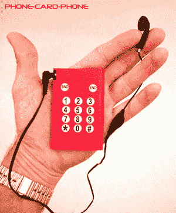

# Retrotechtacular:纸质手机到底怎么了

> 原文：<https://hackaday.com/2016/10/19/retrotechtacular-whatever-happened-to-the-paper-mobile-phone/>

这是世纪之交流传的一个更有趣的消费科技故事之一，这是一款使用多层折叠纸质电路板制造的一次性手机，电路板上印有导电油墨。即使以当时的标准来看，它的功能也是基本的，因为它没有显示屏，唯一的功能是打电话，但目标价格只有 10 美元，这并不重要。它是新泽西州一位多产发明家的创意，旨在成为一系列使用相同技术的纸质电子设备中的第一款，包括内置信用卡支付功能的手机和基本的笔记本电脑型号。

10 美元一部手机的想法在今天似乎并不引人注目，现在 sum 可能会让你拥有一些功能远远超过当时流行的 Nokias 和类似产品的东西。但是，当你考虑到那些 Nokias 在没有合同的情况下可能会有三位数的价格，以及人们认为令人兴奋的新功能是集成天线或可更换的彩色塑料盖，而不是我们今天使用的多核处理器或高分辨率相机时，一部如此便宜以至于可以一次性使用的手机注定是非常具有破坏性的。

The web site publicity shot for the disposable paper phone.

该产品的[网站](https://web.archive.org/web/20010330073206/http://www.dtcproducts.com/home.html) (Wayback Machine 链接，我们已经跳过了 Flash 介绍)有该设备的图片，休息时间下方的视频展示了其发明者接受采访时使用中的照片。但是到了 2002 年底，Wayback 机器从服务器上检索到 404 个错误，关于这个产品的消息就不多了。没有一个迹象曾经来过我们的方式；有上市的吗，你有吗？

受益于 15 年后见之明，为什么我们在过去十年的最初几年没有纸手机作为昙花一现的一部分？这不是一个没有前途的产品；一部十美元的手机可能会获得巨大成功。对廉价笔记本电脑的描述听起来与今天的 Chromebooks 没有什么不同，它可以与远程服务器进行软件对话。

你们中的一些人可能会声称该产品是 vapourware，但鉴于他们展示了一个工作原型，我们会犹豫是否要走那么远。可能的情况是，在竞争加剧到无法再竞争的程度之前，它没有找到所需的部件价格和制造便利性的组合来开拓其目标市场。如果你曾经拆开过那个时期的典型手机，你会对它们为什么不是廉价设备有所了解，例如，当时的 RF 滤波器模块是单独调节的精密元件。纸张和油墨印刷电路板仍然是一项技术，即使是现在也还有很长的路要走，也许这个想法只是太超前了。与此同时，在相对较短的时间内，简单的糖果棒手机价格下降到足以吸引 10 美元的买家花更多钱购买更好的产品，因此机会之窗已经过去。

 [https://www.youtube.com/embed/qoKJ28Yl5eY?version=3&rel=1&showsearch=0&showinfo=1&iv_load_policy=1&fs=1&hl=en-US&autohide=2&wmode=transparent](https://www.youtube.com/embed/qoKJ28Yl5eY?version=3&rel=1&showsearch=0&showinfo=1&iv_load_policy=1&fs=1&hl=en-US&autohide=2&wmode=transparent)

在过去的几年里，我们多次被许诺一次性消费电子产品印刷在纸上，例如，有一段时间，我们的报纸和杂志似乎会以《哈利·波特》和《T2》风格的动态图像为特色。但这似乎是一个传统电子世界已经走在传统媒体前面的领域，除了高端杂志上的一些精品广告之外，这项技术从未突破价格壁垒。我们确实有非常便宜的带有动态图像的手机和报纸，但它们分别来自中国廉价制造的传统电子产品和平板电脑上的网络新闻来源。

去年，我们研究了用于原型制作的[导电墨水](http://hackaday.com/2015/02/13/ask-hackaday-are-conductive-inks-going-to-make-it/)，多年来，我们已经在[多个项目中使用了它们](http://hackaday.com/tag/conductive-ink/)。这是一项仍在等待十美元消费产品的技术吗？