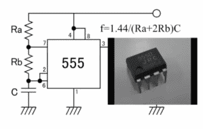
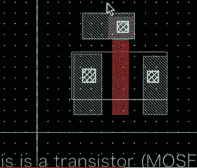
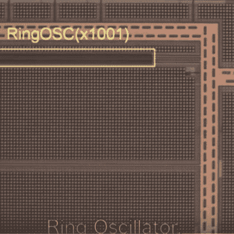

# LED 闪烁–至尊版

> 原文：<https://hackaday.com/2016/10/13/blinking-an-led-extreme-edition/>

这个[黑客在闪烁的 led 上的视频](https://www.youtube.com/watch?v=Pt9i2ABe_mE)从未得到应有的认可。在我写这篇文章的时候，点击量只有 61 次，但它确实是一件艺术品。相信我，滚动到文章的底部观看它，你不会失望的。

不服气？好吧，我来给你讲讲它，以及它在日本创客界打开的世界。我们都眨过 LED。也许只是为了测试一个微控制器，像[最简单的 Arduino 例子](https://www.arduino.cc/en/Tutorial/Blink)。

或者我们是一个有点老的学校，用经典的 555 来做这件事。或者可能像我一样，你们一起经历了一个黑客阶段[相移](http://41j.com/blog/2014/12/phase-shift-oscillator/)和[其他振荡器](http://41j.com/blog/2014/12/npn-common-collector-colpitts-oscillator-notes/)因为嗯……这很有趣！

但[Junichi AKITA]有更极端的品味，认为定制 IC 布局是一条出路。[Junichi]设计了一个由触发器组成的环形振荡器，然后手工布局每个 MOSFET，将每一层精确地放置在应该制造的位置。

最终的设计由日本的一家学术穿梭服务公司制造(有点像著名的 [MOSIS 服务公司](https://www.mosis.com/products/fab-schedule))。结果是在集成电路的右上角出现了一个微小的电路。当然[Junichi]随后不得不进行丝焊(查看视频，这是一台很酷的 20 世纪 80 年代风格的 Westbond 机器，在日本仍然非常流行)。

  IC Layout… by hand!  Optical image of the fabricated circuit.

[Junichi]将芯片直接键合到 PCB (COB)上。我假设，纯粹是为了讽刺，一个 555 和一个基于 ATtiny 的振荡器也在电路板上。

我猜你可能有几个挥之不去的问题。首先，你可能会哀叹缺乏自己的制造设施(我仍在关注那些不时出现在易贝的二手 1 微米晶圆生产线)。其次，你可能会问自己…为什么？

这两个问题在某种程度上都是由 [MakeLSI 项目](https://www.facebook.com/makelsi)给出的答案。这个在日本不断发展的项目似乎为各种项目打开了半导体制造的大门。

虽然我的日语还不够好，不能完全理解正在发生的事情，但很明显有许多令人敬畏的项目正在进行。包括在[矢量图形包](http://ifdl.jp/make_lsi/index.php?plugin=attach&refer=FrontPage&openfile=15MkLSI-C89main.pdf) (Inkscape)中设计的 IC 布局，以及包装有有趣布局、动漫人物和二维码的模具图像等乐趣。

更多精彩的图片和信息(不幸的是都是日文)你可以在脸书的或者他们的[主页](http://ifdl.jp/make_lsi/)上查看。

 [https://www.youtube.com/embed/Pt9i2ABe_mE?version=3&rel=1&showsearch=0&showinfo=1&iv_load_policy=1&fs=1&hl=en-US&autohide=2&wmode=transparent](https://www.youtube.com/embed/Pt9i2ABe_mE?version=3&rel=1&showsearch=0&showinfo=1&iv_load_policy=1&fs=1&hl=en-US&autohide=2&wmode=transparent)

