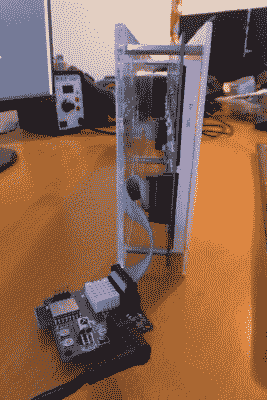

# 64×16 LED MQTT 洗衣显示器

> 原文：<https://hackaday.com/2016/10/11/64x16-led-mqtt-laundry-display/>

当 MQTT 代理接收消息时，您希望能够看到它们。[Xose Pérez]已经建立了一个向他发送通知的系统，但他有一对 32×16 的 LED 矩阵，所以他[决定制作一个大而亮的标志](http://tinkerman.cat/mqtt-led-matrix-display/)，让他知道何时有重要消息发送给经纪人。

[Xose Pérez]已经建造了一个[洗衣监控器](http://hackaday.com/2016/08/01/your-laundry-is-done/)，它向 MQTT 经纪人发送信息，这样他就不会忘记他的衣物放在洗衣机里。为了和经纪人沟通，他用了一个 ESP-12。他已经为矩阵使用的 Holtek HT1362C 显示器驱动程序移植了 Arduino 库，以便与他的驱动板一起工作。

他想尝试 SMD 焊接，所以他制作了一个定制的 PCB 来容纳 ESP-12、电源、无源元件和连接器，他描述了他的方法和结果。代替硬编码的信息，他希望系统是可配置的，并显示不仅来自他的洗衣系统，而且来自其他传感器的信息。运行在 ESP-12 上的由 jQuery 和 WebSockets 构建的 web 界面允许用户订阅代理上的主题，并在有效负载可用时在显示器上显示定制的名称和值。

总而言之，[Xose Pérez]发布了一个很棒的教程，其中他详细介绍了他构建的硬件、他使用的库、SMD 焊接、他如何制作外壳，甚至他在 IDE (PlatformIO)中的选择。他还在 bitbucket 上发布了软件、主板设计和机箱型号软件和硬件。最终结果是一个看起来很棒的 LED 矩阵，不仅显示他的洗衣状态，还显示他想从 MQTT 经纪人那里得到的任何信息。

如果您想尝试 MQTT，ESP8266 是一个非常棒的传感器节点设备，任何 Linux 设备(如 Raspberry Pi)都是一个简单的代理。查看[埃利奥特·威廉姆斯] [Minimal MQTT 系列](http://hackaday.com/2016/05/09/minimal-mqtt-building-a-broker/)，您将立即启动并运行。