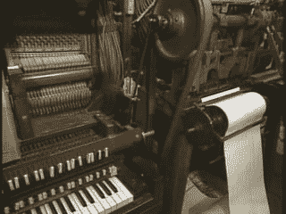

# Retrotechtacular:苹果制造的钢琴卷纸][

> 原文：<https://hackaday.com/2016/10/17/retrotechtacular-piano-rolls-made-by-apple/>

钢琴卷纸是世界上持续时间最长的记录媒体，也是第一个数字记录媒体。它们在 1896 年至 2008 年间大量生产，今天你仍然可以买到一些，尽管它们是特产。他们背后的技术，无论是播放器还是录像机，都非常棒。

[lwalkera]给我们发来了这个精彩的视频(嵌在下面)，它提供了 80 年代后期对[QRS 唱片公司](https://en.wikipedia.org/wiki/QRS_Records)作品的一瞥，主持人似乎很喜欢它的每一分钟。

播放器钢琴足够酷，当它经过时，它们的“拉杆”通过纸卷上的孔吸入空气，并气动激活按键。但是你想过面包卷是怎么做的吗？

 有些是在录音钢琴上现场制作的，钢琴会刮擦滚动的复写纸轮产生划痕，这些划痕随后会被转移到生产中的打孔机上。但另一台机器让技术人员以他(在这种情况下)想要的任何速度演奏乐曲，并有保持杆，使一些音符持续。这是上个世纪之交的工程奇迹。当然，面包卷可以用打孔机手工切割。

但是科技并没有让纸钢琴卷单独存在。在 80 年代中期，QRS 公司在其苹果电脑上安装并运行了电脑钢琴卷帘窗编辑软件。事实上，他们的生产设置似乎是由一个苹果驱动的 16 个同步打孔机。现代四轴数控机床，吃你的心了。

如果你喜欢音乐，或旧电脑，或两者兼而有之，这个视频是一个宝石。当然，我们已经看到了那些阅读钢琴曲的黑客们——这里的和这里的和[甚至这里的](https://hackaday.com/2015/11/16/citizen-scientist-hedy-lamarr/)——物理机器，带着它们的滑轮和轮子以及呼哧呼哧的气动系统，它们本身仍然足够酷。

 [https://www.youtube.com/embed/i3FTaGwfXPM?version=3&rel=1&showsearch=0&showinfo=1&iv_load_policy=1&fs=1&hl=en-US&autohide=2&wmode=transparent](https://www.youtube.com/embed/i3FTaGwfXPM?version=3&rel=1&showsearch=0&showinfo=1&iv_load_policy=1&fs=1&hl=en-US&autohide=2&wmode=transparent)

