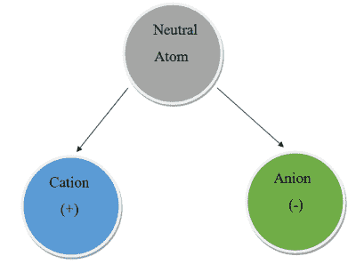
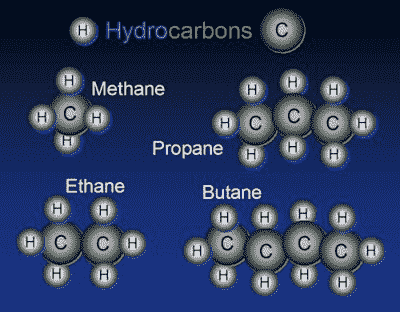

# 化学命名法

> 原文：<https://hackaday.com/2016/10/20/chemical-nomenclature/>

看一些热门加工食品的配料表，典型的黑客脸上会产生疑惑的表情。磷酸三钙、硝酸硫胺、锌蛋白盐、盐酸吡哆醇……到底是谁想出这些名字的？原来化学名称结构的疯狂是有方法的。其中一些是众所周知的，如氯化钠(NaCl)和过氧化氢(H2O2)。其他的……就没那么多了。在化学的早期，化学物质是根据它们的外观、作用和用途来命名的。小苏打、笑气和蚁酸(*蚁酸*在拉丁语中是蚂蚁的意思，负责蚂蚁叮咬时的刺痛)等等。随着时间的推移，越来越多的化学物质被发现，需要一个更加结构化的命名规则。今天，上述物质分别被称为碳酸氢钠(NaHCO3)、一氧化二氮(N2O)和一种羧酸(R–COOH，把“R”看作一个变量)。

在今天的文章中，我们将讨论这种命名结构，以便下次您欣赏汤罐头的背面时，不会看起来如此困惑。我们还将涵盖每个生物黑客新手都应该熟悉的几个常见定义。

## 命名离子化合物

当两个或两个以上的原子粘在一起时，就形成了化合物。其中一种方法叫做离子键。当原子之间的电荷存在差异时，就会发生这种情况，黑客应该很熟悉这种情况，因为它涉及正负电荷。原子通常是中性的，带负电的电子和带正电的质子数量平衡。然而，通过获得或失去一个或多个电子，许多电子很容易带电。当这种情况发生时，原子被称为离子。如果它带正电荷，我们称它为阳离子。如果它带负电，我们称之为**阴离子**。

Image via [Pediaa](http://pediaa.com/difference-between-cation-and-anion/)

元素周期表前三组中的原子倾向于形成阳离子，因为它们具有很少的价电子，这使得它们容易被去除。钠阳离子简称为钠离子。这些组不需要更改名称，因为它们的费用通常与它们的组号相同。

对于第 4 组到第 7 组来说有点不同。这些原子倾向于形成阴离子，因为它们的价电子层几乎是满的。他们很乐意窃取一个电子，与最近的惰性气体成为等电子态，这是最稳定的状态。当一个原子变成阴离子时，字母“ide”被附加到末尾。让我们来看一个例子——氯化钠。

钠原子会失去它的单价电子，而氯原子会欣然接受它。这就产生了两种离子——一种钠离子和一种氯离子。因为它们现在有不同的电荷，它们粘在一起形成离子键。钠原子仍称为“钠”，但氯原子变成了“氯”。

大多数离子化合物是二元的。首先是阳离子名称，然后是阴离子名称。更多的例子是溴化钠(NaBr)，氟化钙(CaF2)，氮化锂(Li3N)…你明白了。

## 命名分子化合物

对于离子键，我们在处理失去和获得电子以及形成离子。原子也可以互相分享电子。当他们这样做时，我们称之为共价键。大多数共价键发生在非金属之间，其结果被称为**分子化合物**。

命名惯例类似于离子化合物。名称的第一部分是公式中的第一个原子。公式中的第二个原子在末尾添加了“ide”。例如，HCl 被称为氯化氢。

一对元素通过共价键形成不同的二元化合物是很常见的。当这种情况发生时，希腊前缀被用来表示原子的数量。回想一下，希腊语前缀是 mono (1)，di (2)，tri (3)，tetra (4)，penta (5)等等。所以二氧化碳的分子式应该叫做二氧化碳。传统上，如果只有一个原子，那么第一个原子就没有 mono 前缀。但是如果不止一个，规则也是一样的。例如，N205 被称为五氧化二氮。

## 命名有机化合物

正如你们大多数人已经知道的，有机化合物是特殊的。毫不奇怪，它们有自己特殊的命名法，我们将简要介绍一下。有机化合物是含有氢和碳的化合物。当化合物仅由氢和碳组成时，它们被称为碳氢化合物。其中最简单的称为烷烃，其名称取决于分子中碳原子的数量。

 例子包括:

| 甲烷 | 甲烷 |
| 乙烷 | C2H6 |
| 丙烷 | C3H8 |
| 丁烷 | C4H10 |
| 戊烷 | C5H12 |
| 己烷 | C6H14 |
| 庚烷 | C7H16 |
| 辛烷 | C8H18 |
| 壬烷 | C9H20 |
| 癸烷 | C10H22 |

## 酸

酸是溶于水时产生氢离子的物质。你可能已经注意到了上面的氯化氢的例子。这是正确的。只有当它溶于水时，它才变成盐酸。

根据定义，酸至少需要一个可电离的氢原子。为了给一种酸命名，我们把氢中的“gen”去掉，把二次元的“ide”换成“ic”。一些例子是氢氟酸(HF，可能是你遇到的最糟糕的酸)和氢溴酸(HBr)。

这篇文章只是触及了化学术语的表面，但是应该会给你一个很好的基础，希望下次你读到你最喜欢的加工食品的成分时能有所了解。