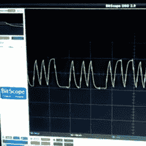

# 掉进兔子洞又出来:耳机插孔上的串行

> 原文：<https://hackaday.com/2016/10/21/down-the-rabbit-hole-and-back-out-again-serial-over-headphone-jack/>

[ttsiodras]讲述了一个在华硕 MemoPAD (ME103K)平板电脑上安装定制 Debian 内核的史诗故事。跳到故事的结尾，他发现当系统启动时，耳机插孔上似乎出现了串行数据，但信号失真严重，他无法简单地解读它。解决方案原来是[附加一个电平转换器芯片](http://electronics.stackexchange.com/questions/262853/noise-capacitance-related-in-serial-signal/)。

电平转换器是一个非反相放大器，通常带有一个[施密特触发器](https://en.wikipedia.org/wiki/Schmitt_trigger)用于抗噪声。在这种情况下，它就像一个“二进制化器”，当输入高于阈值时输出高电压，当输入低于阈值时输出低电压。当您需要清理杂乱的数字信号时，它是正确的部分，在这种情况下，它工作得很好，因为容性失真效应会降低信号的前沿和后沿，保持串行数据的时序完整。

那是剧透。如果你想阅读关于在 Android 设备上安装定制 Linux 的文章，可以看看[ttsiodras]的第一篇文章，其中他[备份了机器](http://android.stackexchange.com/questions/124344/trying-to-flash-a-system-img-i-took-with-dd-failing)，第二篇文章中他[安装并运行了他的定制内核](http://android.stackexchange.com/questions/124857/selinux-and-chroot-system-call)。如果你曾经面对一个还没有人拥有的 Android 平板电脑，或者如果你只是有 DIY 的倾向，这应该可以帮助你开始。

使用串行音频插孔实际上[并不罕见](http://hackaday.com/2013/05/30/giving-the-nexus-4-a-serial-port/)，并且[发现一个在启动时监听的串行终端](https://hackaday.com/2013/12/14/reverse-engineering-serial-ports/)是我们最喜欢的将 Linux 操作系统嵌入到奇怪设备的方法。因此，当你看到一个有趣的、失真的信号以 115，200 波特的速度输出时，花点时间清理一下它的边缘，看看你得到了什么。