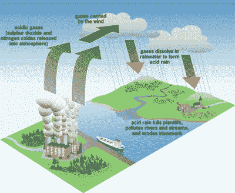
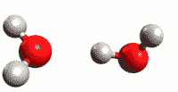
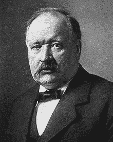

# 酸、碱和氢的力量

> 原文：<https://hackaday.com/2016/11/10/acids-bases-and-the-power-of-hydrogen/>

20 世纪 70 年代是美国公民面临酸雨威胁的十年。几年前就已经知道它的存在，但是问题的来源尽他们最大的努力来压制这个信息。直到环境破坏变得足够严重，引起了全国的关注，才导致美国颁布法规来阻止酸雨。

[Source](http://acidrainawscience.weebly.com/diagram.html)

事实上，大多数公众可能还不知道酸雨到底是什么。非化学家脑海中默认的想象是大滴的电池酸液从天而降，吞噬一切。然而，事实并非如此。纯水的中性 pH 值为 7。正常的雨水实际上是微酸性的，因为它从空气中吸收二氧化碳，生成碳酸。但是，当这种“正常”的雨水与工业工厂的副产品混合时，这些副产品向大气中排放大量的二氧化硫和氧化氮，雨水变得更加酸性，pH 值降至 3。这场“酸雨”具有柑橘类果汁的酸度，所以它不会让世界着火。但它会对当地的生态系统造成严重破坏。

20 世纪 90 年代，政府对大型工厂排放的二氧化硫和一氧化氮制定了严格的规定，基本上消除了美国的酸雨。酸雨的起起落落是一个很好的例子，说明了为什么我们应该在定义我们生活的基本化学方面教育自己，即使我们可能不是真正的化学家。在这篇文章中，我们将回到你大学的第一年，讨论酸和碱的定义。巩固我们对酸碱度的理解。对于未来的生物黑客来说，在他们的工具箱中拥有这些知识是必不可少的。

## 氢的力量

我们的旅程从普通的老水开始。你可能认为纯水只不过是 H2O。这张照片的问题在于水有自动电离[的趋势。发生的情况是，一个氢原子将脱离一个水分子，加入另一个水分子。这就产生了两种分子——氢离子和氢氧离子。你可能已经猜到了，+H [3] O 带正电荷，而-OH 带负电荷。该过程在 25℃的水中形成平衡，因此溶液保持中性。这意味着 25°C 的纯水由 H [2] O 和等份的+H [3] O 和-OH 组成。](https://en.wikipedia.org/wiki/Self-ionization_of_water)

向水中加入不同的分子会破坏水合氢离子和氢氧根离子的平衡。

*   当[+H [3] O] = [-HO]时，溶液为中性。
*   当[+H[3]O】>[-HO]时，溶液是酸。
*   当[+H[3]O】<[-HO]时，解是一个基数。

溶液中+H [3] 0 离子的数量将决定溶液的酸性。通常，化学家使用摩尔来计算样品中原子或分子的数量。鼹鼠有点像“化学家的一打”。一打是一个  十二的计数，一对情侣是两的计数，鼹鼠是 6.022 x 10 ^(23) 的计数。然而，水溶液中存在的+H [ 3 ] O 离子的数量可以相差几个数量级，因此创建了另一种秤来更好地量化这一数量。它被称为 pH 标度，pH 代表“氢的力量”。

为了避免我们的大脑被束缚在不太有用的转换中，假设中性水中+H [3] 0 离子的浓度约为 1.0×10^(-7)摩尔。所以我们说这种中性水的 pH 值是 7。随着+H [3] O 离子数量的增加，pH 值降低。橙汁的 pH 值约为 3.5，这意味着它的+H [3] O 浓度为 1.0 x 10 ^(-3.5) M。氨的浓度为 1.0 x 10 ^(-11) M，这使它的 pH 值为 11。你明白了。很简单吧！

pH 值是对数的，所以 pH 值为 3 的酸雨的+H 离子浓度是 pH 值为 6 的典型雨水的 10 x 10 x 10 或 1000 多倍。

## 约翰内斯·布朗斯特德

在我们的[上一篇文章](http://hackaday.com/2016/10/20/chemical-nomenclature/)中，我们将酸定义为溶于水时产生氢离子的物质，这就是众所周知的[阿伦尼乌斯](https://en.wikipedia.org/wiki/Svante_Arrhenius)模型。虽然这个定义对于你作为生物黑客会遇到的大多数人来说已经足够了，但我们应该花时间提一下丹麦化学家[约翰纳斯·布朗斯特德](https://en.wikipedia.org/wiki/Johannes_Nicolaus_Br%C3%B8nsted)在 1932 年提出的一个更具包容性的定义。他的定义可以解释酸和碱，而不需要它们溶解在水溶液中。但是更深入一点。

Svante Arrhenius 1859 – 1927

考虑上述水如何自动电离的例子。我们解释说，一个氢原子从一个水分子中脱离出来，然后与另一个水分子结合，生成 H [3] O，并留下一个 OH。虽然这有助于解释，但它并不完全*准确。当氢原子离开它的水分子时，它也就离开了它的电子。由于氢原子由一个质子和一个电子组成(H 中没有中子)，这意味着它基本上是一个自由质子。现在，这个质子带正电荷，水中的氧带一点负电荷。所以质子会被其他 T4 分子上的氧原子吸引。H [3] O 可以更准确地写成[H [2] O * H+]。了解到酸性溶液中的游离氢离子是(氢)质子，就可以得出更好的定义。布朗斯台德的定义将酸定义为具有质子供体的溶液，将碱定义为具有质子受体的溶液。*

考虑氢氟酸的例子。当你将氟化氢(HF)与水混合时，氢原子和氟原子会分解，这个过程被称为[离解](https://en.wikipedia.org/wiki/Dissociation_(chemistry))。氢原子把它的电子和氟一起留下，所以你会得到这样的结果:

**HF**(*AQ*)**+H[2]O**(*l*)**<–>+H[3]O**(*AQ*)**+-F**(*a**q*)(*AQ*的意思是

根据 Arrhenous 定义，HF 产生自由氢离子，因此是一种酸。根据布朗斯台德的定义，HF 给一个质子(没有电子的氢原子)，因此是质子给体。这也使它成为一种酸。

现在你应该对什么是酸和碱有了一个基本的概念，以及为什么它们是这样定义的。在我们研究更令人兴奋的氨基酸——蛋白质和地球上所有生命的组成部分之前，这些基本知识是必需的。