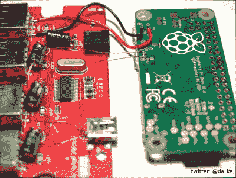

# 你应该阅读的规范:美国宇航局工艺标准

> 原文：<https://hackaday.com/2016/11/03/specifications-you-should-read-the-nasa-workmanship-standards/>

“Reflective of the typically idiosyncratic way engineers of this era explored the human condition. The shitty gradient show’s the deep struggle with deadlines and their personal philosophy on the tyranny of the bourgeois. ” – An excerpt from a confused student’s art history paper after the standard is installed in the Louvre.

NASA 的工艺标准绝对漂亮。我的意思是在这个世界的最大范围内。如果我对挂在卢浮宫的艺术品有发言权，我会把它们挂在蒙娜丽莎旁边。他们是标准的典范。一次完成施工、设计和检验的清晰说明。它们是用清晰的语言写的，包含了人们解释它们所需要的所有方言。他们很谦逊。这些插图非常具有交流性。这是工程师艺术的丰碑。

大约五年前，我有一个问题需要解决。每次一个设备愉快地通过它无数的连接器传输魔法进入这个领域，它将不可避免地带着红色标签、满是灰尘和悲伤回来。它需要停止。我尽职尽责地追踪问题到一个连接器，我发现了问题。之前的一位工程师告诉所有人，压接后焊接连接器是完全可以的。增加这个说明是因为，以前，压接是用一把普通的尖嘴钳进行的，而且会松开很多。不用说，焊料也会干扰它们的可靠运行，尽管不太明显。应力故障和间歇性接触是常见的。

Outrageously. Expensive.

我在心里清点了所有受影响的设备，并用鼻子呼吸了一下。当我平静的时候，我做了几件事。第一，我订购了非常昂贵的连接器压接工具。第二，我通知每个人，如果我看到他们焊接连接器或用钳子压接连接器，我会很烦。这是我唯一的威胁…第三，我开始为我们的连接器寻找或编写一个标准。为此我必须接触更高的力量。在工程上，这显然是美国国家航空航天局。

### 在哪里可以找到 NASA 标准

现在，NASA 把他们的标准存放在两个地方。[更新的在这里](https://standards.nasa.gov/nasa-developed-standards)，不幸的是这些虽然更新了，但还不完整。此外，美国宇航局已经开始[采用一些外部规范](https://nepp.nasa.gov/index.cfm/22093)。虽然这些都是经过验证和测试的，但它确实把它们扔到了付费墙后面。只有少数标准符合“开放”的标准，任何普通人都可以访问。要得到其余的，你需要一个美国宇航局的 ID。较老的一个，但是更加完整和有趣的一个被埋在叫做 workmanship.nasa.gov 的子域的[里。](http://workmanship.nasa.gov/lib/insp/2%20books/frameset.html)

在礼貌的谈话中，我会避开使用这样的句子，“这个工程规范真的是一本好书，”但幸运的是这是 Hackaday。美国国家航空航天局的工艺标准是一本很好的读物。有用的、即时可用的信息量是巨大的。一个[线路员拼接应该是什么样子的](http://workmanship.nasa.gov/lib/insp/2%20books/links/sections/407%20Splices.html)？这个连接器的[端的一大团焊料没问题吧？如何](http://workmanship.nasa.gov/lib/insp/2%20books/links/sections/614%20Solder%20Cups.html)[紧一个扎带](http://workmanship.nasa.gov/lib/insp/2%20books/links/sections/401%20General%20Requirements.html)会不会太紧？标准清晰简洁地回答了这个问题。我保证任何读到它的黑客很快就会在他们的项目中看到更少的失败。

 

真的，缺乏空间准备的 Pi 零 USB 集线器令人失望。电容器甚至不符合 NASA-STD-8739.1 [9.2.1]。天啊。此外，建造一些无意义的东西也不会伤害自我，比如树莓派 Zero USB hub 主题的最新变化，达到与宇宙飞船相同的标准。

至于我的连接器规格。最后，我按照 NASA 的方式[写了这篇文章，](http://workmanship.nasa.gov/lib/insp/2%20books/links/sections/201%20General%20Requirements.html)使用了来自我们自己的连接器的图片。我想把我们设备上的完美端接连接器归功于我的精彩规范，但我不认为有人读过它。最后，我的同事们都是关心他们工作的专业人士。一旦他们有了正确的工具和正确的知识，这就不再是问题了。这是更重要的一课。标准是好的，但只掌握在有能力的人手中。

【主图来源: [*蒙娜丽莎保护盾*](https://commons.wikimedia.org/wiki/File:MonaLisaShield.jpg) 卡耶塔诺 CC-BY-SA】