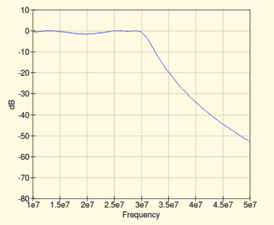
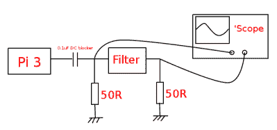
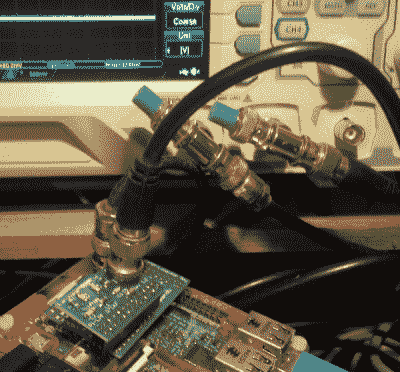

# 从计算机控制您的仪器:做一些有用的事情

> 原文：<https://hackaday.com/2016/11/29/controlling-your-instruments-from-a-computer-doing-something-useful/>

你知道如何从你的实验工具中获取数据吗，比如用计算机从你的示波器中绘制带宽？这其实很简单。许多工作台工具使用带有 USB 的标准协议进行连接，从而简化了这一过程。

在本文的前一期中，我们讨论了用于从计算机与您的仪器通信的 National Instruments VISA(虚拟仪器软件架构)标准，并介绍了它的 Python 包装器，使用 Raspberry Pi 进行了简单的演示。现在，我们将通过描述一个更有用的 Raspberry Pi 和数字示波器应用程序来建立这个适度的开端；我们将绘制一个 RF 滤波器的带宽。我们假设您已经阅读了上一期文章，并且在您的机器上安装了 Python 和所需的库。在我们的例子中，计算机是 Raspberry Pi，仪器是 Rigol DS1054z，但是类似的技术可以用于其他计算机和仪器。

### 我们现实世界的问题:低通滤波器

[](https://hackaday.com/wp-content/uploads/2016/10/10m-prototype-simulation.png)

QUCS simulation for a prototype 10m low-pass filter.

使用 [QUCS 模拟器](http://qucs.sourceforge.net/)设计了 10m 业余无线电波段的原型低通滤波器。该频段位于高频频谱的顶端，从大约 28 到 30MHz，因此其想法是创建一个滤波器，让低于 30 MHz 的所有信号通过，并衰减高于该频率的所有信号。仿真显示截止频率为 30MHz，通带的上 2 MHz 响应平坦。几乎完美的应用。

但是在庆祝之前，值得检查一下，滤波器*真的和它的模拟一样好吗？为此，我们需要测量它在现实世界中的性能，为了节省重复手动读取和计算的工作量，我们将使用 Raspberry Pi 来自动完成这项任务。*

[](https://hackaday.com/wp-content/uploads/2016/10/filter-test-setup.png)

Our fiter test setup, simplified. USB cable omitted.

我们的任务是测量覆盖滤波器通带和阻带的一系列 RF 频率的输入和输出电压，并计算每组读数的衰减。作为 RF 源，我们将使用 Raspberry Pi 的板载时钟发生器。这在扩展连接器的引脚 7 上产生一个逻辑电平输出，经过一个 DC 隔直电容后，我们将把它发送到滤波器。

输入和输出都采用 50 欧姆的负载，示波器从这些负载测量均方根电压。然后，我们的脚本读取这两个读数，并计算滤波器衰减的 dB 值。这不是完美的测量，因为输入不是正弦波，但是一旦它通过 DC 隔直电容，并面对示波器终端的滤波器输入，它就是一个讨厌的舍入波形，为了我们的目的，我们可以假设它是一个正弦波的近似值。我们感兴趣的是曲线的形状，而不是读数的绝对质量，所以对我们来说最重要的是它们的一致性。

### 进行测量

[](https://hackaday.com/wp-content/uploads/2016/10/filter-test-picture.png)

Our filter and terminators all wired up and ready to go.

因此，我们的过滤器被安装在我们的树莓 Pi 上，而示波器则与 BNC 引线、T 形件和终结器连接在一起。通道启用了，下一步呢？我们已经有了 Python 和从[到 Pi-scope 通信](http://hackaday.com/2016/11/16/how-to-control-your-instruments-from-a-computer-its-easier-than-you-think/)的所需库，所以只剩下[下载和编译](https://github.com/JennyList/LanguageSpy/tree/master/RaspberryPi/rf/freq_pi)一份【Jan Panteltje】的 freq_pi 信号发生器。

这个版本有一个 mod 来识别最新的 Pi 处理器，这是最初的所没有的。然后创建了下面的脚本，并对其进行了修改，以反映 freq_pi 可执行文件的路径和 Rigol 的资源名称，如本系列的前一部分所述。更好的脚本可能会从'范围中检索最后一个值，但这超出了本演示的范围。以赫兹为单位指定起始、结束和步进频率，它将遍历每个值，并根据每个值的输入和输出读数计算 dB 衰减系数。

我们将 Python 代码的副本保存为 db-filter-analyser.py。

```

#!/usr/bin/env python
import time
import math
import subprocess
import visa
import matplotlib.pyplot as plt
#Start, end, and step frequencies in Hertz
startfreq = 25000000
endfreq = 32000000
freqstep = 100000
#The resource name for your 'scope, you'll need to change this line
resourcename = 'USB0::6833::1230::DS1ZA123456789::0::INSTR'
#Location of the freq_pi executable
freqgen = &quot;/home/pi/freq_pi/freq_pi&quot;
#Open the resource manager
rm = visa.ResourceManager('@py')
#Open the 'scope by name
oscilloscope = rm.open_resource(resourcename)
#Return its ID string to tell us it's there
print(oscilloscope.query('*IDN?'))
#Set up arrays, then loop
graphfreqs,graphdbs = [],[]
for freq in xrange(startfreq,endfreq,freqstep):
    print freq
    subprocess.call([freqgen, &quot;-f&quot;, str(freq)]) #Call the RF generator
    #Read the input values from the 'scope and extract a float.
    #Input
    time.sleep(0.1) #Let everything catch up
    #Change CHAN to your channel number
    oscilloscope.query(':MEAS:SOUR:CHAN1')
    fullreading = oscilloscope.query(':MEAS:ITEM? VRMS,CHAN1')
    readinglines = fullreading.splitlines()
    inputreading = float(readinglines[0])
    #Output
    time.sleep(0.1) #Let everything catch up
    #Change CHAN to your channel number
    oscilloscope.query(':MEAS:SOUR:CHAN2')
    fullreading = oscilloscope.query(':MEAS:ITEM? VRMS,CHAN2')
    readinglines = fullreading.splitlines()
    outputreading = float(readinglines[0])
    #Calculate a dB value from the two readings
    decibels = 20*math.log10(outputreading/inputreading)
    print decibels
    #Add the values to the arrays
    graphfreqs.append(freq)
    graphdbs.append(decibels)
#Stop the RF
subprocess.call([freqgen, &quot;-q&quot;])
#Create our graph
plt.plot(graphfreqs,graphdbs)
plt.ylabel('dB')
plt.xlabel('Frequency')
plt.show()

```

在本演示中，为了简单起见，运行代码需要 sudo 使用 USB 端口。如果你想这么做，你可以通过设置 [udev 规则](https://wiki.debian.org/udev)来允许非根用户使用你的作用域。因此，同时打开、连接范围，并启用相应的通道，我们如下运行脚本:
`sudo python db-filter-analyser.py`

### 它与模拟的匹配程度如何？

来自过滤器的 dB 读数列表在屏幕上滚动，最终图表出现了。那么，我们的过滤器表现如何？从左边的结果图中可以看出，它表现出一个锐截止，因此它很适合作为低通滤波器。不幸的是，虽然它低了约 1 MHz，截止频率略低于 29 MHz，而不是我们在仿真中发现的 30 MHz。或许这是元件容差的作用，或许只是对仿真的错误信任。至少对于这个设计来说，似乎回到制图板是合适的。

此处显示的滤波器特性并不是执行该任务的最佳方式，但它显示了如何利用您工作台上的设备来执行该任务(以及类似的测量问题)。你可以控制你的仪器，从电脑上进行测量——这不是什么黑暗的艺术——你也应该尝试一下自己的仪器和测量问题。无论你做什么，请务必在 [Hackaday.io](https://hackaday.io/) 上与我们分享！