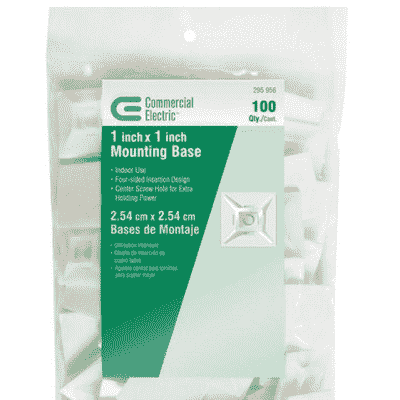
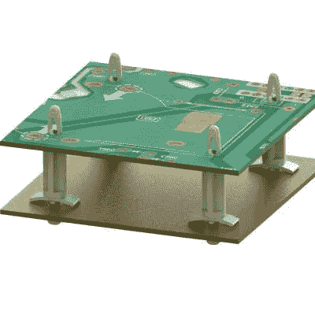

# 你应该知道的部分:一个有用的注塑支架宇宙

> 原文：<https://hackaday.com/2016/10/27/parts-you-should-know-a-universe-of-useful-injection-molded-standoffs/>

Your clever branding won’t work on me!
*types caption in on iPhone, sips Starbucks*

我记得我第一次组装电脑的时候。我姐姐和我为谁能使用家庭电脑进行了最后一次争吵，现在是我有一台自己的电脑的时候了。我知道一点点，我知道我不会成为那种为牛栏里的一个入口付高价的平民。所以我外包了。我童子军中的一位懂电脑的父母非常友好地同意为我整理一份部件清单。我花光了我的圣诞节钱、生日钱和我攒下的一小堆钱。我记得收到邮寄的零件。我非常兴奋，一周前我甚至买了一个超级蹩脚的计算机工具包来组装它。

我仍然记得安装母板的支架是多么令人沮丧。我认为计算机仍然认为它们不需要大型机的所有功能。无论如何，在一个 1 厘米高的黄铜支架的两边各有一个 3 毫米的螺丝。出于某种原因，它还想让我把这些小隔离纸垫圈放在组件上。即使我的手有总统那么大，也花了很长时间。我妈妈后来告诉我，大约就在这个时候，她确信整个努力将以眼泪告终。

经过六个小时的精心工作，我终于把电脑组装好并运行起来，这时我意识到我忘了给它买操作系统。她几乎是对的。

不管怎样。我早期的电脑组装经验让我喜欢标准化的螺丝，讨厌过多的紧固件，并对布线不当的电线深恶痛绝。我是个古怪的孩子。无论如何，当我开始设计自己的电路板外壳时，我有了所有独特的心理伤害和支撑，我需要浪费大量时间在互联网上搜索，寻找一种替代的，无螺丝的方法，将电路板从表面上移开。

我最终找到了一家公司，这家公司似乎完全专注于注射成型的卡扣或粘合支架、卡和电缆管理组件。外面还有像我一样的人吗？最好不要去想它…

Handy. Just prep the surface first.

不管怎么说，你可能以前从这家公司买过一些组件，甚至不知道它。例如，他们可能是那些你可以在大盒子商店买到的方便的粘合剂电缆扎带安装柱的制造商。

你曾经买过一个很好的主板，它实际上有一个小凸轮夹来固定你的 PCI 卡吗？很可能是他们做的。他们过去被称为罗伯逊连接器，但最近与一家通用名称为“Essentra components”的企业集团合并

对我来说，他们产品线的真正赢家是他们的对峙线。他们有大多数人想要的尺寸和配置。它们有助于快速可靠的组装。螺丝松动导致短路的可能性为零。即使僵持不下，打破了它也只会用一点塑料填充外壳。除此之外，他们对组件施加恒定的力。与金属支架不同，它们会针对制造缺陷进行一些调整。最重要的是，即使配合松散，也是铜对尼龙，或者尼龙对钢。与普通金属和黄铜组件相比，支架损坏电路板的机会大大降低。他们还有一个我非常喜欢的减震支架。

The stand-offs are really great

他们的塑料铆钉系列非常适合非永久性地固定外壳。他们有一种可拆卸的，也有一种需要切断。对于低负荷的目的，他们的工作就像一个金属铆钉，但更少的破坏性安装时(不会凹痕你的材料)，看起来有点干净启动。

最后，他们有一个真正惊人的电缆布线夹具。有背胶板(这是 3M VHB，如果你在使用前用酒精清洗，它会永远粘着)。有通孔搭扣配合环。有各种你能想到的电缆夹可供选择。任何东西都可以，从前面提到的可以穿过电缆扎带的垫子，到一种可以让电缆穿过的带“拳头”的 U 型。太棒了。

如果你正在做大量的制造工作，或者只是想看看那里有什么，那么[他们的目录是很值得一看的](http://uk.essentracomponents.com/en-GB/pcb-electronics-hardware)。我希望我能给你指出更多的方向。在过去的几年里，埃森特拉已经吞并了大约四家其他公司。3M 和其他一些公司也有部分产品线，但都没有这么大。我想也有一些竞争的进口公司。

你们有人在工作中用到这些吗？你知道不常用的酷扣件吗？我们很想听听你的支座和紧固件的秘密供应商，以及你最喜欢的常见或古怪的组件。请在下面的评论中发表意见。