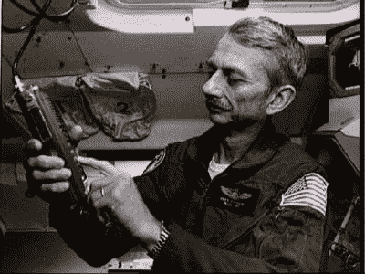
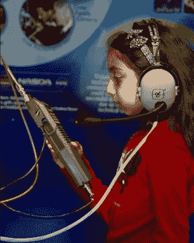
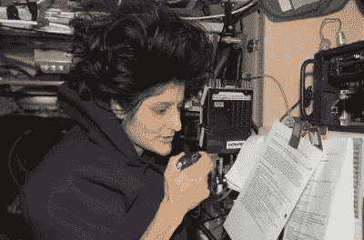
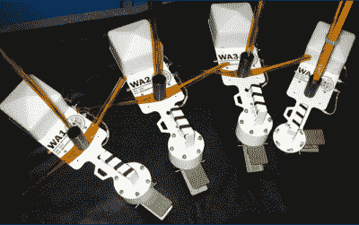

# 太空中的火腿第二部分:载人航天飞行

> 原文：<https://hackaday.com/2016/11/01/hams-in-space-part-2-the-manned-spaceflights/>

无论是试图通过难以点亮 LED 的发射器在全球范围内进行联系，还是将信号发射到太空并从月球反弹回来，业余无线电运营商一直处于通信技术的前沿。当人类在 20 世纪 50 年代和 60 年代登上太空时，hams 与第一批私人卫星一起登上了太空。但是，尽管奥斯卡卫星取得了成功，它们充其量只是太空中的信标或中继器。需要的是人情味——一个真正的现场操作员与地面上的人联系，展示业余无线电的能力，同时激发公众对太空计划的兴趣。我们需要的是太空中的锤子。

### 如果一开始你没有成功…

在阿波罗时代的末期，第一次尝试通过有执照的运营商将业余电台送入太空。欧文·加略特(W5LFL)在 1965 年被选为首批六名科学家宇航员之一时，拥有电气工程博士学位。他为天空实验室 3 号进行了训练，并最终在 1973 年进行了飞行。在执行任务的后期，加略特提出了一个正式建议，要带上一个哈姆钻机，这样他就可以从轨道上进行联系。美国国家航空航天局喜欢这个想法，但由于这个想法在任务周期中出现得太晚，没有时间为航天飞行正确认证设备，因此该提议被拒绝。

Owen Garriott aboard Spacelab-1

幸运的是，加略特将有另一项任务和另一个机会成为太空第一人。加略特被选为 STS-9 的任务专家，这是 1983 年哥伦比亚号航天飞机上的太空实验室-1 任务。这次做好了充分准备，加略特带着摩托罗拉 MX-300 手持式无线电收发机飞向高空，用于 2 米波段。天线是一种妥协；航天飞机上没有配备外部天线，所以在一个装有 Velcro 的窗户上安装了一个空腔天线。蒙大拿州的兰斯·科利斯特(WA1JXN)是记录下与轨道上的宇航员第一次接触(QSO)的幸运儿。

STS-9 期间大约有 300 个 qso 加略特记录在案——包括美国参议员巴里·戈德华特(K7UGA)和约旦国王侯赛因(JY1)等贵宾——这是美国宇航局的一次公关妙招。与轨道上的人直接对话曾经是其他宇航员和总统的特权。现在，任何一个业余爱好者都可以和宇航员取得联系，更重要的是，任何一个业余爱好者都可以利用他或她的装备和专业知识让学生和宇航员交谈。

### 激励下一代

当他们看到一个好东西时，他们意识到这是一个好东西，NASA 通过太空业余无线电实验 SAREX T1 在太空中正式建立了业余无线电。SAREX 与无线电业余卫星公司(AMSAT)和美国无线电中继联盟(ARRL)合作，明确表示要让年轻人对科学和工程职业感兴趣，从 1983 年到 1999 年，它执行了 25 次航天飞行任务。

随着 SAREX 计划的进展，飞行任务中的业余无线电设备变得越来越复杂——慢扫描电视(SSTV ),一种自动化分组无线电系统，即使在空间站无法载人时也能全天候工作，以及从最初的 2 米波段扩展到 70 厘米超高频波段。在地面上，通过提供与固定地面站的电话连接，远程桥接系统的建设增加了与航天飞机联系的学校数量。

Talking to an astronaut. Source: [NASA](http://www.nasa.gov/mission_pages/station/research/experiments/23.html)

短程航天飞机任务并不是唯一搭载哈姆的飞行。1988 年，俄罗斯和平号空间站机组人员弗拉基米尔·蒂托夫、穆萨·马纳罗夫和瓦列里·波利亚科夫在轨道上获得了他们的业余执照。拉出令人羡慕的呼号 U1MIR、U2MIR 和 U3MIR，后来他们被提供了一个八重洲 FT290 2 米收发器和一个天线，在太空行走期间安装在扶手上。随着设备的升级和工作人员的更换，和平号上的 Hams 多年来继续向学校推广。

当 1998 年国际空间站的第一批组件开始进入轨道时，已经计划好了业余无线电的存在。国际空间站计划中的业余无线电爱好者 ARISS 聚集了来自世界各地的业余无线电团体，为国际空间站上的业余无线电广播站制定一项全面的计划。1998 年，爱立信的一个 2 米长的手持设备是第一批发送到俄罗斯扎里亚模块的有效载荷之一，这突出表明了业余无线电对航天国家来说是多么不可或缺，以及他们为接触公众所做的努力。

### 国际空间站的无线电

Sunita Williams operates one of the Kenwood stations aboard the ISS. Source: [NASA](http://www.nasa.gov/mission_pages/station/research/experiments/23.html)

在地球上，以火腿的身份上电视很容易——学习一点，通过测试，然后买你的第一套装备。档位选择取决于你能负担得起的档位，以及你想使用的波段和模式。但是，当你的钻塔在 400 公里的高空通向一个加压的锡箔管时，档位选择过程必须更加严格。你可能会认为这意味着设备完全是由一些政府承包商定制的，但事实证明，现在国际空间站上几乎所有的无线电都是现成的设备，任何火腿都可以购买和操作。像任何其他前往国际空间站的设备一样，业余无线电爱好者的无线电设备必须符合飞行条件，以确保它不会对空间站或船员造成任何危险，但除此之外，今天在那里的所有装备对任何业余无线电爱好者来说都是熟悉的。

目前国际空间站上有三个空间站，分三个不同的模块。除了扎里亚模块中最初的爱立信 2 米手持收发器和分组调制解调器之外，餐桌附近的 Zvezda 服务模块中还有 Kenwood 双频带(VHF 和 UHF)无线电，Columbus 模块中还有另一个电台。

位于哥伦布的爱立信 MP-A 甚高频设备以坚固和可靠而闻名，但在国际空间站上运行了 16 年后，无线电最近开始显示错误代码，目前已经停止广播。ARISS 的操作被转移到俄罗斯模块中的空间站，直到可以发送替换空间站。阿里斯已经计划让一架[肯伍德 D710-GA](http://www.kenwood.com/usa/com/amateur/tm-d710ga/) 和电源飞行，这两者在到达顶部之前都在接受美国宇航局的最终批准和认证。

### 天线

The WA series: antennas fit for a space station. Source: [ARISS](http://www.ariss-eu.org/old/phase2.htm)

任何一个火腿都会告诉你，业余无线电的艺术一半在于天线设计和构造。地球上的 hams 有很大的自由来试验天线，并通过打开的窗户运行馈线，但对于他们的 ISS 同行来说，事情有点受限。

虽然早期航天飞机任务中的天线有些特别，但国际空间站从一开始就被设计成支持 ARISS 操作的多个外部天线。早期的国际空间站工作人员在服务舱周围安装了四个天线系统。命名为 WA1 至 WA4，每个天线由用于 UHF/VHF 或 HF 信号的 Kapton 涂层鞭状天线以及用于 L 波段(1-2GHz)和 S 波段(2-4 GHz)的螺旋天线组成。国际空间站上还没有这些波段的业余站，所以天线支持俄罗斯 Glisser 太空头盔相机系统。空间站周围有四个天线提供了故障情况下的冗余，并有助于保持至少一个天线正确定向，尽管国际空间站的姿态调整。

2008 年，欧文·加略特的儿子理查·盖瑞特(W5KWQ)作为付费乘客，带着一台[肯伍德 VC-H1](http://www.kenwood.com/i/products/info/amateur/vch1.html) 便携式 SSTV 终端前往国际空间站，完成了数百次 qso，业余无线电在太空的存在又回到了起点。Hams 已经在太空运行了 30 多年，并且有一个连续的 hams 站在轨道上运行了超过 15 年。业余无线电为世界各地成千上万的孩子提供了灵感和教育，并通过提供与家人和朋友的沟通，成为机组人员舒适和幸福的来源。只要有人驾驶的宇宙飞船存在，很有可能 hams 就会在上面运行。