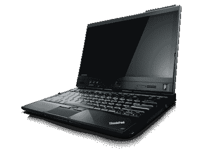
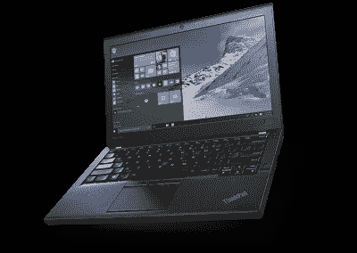

# 苹果现在糟透了，这是 ThinkPad 的购买指南

> 原文：<https://hackaday.com/2016/10/28/apple-sucks-now-heres-a-thinkpad-buyers-guide/>

在过去的十年里，MAC 电脑一直在 x86 处理器上运行类似 UNIX 的操作系统。它们一直是出色的开发人员的机器，MacBook Pro 是发放给所有开发人员、所有 hackathon 参与者以及任何使用计算机进行实际工作的人的事实上的标准笔记本电脑。

本周，苹果发布了最新的 MacBook Pro，并提供了更多证据证明史蒂夫·乔布斯其实知道他在做什么。bones 将为你提供一台配备最新一代处理器、退出键、耳机插孔和两个雷电 3 端口(其中一个端口需要充电)的 MacBook Pro。下一款 up 售价 1800 美元，去掉了 Escape 键，变成了一个专用的表情条，包括四个雷电 3 端口。

过去，我曾为选择 MacBooks 作为笔记本电脑的人辩护。MacBook 是一款商务笔记本电脑，当然价格也更高。然而，苹果最新发布的硬件并不给力，而且定价过高。如果你正在寻找一台新的笔记本电脑，你最好考虑其他品牌。为此，这里有一份 ThinkPads 的购买指南，这是我在开发人员/黑客/代码破解人群中见过的第二受欢迎的笔记本电脑。

### ThinkPad 和联想的怪异之处

ThinkPad 是 IBM 在 1992 年发明的。在最初几年的发展中，有三条产品线脱颖而出。300 系列的 ThinkPad 是最低的，500 系列是中间的，700 系列是你能得到的最好的。这与营销宝马 3 系、5 系和 7 系的思路是一样的。这与命名 PowerBook 100、140 和 170 的营销方式相同。

以下是苹果仍在使用的笔记本电脑名称(是的，这些是实际的型号名称):

*   配备 2.0GHz 处理器和 256GB 存储空间的 13 英寸 MacBook Pro
*   13 英寸 MacBook Pro，带触控条和触控 ID，2.9 GHz 处理器和 256GB 存储空间
*   13 英寸 MacBook Pro，带触控条和触控 ID，2.9GHz 处理器和 512GB 存储空间

ThinkPad 的命名惯例让营销变得更容易，产品差异化变得更简单，相比之下，第一次没有乔布斯的苹果比第二次没有乔布斯的苹果更好。

在 ThinkPads 的世界里，这个传统一直延续着。2005 年，IBM 将他们的个人电脑部门出售给联想，联想现在保持着 ThinkPad 品牌的太空级声誉。然而，并非所有的 ThinkPads 都是生而平等的。T、X 和 P 系列是你应该关心的唯一的 ThinkPads。 虽然许多联想笔记本电脑已经成为一些安全问题和 0-days(如 [ThinkPwn](https://github.com/Cr4sh/ThinkPwn) )的目标，但没有 T、X 或 P 系列标签的笔记本电脑受到的影响更大。不仅低端的 ThinkPad(E 和 L 系列)配备了更多的垃圾软件，ThinkPad 的三个主要系列的结构也更加强大。

也就是说，这是我们见过的最常见用例的购买指南。

### 我需要一台后启示录时代用的一次性笔记本电脑，或者一台斯托曼能用的

The Lenovo x220t. Image: Lenovo

你有两种选择:T400 或者 T2 X200。是的，这些都是旧笔记本电脑，但是多亏了[英特尔的管理引擎](http://hackaday.com/2016/01/22/the-trouble-with-intels-management-engine/)，这是你可以使用的最新的 ThinkPad。如果你要追溯到这么久以前，安装 Libreboot，忽略过去几个月 Libreboot 邮件列表上的所有内容。

如果你只需要一台一次性笔记本电脑，而不需要 GPL 在你身体的每一根血管中流动，你就有了一台 [X220](http://support.lenovo.com/us/en/products/laptops-and-netbooks/thinkpad-x-series-laptops/thinkpad-x220?c=1&beta=false) 。有了 X220，你会有一个稍微更现代的 ThinkPad，但仍然可以处理基本任务、开发和几乎所有不是视频、游戏或照片编辑的事情。这是*疯狂的麦克斯*笔记本电脑，通过易贝或类似渠道大约 200 美元就能买到。安装一个固态硬盘，你就有了一个完美的日常驱动程序。X220 [可以与 coreboot](https://www.coreboot.org/Board:lenovo/x220) 配合使用，X230(配有降级键盘的那款)现在是全球顶尖 ThinkPad 专家的活跃研究领域[。](https://twitter.com/qrs/status/791323795818704896)

### 我需要更换我的 2013 款 MacBook Pro

以下是 ThinkPad 产品线的细分。X 系列是 ThinkPads 的超便携系列。 *T-* 系列是中庸之道——比 X 系列略大，但功能更强。 *P-* 系列(前身为 *W-* 系列)是 ThinkPads 的便携式工作站级别。

Lenovo X260\. Image: Lenovo

以系列作为机型名称的首字母，接下来可以考虑屏幕尺寸。X260 有一个 12 英寸的屏幕。T460 有一个 14 英寸的屏幕。P50 的屏幕为 15 英寸，P70 的屏幕为 17 英寸。显然，型号名称的第一个数字表示屏幕尺寸。

这个问题解决后，这里有一个不错的购买指南:如果你想要一台超便携电脑，就买一台 [X260](http://shop.lenovo.com/us/en/laptops/thinkpad/x-series/x260/) 。如果你想要独立显卡，买一个 [T460s](http://shop.lenovo.com/us/en/laptops/thinkpad/t-series/t460s/) 。如果你还没有背部问题，想要一个便携式工作站，买一个 [P50](http://shop.lenovo.com/us/en/laptops/thinkpad/p-series/p50/) 。需要采用至强和 ECC 内存的笔记本电脑吗？[存在的。在 ThinkPads 的 X、T 和 P 系列中，每个人都能找到自己想要的东西。不要耗尽 OEM RAM，只需再买一根。同样的理论也适用于固态硬盘和硬盘。](http://shop.lenovo.com/us/en/laptops/thinkpad/p-series/p70/)

### 我需要编辑视频或做其他占用大量 CPU 和内存的工作

笔记本电脑不适合你。这里是 [PCPartPicker](https://pcpartpicker.com/) 。构建自己的桌面。这就像乐高，但对成年人来说。

### 这对我们来说很奇怪

除了 3D 打印机之外，Hackaday 出人意料地对消费电子产品保持沉默。也就是说，我们策划了如此多的聚会，参加了如此多的黑客马拉松，并在如此多的会议上放松下来，这给了我们对笔记本电脑购买趋势的独特见解。总的来说，Hackaday 社区在 MacBooks 和 ThinkPads 之间的比例是 60:30，其余的被 Chromebooks 或一些真正可怕的黑色星期五特价所占据。

尽管从编辑的角度来看，一波又一波关于最新最闪亮产品的帖子非常受欢迎且有利可图，但这篇帖子却是个例外。我们不会成为下一个*优步消费者博客*在产品发布上浪费你的时间。

然而，苹果公司最新发布的 MacBook 没有抓住要点，你不会发现很多人有不同的看法。ThinkPads 有优秀的 Linux 支持，比 Cygwin 更好的 [*nix 正在向 Windows 走来。如今，便携式电脑是必须的，我们谦卑地提供我们在黑客的*第二*选择笔记本电脑方面的经验。](https://hackaday.com/2016/03/30/windows-and-ubuntu-cygwin-can-suck-it/)