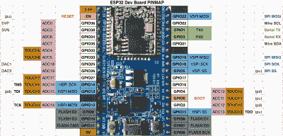
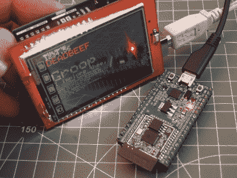
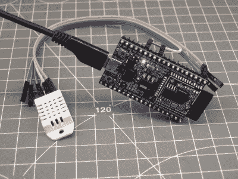
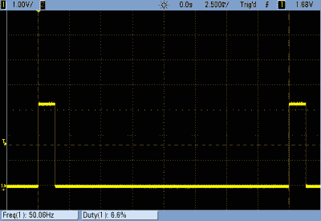

# 有什么新鲜事，ESP-32？测试 Arduino 库

> 原文：<https://hackaday.com/2016/10/31/whats-new-esp-32-testing-the-arduino-esp32-library/>

如果你错过了，[大新闻](http://hackaday.com/2016/10/09/hackaday-links-october-9-2016/)是一个最小的 Arduino 内核已经在 ESP32 上运行。还有很多工作要做，但核心功能——GPIO、UART、SPI、I2C 和 WiFi——都已经准备就绪，可以进行测试了。安装这个库就像[从 GitHub](https://github.com/espressif/arduino-esp32) 中取出代码安装到你的 Arduino 中一样简单，所以这正是我所做的。

然后我花了几天时间摆弄它。这是一项正在进行的工作，但它已经到了有用的地步，代码库本身包含一些隐藏的宝石。来吧，让我们先睹为快。

## 核心

[](https://hackaday.com/wp-content/uploads/2016/10/arduino_logo_pantone.png) 一个 Arduino 除非能和外界对话，否则价值不大，让大家熟悉的 Arduino 命令和 ESP32 的外围硬件一起工作是核心固件的工作。在撰写本文时，GPIO、WiFi、SPI 和 I2C 已经准备好进行测试。GPIO 基本上是指`digitalWrite()`和`digitalRead()`的意思，没什么好说的——它们确实有效。WiFi 与 ESP8266 版本非常相似，除了将 ESP32 连接到我们的家庭 WiFi 网络上，我还没有用力推动它。当其他使用 WiFi 的图书馆上线时，我会再看一眼。

### 精力

ESP32 Arduino 端口中的 SPI 例程都工作正常。我通过将一个 [25LC256 SPI EEPROM](http://www.microchip.com/wwwproducts/en/en023856) 连接到芯片上进行测试。ESP 极其灵活的硬件外设路由矩阵允许它将 SPI 功能分配给任何引脚，但 Arduino 实现预设为默认引脚排列，因此您只需查找它，并将 MOSI 连接到 MOSI 等。到目前为止，它只使用了 ESP32 的两个免费 SPI 单元中的一个。

有了 SPI，在像 ESP32 这样的强大芯片上使用 Arduino 的一些怪异之处开始显露出来。要设置 SPI 外设的速度，您可以使用熟悉的`SPI_CLOCK_DIV_XX`宏，只是它们被放大以匹配 ESP32 更快的 CPU 时钟速度。最终结果是`SPI_CLOCK_DIV_16`在 16 MHz Uno 或 240 MHz ESP32 上为您提供了 1 MHz SPI 总线，这可能是您希望与旧代码兼容的原因。但是 240 除以 16 是*而不是* 1。回想起来，根据所需频率而不是分频系数来定义宏会更好，但您无法回到过去。

还有两个额外的定义，我必须添加到程序中，使其运行，但它们都在过去的十八个小时里被精简到主线中。这就是快速进化、公开开发的软件的处理方式。有一天你写道宏`MSBFIRST`还没有定义，在你出版之前，它已经在`Arduino.h`中定义好了。很棒的东西！

### I2C:电线

[](https://hackaday.com/wp-content/uploads/2016/10/esp32_pinmap.png)I2C(“Wire”)库也获得了 ESP32 处理，并与 [LM75 温度传感器](http://www.ti.com/product/LM75A)一起正常工作。这是我的标准 I2C 测试设备，因为默认情况下，它允许您读取一些寄存器，但您也可以向传感器发送一些配置选项，然后再读取出来。这不是一个要求特别高的设备，但当它工作时，你知道基本功能正在工作。确实如此。

ESP 的专用 I2C 引脚位于 GPIO 21 和 22 上，分别用于数据和时钟。一些 I2C 实现将使用微控制器的上拉电阻来拉高 I2C 总线，所以我通过拉出 10 千欧电阻来测试。ESP 立即停止获取数据，这就回答了这个问题。不要忘记 I2C 线上的上拉电阻，一切都会好的。否则，它只是连接两根电线，仔细检查 I2C 设备地址，并读取数据。那很容易。

## 外部库

使用 Arduino 的一半以上原因是广泛的外部附加库，这些库使与各种硬件的接口变得简单而容易。许多这样的库都是严格建立在 Arduino 核心之上的，应该“正常工作”。当然，当你真的这么接近硬件编码时，没有什么比在你的台式计算机上更高的抽象层更具有可移植性了。我们去验证一下这个假设。

### El Cheapo IL9341 TFT 显示屏

[](https://hackaday.com/wp-content/uploads/2016/10/dscf8969.jpg)

Uno Lauging at ESP32

既然 SPI 库是开箱即用的，那么依赖于它的其他各种库也应该如此，对吗？嗯，算是吧。浪费了一个下午，还是失败了。为什么？我有一个便宜的 ILI9341 屏幕，只能与旧的`TFTLCD`库一起工作，而不能与好的`Adafruit_ILI9341`库一起工作。前者充满了 AVR 特有的巫术，以至于完全无法编译，并且可能比以目前的形式为 ESP32 从头重写更容易。Adafruit 库编译很好，因为它只依赖于 SPI 库，但是它不能与我糟糕的屏幕一起工作。

在这两个库之间反复往返，我的 LCD 实验以眼泪和沮丧告终:我不能让它们中的任何一个工作。我在逻辑分析仪上分析了 SPI 数据，它看起来不错，但没有在屏幕上显示出来。此时，需要进行完整的逐行协议分析，这需要几天的时间。如果我只是想要一个运行的 ILI9341 驱动程序，我会去获取[Sprite_tm]的 [NES 仿真器演示](https://github.com/espressif/esp32-nesemu)并使用那里的一个，但是它还没有被 Arduinified，所以它超出了本文的范围。

### DHT22 湿度和温度传感器

[](https://hackaday.com/wp-content/uploads/2016/10/dscf8971.jpg)

The Way It Should Work: Three Wires and Ten Lines of Code

寻求一个快速而肮脏的成功，并被数小时的黑客攻击击败，一无所获，我从易贝的箱子里拿出一个 DHT22 传感器，并克隆了 [Adafruit 的 DHT 库](https://github.com/adafruit/DHT-sensor-library)。当然，它不是开箱即用就能编译的，但只有几处是错误的，而且这两处都很容易修复。

ESP32 的 Arduino 还没有一个`microsecondsToClockCycles()`函数，所以我将其注释掉，乘以 240 MHz，并在我的代码中留下一个硬编码的常数。这个值只是用于超时，所以我不太担心。还有一些时序关键的代码段，在这些代码段中，Adafruit 代码使用了一个`InterruptLock()`函数来全局启用和禁用中断，但是这些函数还没有实现，所以我只是将其全部注释掉，并祈祷好运。

将数据引脚重新分配给 ESP32 的一个空闲引脚(GPIO 27，FWIW)后，它可以编译、上传并正常运行。我现在确切地知道在我的办公室里有多热多潮湿，而且 Arduino 外部图书馆很快就成功了，我的信心也恢复了。

### 来自图书馆的教训

我怀疑这两个例子在一段时间内会成为 ESP32-Arduino 体验的代表。古怪的硬件需要一些时间来获得支持。尽管是“Arduino”代码，但也需要移植具有周期正确计时或其他微控制器架构特定代码的高度优化的库。如果你是一个代码消费者，你只能等待向导们在幕后施展他们的魔法。

但是还会有一大群库是以或多或少与设备无关的方式编写的，这些库应该很容易在大约 15 分钟内开始工作，就像 DHT 传感器库一样。如果您愿意编译、阅读错误，并注释掉或修复出现的任何问题，一些代码库将很快工作。

## 下一步是什么？转动伺服系统

鉴于 Arduino-ESP32 端口是全新的，事实上它仍在开发中，社区有很多工作要做，以使它达到速度。假设你需要驱动很多伺服系统，但是“伺服”库还没有实现。你是一个没有耐心的程序员。怎么办？去黑吧！

好消息是 Arduino-ESP32 库本身充满了入门的提示和示例。打开从 GitHub 克隆的 [ESP32 专用目录](https://github.com/espressif/arduino-esp32/tree/master/cores/esp32)。通常的`*.cpp`文件提供了标准的 Arduino 核心功能。`esp32-hal-xxx.h`和`esp32-hal-xxx.c`文件是特定于芯片的，在利用芯片的陌生选项方面有很大的帮助。例如，`esp32-hal-matrix.*`让您可以方便快捷地访问引脚布线矩阵，如果您只是从数据表开始，这是一项艰巨的任务。

[](https://hackaday.com/wp-content/uploads/2016/10/scope_23.png)

Spot-On and Jitter-Free

但是让我们回到伺服系统。ESP32 芯片有一个有趣的硬件 LED PWM 外设，允许您将多达 16 个通道分配给单个 LEDS，指定 PWM 频率和位深度，然后通过适当设置硬件寄存器中的位来控制它们。如果你认为这很难手工完成，[你是对的](http://iot-bits.com/esp32/esp32-led-pwm-controller-example-sample-code/)。`esp32-hal-ledc.*`文件提供了帮助函数来设置硬件 PWM 发生器，有了这些库，在 C 或“Arduino”中获得 16 位 LED 渐变就很容易了。但是我们的目标是伺服系统。

要驱动一个业余爱好伺服系统，每个需要 1000 到 2000 微秒的脉冲，大约每 20 毫秒重复一次。将重复频率设置为 50 Hz 负责第一部分，每次计数为 20 ms / 65，635 个节拍，大约 0.3 微秒。将 PWM 宽度值设置为 3，300 到 6，500 之间的某个值会产生合适的脉冲，我的伺服系统无抖动运行(示波器上确认了一个干净的信号)。以下是我所做的一切:

```

#include &quot;esp32-hal-ledc.h&quot;
void setup() {
   ledcSetup(1, 50, 16); // channel 1, 50 Hz, 16-bit depth
   ledcAttachPin(22, 1);   // GPIO 22 on channel 1
}

void loop() {
   for (int i=3300 ; i &lt; 6500 ; i=i+100){
    ledcWrite(1, i);       // sweep the servo
    delay(100);
   }
}

```

这并不难，是吗？它不是“Arduino”风格的——看不到任何对象或类或方法——但由于一个简单明了且编写良好的硬件抽象层，使用非常复杂的外围设备变得非常简单。[me-no-dev]在后端所做的工作值得称赞。Arduino 库内的 HAL 是目前许多更深奥和有趣的芯片外设的代码示例的最佳来源。

## 结论？

我深入研究`Arduino-esp32`的简短版本是，这里有很多，尽管还没有完成。闪烁的 led 和其他简单的 GPIO 是已知的，已经实现的核心通信库为我工作:GPIO、WiFi、SPI 和 I2C 已经启动并运行。

非核心库时好时坏。我怀疑他们中的许多人只需要一点点调整就能工作。其他的，尤其是那些依赖于架构的，可能不值得移植，需要重写。ESP32 有一堆有趣和创新的板载硬件外设，当然还没有为它们编写的 Arduino 库，但在 Arduino-ESP32 代码库中隐藏了一些很棒的 HAL 代码，会给你一个良好的开端。我们可能会在里面迷路几个小时。是时候进行黑客攻击了！

ESP32 仍然是一个新的芯片，但订单应该很快就会到来。吃一个吗？想看看我们测试其他库或语言的速度吗？请在评论中告诉我们。