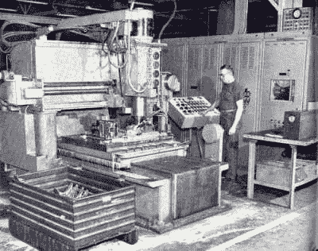
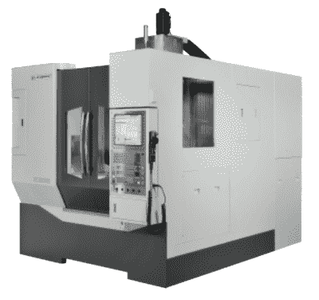
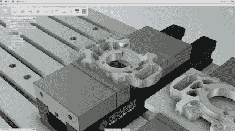

# 数控机床控制导论

> 原文：<https://hackaday.com/2016/11/11/an-introduction-to-cnc-machine-control/>

我们最近给了你一些关于[购买你的第一台铣床](http://hackaday.com/2016/08/17/tips-for-buying-your-first-milling-machine/)的提示，但是我们没有触及的是铣床(或其他机器，如车床)的 CNC(计算机数字控制)系统。这是因为 CNC 是一个复杂的主题，值得单独撰写一篇文章。所以，今天我们深入了解什么是 CNC，它是如何工作的，以及最终它是否适合你这个业余爱好者。

## 数控系统简史

作为一个黑客读者，你无疑是一个精通技术的人，至少已经对 CNC 的概念有所了解。毕竟，它的核心是加工的自动化。如你所料，CNC 系统的历史非常接近计算机的发展，并且两者直接相关。第一个全自动控制系统在 20 世纪 50 年代随着 NC(数字控制)开始出现。这些使用穿孔带(或类似的指令存储技术)来指导机器——主要是铣床、刳刨机和车床。

为这些机器供电已经有一段时间了。这些使用(现在仍然使用)电动机或机械链接，以恒定的速率给机器上的特定轴进给。好处是双重的:它大大减少了机械师的劳动，平稳一致的进给提高了表面光洁度和刀具寿命。

到了 50 年代，高端机器有了更先进的供电控制，可以设定不同的速度。数字控制本质上只是现有技术的自动化。操作员可以告诉机器何时何地移动每个轴，从而消除了加工中最耗时的部分(精确转动手柄)。

A magnetic tape controlled vertical profiler from 1962 (courtesy of wimb.net)

这项技术的发展是可以预见的:数字计算机产生了 CNC，不再需要陈旧的穿孔带。CAD(计算机辅助设计)的出现使设计过程数字化，使操作员能够在计算机上设计零件和编写机器程序。计算机变得越来越小，越来越强大，越来越便宜。机器的电子设备得到了改进，允许更精确的控制和更好的反馈。最近，特别是开源运动已经使得 CNC 控制的机器[很容易为业余爱好者所用。](http://linuxcnc.org)

## CNC 的优势

CNC 最明显的好处是自动化，尤其是在制造业。如果一个制造商需要制造成千上万个相同的零件，CAD 和 CAM(计算机辅助制造)过程只需要做一次。然后，一个操作员可以同时运行几台机器，只需简单地装载和卸载零件，然后按下“开始”这种效率导致了以令人印象深刻的高精度大规模生产复杂机械零件(在 20 世纪上半叶是手工完成的)的能力。

CNC 的另一个主要优点是精度和可重复性。精度一直是机械加工的重要组成部分，但手动操作机器时保持严格的公差并不简单。它要求机械师有良好的数学技能，了解机器，并对细节有强烈的关注。如果机械师把手柄转得过了几度，零件可能需要报废，因为它不符合工程师要求的公差。

另一方面，数控机床非常擅长数学。他们确切地知道他们应该被定位在哪里，并且能够一遍又一遍地完美地重复他们的程序。一旦 CNC 程序员完善了零件程序，制造商就可以放心了，所有的零件都将彼此完全相同。只要机器运行正常，工具良好，单个零件程序就可以无限期地运行，并产生完美的结果。

另一个经常被忽视，但在我们的现代世界中极其重要的好处是，数控机床能够进行人类无法复制的运动。以一个简单的圆形口袋为例。如今它是如此琐碎，以至于我们甚至没有想到它——数控铣床可以使用任何直径小于凹槽直径的工具以许多不同的方式切割它。但是，为了手动加工相同的凹槽，机械师要么需要一个与凹槽直径完全相同的孔，要么需要一个旋转台来旋转零件。并且，后者需要转盘的轴线与圆形槽的轴线精确对准。

这是因为一个圆需要两个轴同时运动，并且相对于彼此以不同的速度运动。机械师根本无法手动完成，至少不能在保持任何实际公差的情况下。把它想象成试图在蚀刻草图上画一个完美的圆，现在想象你必须在小于千分之一英寸的公差内这样做。这只是不能手动完成，但对于数控铣床来说很容易完成。

An example of a part that would have been impossible to machine without CNC (photo courtesy of HAAS)

当形状变得更复杂时，以及当你添加第三、第四、第五或第六个轴时，同样的概念会得到进一步发展。许多我们现在认为理所当然的产品在 CNC 出现之前根本不可能制造，因为它们不能手工加工。

一台数控铣床并不关心它是否只是在单轴上做直线运动，或者它是否同时协调六个轴的运动。当然，零件程序越来越大，但随着现代存储和处理，这不再是一个问题。

## 数控系统的类型

最基本的 CNC 类型是两轴或三轴系统，用于改造手动机器。这些有各种各样的铣床和车床，本质上只是集成了一台计算机和电源。计算机控制每个轴的动力进给，并试图补偿每个轴的[齿隙](https://en.wikipedia.org/wiki/Backlash_(engineering))。该补偿以闭环或开环方式处理。

在开环 CNC 系统中，没有反馈。信号只向一个方向发送，计算机不知道机器实际做的是否正确。它只是依靠机器去做它应该做的事情。齿隙由固定量补偿，因此必须事先知道。这是大多数廉价机器的工作方式，通常会产生良好的效果。然而，缺乏反馈意味着反冲通常不会得到完美的处理，因此很难保持严格的公差。

闭环 CNC 系统使用编码器向计算机提供反馈。这意味着像反冲这样的事情可以自动补偿——计算机只需验证轴是否移动了所需的量，如果没有，就进行相应的调整。然而，闭环系统需要额外的硬件和更复杂的控制计算机，因此它们更昂贵。

当然，改造系统的主要选择是由 CNC 控制的全新设计的机器。大多数现代机器都是这样制造的，因为它们可以集成许多所需的附加功能。其中包括刀具更换器、自动化冷却系统、附加轴(用于旋转零件、加工角度和进入型腔)、高级主轴等。有了专门制造的机器，这一切也可以很好地包装在一个外壳中，以容纳冷却剂和芯片。

A 5-axis CNC VMC (photo courtesy of Bridgeport)

改型和专用机器通常有两种创建零件程序的方法:g 代码和对话式。g 代码模式接收在独立计算机上创建的指令(通过 CAM 软件或手动编写)，并完全按照编写的指令运行。对话模式是在控制计算机上完成的，允许操作员在机器上创建程序。

对话模式的好处是，操作员可以快速创建简单的程序，而不必涉及使用 CAD/CAM 软件的 CNC 程序员。缺点是程序通常过于简单，制造复杂的零件变得非常麻烦。对话程序也几乎总是只有 2.5D，这意味着 Z 轴不能与 X 轴或 Y 轴同时移动。通过 CAD/CAM 软件创建 g 代码，您可以采用复杂的 3D 模型并直接为其创建零件程序，因此程序的复杂性几乎没有限制。大多数现代车间将根据需要使用这两种方法的组合，但业余爱好者可能最适合用 CAD 设计零件，并使用 CAM 生成 g 代码。

## CNC 工作流程

根据制造商和型号的不同，对话控件会有很大的不同，而且你们中的大多数人可能会对用 CAD 设计零件感兴趣。因此，我们将集中讨论运行数控机床的 g 代码方法。这个过程非常类似于 3D 打印(也使用 g 代码)，CAM 软件取代了 3D 打印切片软件。

工作流程从在 CAD 软件中创建零件的 3D 模型开始，密切注意保持所有尺寸的准确性。最好使用为机械工程设计的参数化 CAD 软件，而不是像 Blender 这样的自由形式的 3D 建模工具。一旦你得到了你的 3D 模型，你需要在 CAM 中处理它来创建刀具路径，然后输出 g 代码。大多数现代 CAD 系统都集成了 CAM 软件，也有独立的 CAM 软件可用。但是，这种软件一般都很贵。Autodesk Fusion 360 是一个很好的免费(业余爱好者)选项，它既有 CAD 又有专业质量的 CAM。

当您切换到 CAM 时，您首先需要设置零件，以告诉机器零件将如何定向，坯料有多大，以及零件将如何在坯料中定位。如果零件需要重新定向(例如，铣削底部)，那么您需要为每个操作创建多个设置。您还需要建立一个刀具库，它定义了可用的刀具(端铣刀、钻头等。)，以及它们的维度是什么。

下一步是开始创建刀具路径来切割零件的特征。与 3D 打印不同，在 3D 打印中，模型被简单地切成层，CNC 刀具路径必须手动创建。对于各种刀具路径，你会得到一系列不同的选项，例如轮廓(用于切割 2D 轮廓)、端面和各种 3D 轮廓技术。确定使用哪种刀具路径需要大量的经验，但是你会发现自己经常使用一些刀具路径。

当您创建刀具路径时，您会得到许多选项和参数来定义。这些因素包括使用哪种刀具、主轴速度、进给速度、切削深度、步距等等。同样，这些需要很多经验才能做好，但是有很多像 [HSM 顾问](http://hsmadvisor.com)这样的工具可以帮助你进行这些设置。一般来说，你需要平衡时间、质量和工具寿命。由于这个原因，通常采用快速而重的粗加工来在短时间内去除大量材料，然后采用轻精加工来精确地去除最后一点材料并获得良好的表面光洁度。

创建刀具路径是您最有可能花费大部分时间的地方，重要的是要正确地避免在坏的零件程序上浪费材料，损坏刀具，甚至可能损坏您的机器。出于这个原因，运行内置模拟以确保它以预期的方式切割，并且没有碰撞，这总是一个好主意。要特别注意你的夹具、老虎钳和工作台的位置，并且工具不会与它们发生碰撞。

Autodesk Fusion 360 offers professional-level CAM

一旦您对您的刀具路径设置正确感到满意，您将需要运行后处理器来创建 g 代码，以供您的机器运行。g 代码是相当标准化的，但是大多数机器都有自己解释代码的方式。因此，后处理器充当 CAM 软件和 CNC 之间的中介，并确保输出的 g 代码与您的机器兼容。大多数 CAM 软件都有一个相当大的后处理器库，很可能你的 CNC 已经在里面了。如果没有，在网上搜索你的 CAM 和 CNC 可以让你找到一个兼容的后置处理器(或者一个通用的也可以)。

有了 g 代码，你需要将它加载到你的 CNC 的内存中。这高度依赖于你使用的数控系统。有些会让你简单地从 u 盘或网络上加载，而其他旧的控件可能需要你通过串行或并行连接来加载。但是，一旦 g 代码在内存中，大多数会给你一个可视化的刀具轨迹，你可以检查，以确保一切看起来正确。

一旦你的原料被装载到机器中，精确设置 X、Y 和 z 的原点是很重要的。这必须与 CAM 软件中的设置相匹配。通常你会使用枪托的一个角，或者你的老虎钳/夹具上的一个特定点。重要的是这是一个你可以参考的切实的观点。一切就绪后，你可以按下诱人的“开始”按钮，让机器开始工作。

如果你弄坏了一个工具，或者你的表面光洁度不好，不要惊讶。这些都是有学习曲线的东西，好的设计永远是一个迭代的过程。有了足够的经验，你将开始学习什么设置工作得最好，以及如何生产高质量的零件。所以，享受学习的过程，享受你不再需要花几个小时转动手柄的事实！