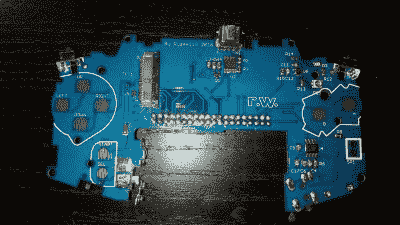

# 在 GameBoy Advance 内部模拟 Gameboy Advance

> 原文：<https://hackaday.com/2016/11/03/emulating-a-gameboy-advance-inside-of-a-gameboy-advance/>

乍看之下，GBA 可能看起来没什么不同。屏幕比你记忆中的要好得多，但那可能只是你的记忆在作怪。声音来自扬声器。感觉重量合适。它使用 AA 电池。见鬼，连按钮都感觉对。

直到你注意到它真的不应该在没有弹夹的情况下玩任何游戏，你才知道在蘑菇王国里有些不对劲。当你看里面的时候，你看到的是一个 Raspberry Pi Zero 的边缘，而不是你预期的卡边缘连接器。

[Ryzee119]花了大量的工作将一个死气沉沉、被水损坏的 GBA 转换成一个基于 Pi 的繁荣的仿真站。第一步是拆下他在其他地方找不到的组件。左右按钮、电位计，甚至[耳机插孔。](http://hackaday.com/2016/10/25/death-to-the-3-5mm-audio-jack-long-live-wireless/)出了名的难见屏幕，当然不得不去。换成了好看的 TFT。此外，原来的扬声器被水腐蚀得太厉害了，他找到了一个替代品。

Custom replacement PCB

接下来他给 GBA 的电路板拍了一张很好的照片。我们想知道他是否使用了[这篇文章的评论](http://hackaday.com/2016/05/06/up-your-cad-game-with-good-reference-photos/)中提到的扫描仪方法？他花了很多时间在达索的 2D CAD 程序 DraftSight 上绘制电路板轮廓。然后，在第 n 次彻底验证了电路板的尺寸之后，他将轮廓导入到 EagleCAD 中。

他设法在 GBA 的原始信封内将相当多的内容塞进电路板。开关、电位计和插孔回到原来的位置。令人印象深刻的是，他为 A、B 和 D-pad 按钮制作了自己的 Pad 痕迹。mod 甚至比原来更好地处理缓慢下降的电池电压。

最后，一切都完美地结合在一起。他将它配置为在启动时就启动到模拟器中。如果你也想要一个，他所有的文件都是开源的。