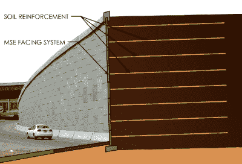

# 用沙子做成的汽车支架

> 原文：<https://hackaday.com/2016/11/07/a-car-stand-made-of-sand/>

当【实用工程】的人说他们有一个[肮脏的汽车站](http://practical.engineering/blog/2016/5/15/mechanically-stabilized-earth-aka-mse-reinforced-soil)时，他们真的是这个意思！他们制作了一块泥土和玻璃纤维片作为加固材料，并通过将其用作汽车支架来测试其抵抗力。是的，积木在工作时不会倒塌。

A MSE structure. The lateral walls add no strength, they just look nice.

土壤是一种天然不稳定的材料，其结构稳定性仅依赖于摩擦力，但其剪切强度非常低(材料内部结构自身滑动的阻力)。因此，一旦你增加重量，土壤结构就会失效。诀窍是通过添加几层坚硬的材料来形成复合材料。这些层增加了剪切强度，最终你会得到一种非常坚固的复合材料，或'[机械稳定土](https://en.wikipedia.org/wiki/Mechanically_stabilized_earth) ' (MSE)。你可能每天都会开车经过一些地方，如右图所示。

尽管现代形式的 MSE 是由法国工程师亨利·维达尔爵士发明的，但自从人类历史开始，加筋土就已经被使用了，事实上，中国长城的某些部分就是用这种技术建造的。【实用工程】讲解演示视频做得很好，休息后一定要查看。万一你下次需要修车时不想玩泥巴，你随时可以做一个 [3D 打印千斤顶](https://hackaday.com/2015/11/25/a-3d-printed-car-jack-no-seriously/)。

 [https://www.youtube.com/embed/0olpSN6_TCc?version=3&rel=1&showsearch=0&showinfo=1&iv_load_policy=1&fs=1&hl=en-US&autohide=2&wmode=transparent](https://www.youtube.com/embed/0olpSN6_TCc?version=3&rel=1&showsearch=0&showinfo=1&iv_load_policy=1&fs=1&hl=en-US&autohide=2&wmode=transparent)

