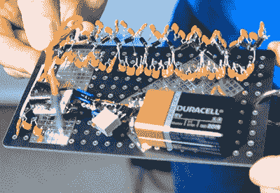

# Hackaday SuperCon 徽章的破解和谜题

> 原文：<https://hackaday.com/2016/11/03/the-hacks-and-puzzles-of-the-hackaday-supercon-badge/>

最伟大的硬件会议就在眼前。如果 Hackaday 超级会议徽章不是历史上最伟大的电子徽章，那将是我们的失职，我们认为我们在这里有一些特别的东西。我们已经看了看今年徽章背后的[硬件，现在是时候看看今年 Hackaday SuperCon 的挑战了。](http://hackaday.com/2016/10/17/design-and-hacking-drilldown-supercon-badge/)

### 谜题

除非有几个谜题要解决，否则会议徽章并不好，2016 年 Hackaday SuperCon 徽章也不差。隐藏在基于加速度计的重力模拟背后的，是一个移动的信息显示，一个俄罗斯方块克隆，和一个红外通信协议，是一系列的五个挑战。第一个战胜挑战的 SuperCon 参与者将获得 256 美元的丰厚现金奖励，并赢得同行的尊重。

我们有很多东西可以用来做会议徽章拼图。当然，最著名的是来自[1057]伟大思想的 DEF CON 徽章。在过去的几年里，DEF CON 徽章是如何以徽章格式展示谜题和密码挑战的最佳范例。这些挑战包括从[留声机](http://hackaday.com/2015/08/06/help-decipher-the-defcon-badge/)到挂绳凯撒密码到 [x86 固件黑客](http://hackaday.com/2016/08/05/def-cons-x86-badge/)。

对于今年的超级会议徽章，我们为徽章拼图做了一些不同的事情。整个谜题在*徽章上运行的应用程序*中。这份申请的细节将于周六上午公布。这并不意味着你必须是这些谜题的幕后策划者。要赢得游戏，你必须在这个带有 16×8 LED 显示屏和四个按钮的徽章上完成四项任务(加上最后一项)。某种暗示，包括摄魂术、莫尔斯电码、电子学、历史和地理等等。

所有这些谜题都可以独立解决(带上笔和纸)，让徽章黑客成为一项集体活动。完整的细节——尽我们所能——将在大会期间揭晓，第一个在徽章上看到“祝贺”字样的个人或团队将赢得大奖和同行的尊重。

### 徽章黑客

徽章拼图是我们通常参加的会议的必要组成部分，但是 Hackaday 超级会议是特殊的。就像去年一样，我们将在徽章黑客活动中加入我们自己的元素，并在以下类别中颁发特别奖:

*   最闪亮的徽章黑客
*   最无聊的徽章黑客
*   最过分的徽章黑客

Sprite_tm’s spark gap badge from the 2015 SuperCon

如果您想知道我们在这些类别中寻找什么，请查看去年的最佳徽章。我们拥有*的一切。*去年的徽章很简单——只是一块 FR4——但去年的与会者用成堆的电子产品盖住了它们。我们有频谱分析仪，大量的 blinky，以及特斯拉线圈徽章的最开始，这要归功于[Sprite_tm]的火花隙和由 Kynar 电线和一个拆卸继电器构建的[Radu Motisan]次级。

今年，我们将继续保持最佳徽章黑客的传统，迎接三项挑战。建立最闪亮、最丑陋或最夸张的徽章。每一个中最好的将被奖励 256 美元。

今年的 Hackaday 超级大会将成为这个星球上最大的硬件大会，我们有与之相匹配的徽章。谜题很棒，我们迫不及待地想看看社区为最闪亮和最丑的徽章带来了什么。