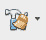

# 破解 supercop 徽章固件的最快途径

> 原文：<https://hackaday.com/2016/11/04/the-fastest-path-to-supercon-badge-firmware-hacking/>

Hackaday SuperConference 将于明天开始，每一位持票的与会者都将得到这个性感的硬件，这就是会议徽章。是的，它挂在你的脖子上看起来很棒，你可以在上面玩一个邪恶的俄罗斯方块游戏，它还运行一个加密挑战。但是徽章黑客是一件事，这篇文章是你能找到的关于固件黑客的最简明的信息。无论这是你第一次闪烁 LED，还是你在 PIC 大会上切齿，你都可以用最少的努力让这个徽章为你服务。

### IDE/编译器:

要在徽章上运行你的代码，你需要一个编译器。我们建议您在参加会议之前在电脑上安装一个 IDE 和编译器。下载并安装 [MPLABX](http://microchip.wikidot.com/mplabx:installation) 和 [XC8](http://microchip.wikidot.com/xc8:installation) 编译器(你需要两个)。

另一个选择是以 [MPLAB Xpress](http://www.microchip.com/mplab/mplab-xpress) 形式的云 IDE/编译器。通常这是最方便的选择，但在会议上，你永远不知道 WiFi 有多可靠，因为数百人试图将设备连接到网络。

### 框架:

我们已经用 C 语言建立了一个例子[,演示了如何与会议徽章交互。下载这个并在 MPLABX 中打开(上一步安装在你的电脑上)或者](https://github.com/Hack-a-Day/2016-Hackaday-SuperConference-Badge-Hacking)[打开云版本](https://mplabxpress.microchip.com/mplabcloud/Example/Details/259#)(寻找红色按钮，上面写着“在 IDE 中打开”)。

徽章正在运行一些硬件维护，这将使你的黑客攻击变得容易。[super co-badge-animate . c](https://github.com/Hack-a-Day/2016-Hackaday-SuperConference-Badge-Hacking/blob/master/SuperCon-badge-animate.c)文件有一组简单的演示，显示如何点亮显示器中的 LED，如何轮询加速度计(如上所示的向左或向右箭头)，如何从按钮获取输入(球在上面移动)，以及无阻塞计时(以大约 1 Hz 以上的频率闪烁行)。

### 闪烁您的代码:

将编译好的代码闪烁到徽章上非常简单:

1.  使用 USB 微型 B 线插入您的徽章
2.  按住电源按钮并按下重置键进入引导加载程序模式
3.  该徽章将作为 USB 拇指驱动器出现在您的计算机上。复制你的。十六进制文件到这个驱动器
4.  按下电源按钮运行您的代码。您不需要断开电缆(对代码进行修改，重新编译并从第 2 步开始)

你从哪里得到的。十六进制文件？如果您正在使用 MPLABX，单击“清理并构建主项目”将编译您的代码，输出窗口将告诉您它的位置。例如:

```
Loading code from /home/mike/Downloads/2016-Hackaday-SuperCon-BadgeHack.X/dist/default/production/2016-Hackaday-SuperCon-BadgeHack.X.production.hex...
```

如果您正在使用云 IDE MPLAB Xpress，单击“制作和编程设备”按钮编译并自动下载您的。十六进制文件。

### 返回到库存固件:

不要担心，如果你不喜欢你的黑客，你可以随时回到徽章上的股票固件。只需从 [Voja 的徽章项目页面](https://hackaday.io/project/16401-supercon-ii-badge#menu-files)下载演示用的十六进制文件。