# 最佳黑客 t 恤视觉指南

> 原文：<https://hackaday.com/2016/11/09/visual-guide-to-the-best-hacker-t-shirts/>

走进正常的“平民”世界，看看你周围的衬衫。我不想对此太过反感，但让我们面对现实吧——你看到的 t 恤会很无聊，没有创意。现在把它和你最喜欢的黑客骗局进行比较。我们穿衬衫就像穿油画一样。

进入 SuperCon 的周末，我没打算写这篇文章。但后来我看到了一件非常棒的衬衫，手里已经有了相机，所以我问我是否可以拍一张照片。那天晚些时候，这种情况又发生了。然后我不知道我怎么了。这里是我最喜欢的，但我已经策划了大量伟大的服装，让你在休息后观赏的乐趣。

 [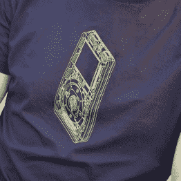](https://hackaday.com/2016/11/09/visual-guide-to-the-best-hacker-t-shirts/re_dsc_0379/)  [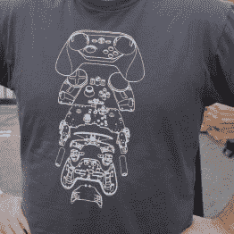](https://hackaday.com/2016/11/09/visual-guide-to-the-best-hacker-t-shirts/re_dsc_0479/)  [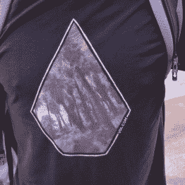](https://hackaday.com/2016/11/09/visual-guide-to-the-best-hacker-t-shirts/re_dsc_0375/) 

以下是我最喜欢的三个，排名不分先后。最初的 iPod 在霓虹线框中获得了真正的赛博朋克待遇。我一直在寻找使用单一颜色墨水的衬衫设计。在这里，我们看到蒸汽控制器被放大，以展示其内部的工程设计——这是一个引人注目的设计，我很想穿上它。最后，泪珠艺术品是我周末的最爱。它让我想起了《太空堡垒卡拉狄加》的几何形状，但里面的艺术让我想起了我一直以来最喜欢的衬衫设计，即[黑客日科幻竞赛衬衫](https://hackaday.io/page/377-sci-fi-contest-shirts-status-page)。

 [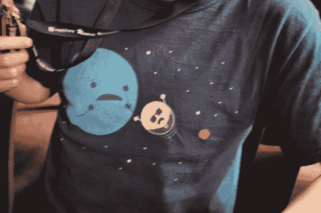](https://hackaday.com/2016/11/09/visual-guide-to-the-best-hacker-t-shirts/re_dsc_0390/)  [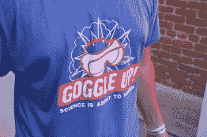](https://hackaday.com/2016/11/09/visual-guide-to-the-best-hacker-t-shirts/re_dsc_0376/)  [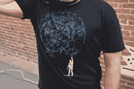](https://hackaday.com/2016/11/09/visual-guide-to-the-best-hacker-t-shirts/re_dsc_0478/)  [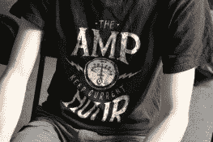](https://hackaday.com/2016/11/09/visual-guide-to-the-best-hacker-t-shirts/re_dsc_0389/) Who isn’t a fan of this podcast? [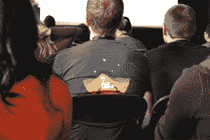](https://hackaday.com/2016/11/09/visual-guide-to-the-best-hacker-t-shirts/re_dsc_0384/) There were many NASA and SpaceX Engineers at SuperCon [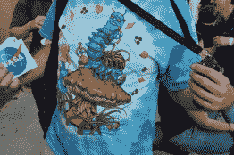](https://hackaday.com/2016/11/09/visual-guide-to-the-best-hacker-t-shirts/re_dsc_0472/) Take a little trip  Political statement   [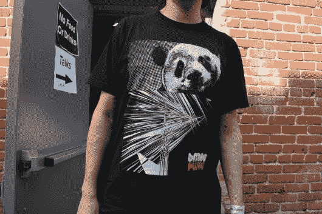](https://hackaday.com/2016/11/09/visual-guide-to-the-best-hacker-t-shirts/re_dsc_0467/) Alek designed this shirt himself [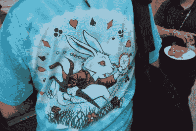](https://hackaday.com/2016/11/09/visual-guide-to-the-best-hacker-t-shirts/re_dsc_0473/)  [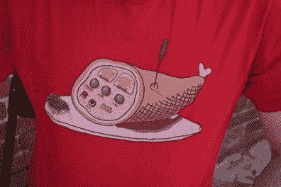](https://hackaday.com/2016/11/09/visual-guide-to-the-best-hacker-t-shirts/re_dsc_0465/)  [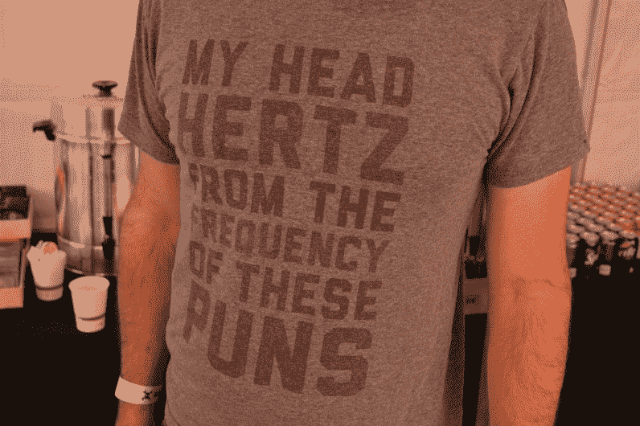](https://hackaday.com/2016/11/09/visual-guide-to-the-best-hacker-t-shirts/re_dsc_0378/) 

这是一套多色印刷品。火腿收音机几乎是我的最爱。当然，我们很高兴在展会上看到至少一件 *Amp Hour* 的衬衫。我们不仅是播客的粉丝，克里斯·甘梅尔也是 SuperCon 的组织者之一。

 [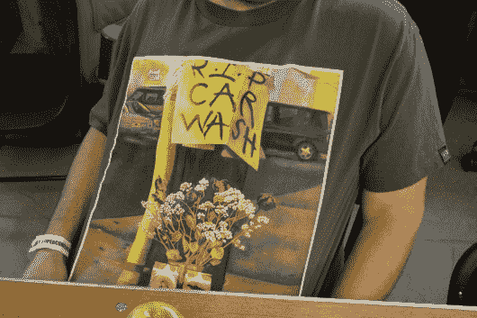](https://hackaday.com/2016/11/09/visual-guide-to-the-best-hacker-t-shirts/re_dsc_0481/) Shirt actually purchased as fine art [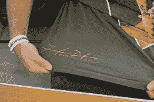](https://hackaday.com/2016/11/09/visual-guide-to-the-best-hacker-t-shirts/re_dsc_0482/) Here is the artist’s signature [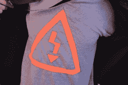](https://hackaday.com/2016/11/09/visual-guide-to-the-best-hacker-t-shirts/re_dsc_0383/)  [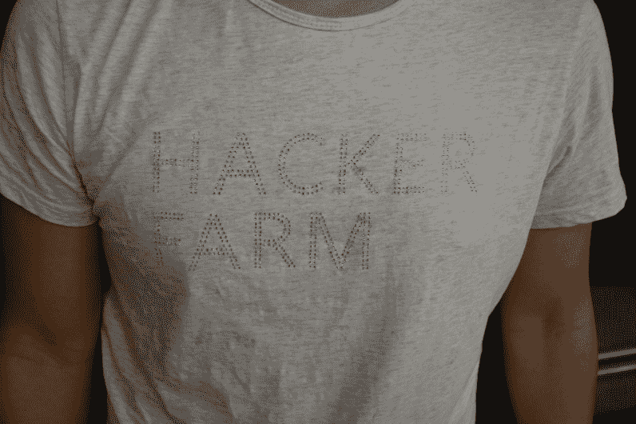](https://hackaday.com/2016/11/09/visual-guide-to-the-best-hacker-t-shirts/re_dsc_0408/) 

我把这些放在一个特殊的类别中，因为它们真的很突出。同一件衬衫有两张图片——有人向我解释说，这是为了支持原艺术家而购买的，ans 实际上是在你的肾脏被发现的地方附近的转弯处签名的。高压图标衬衫是一款手工制作的产品。橙色标志被缝进灰色衬衫上剪下的空隙里。我们让你猜猜谁穿了 Hacker Farm 的衬衫。秋叶正在展示镶有宝石的球座，以拼出信息。

 [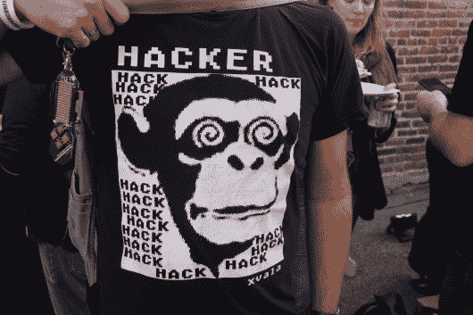](https://hackaday.com/2016/11/09/visual-guide-to-the-best-hacker-t-shirts/re_dsc_0468/)  [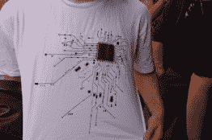](https://hackaday.com/2016/11/09/visual-guide-to-the-best-hacker-t-shirts/re_dsc_0466/)  [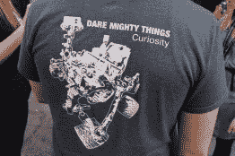](https://hackaday.com/2016/11/09/visual-guide-to-the-best-hacker-t-shirts/re_dsc_0477/)  [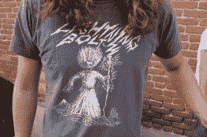](https://hackaday.com/2016/11/09/visual-guide-to-the-best-hacker-t-shirts/re_dsc_0470/)  [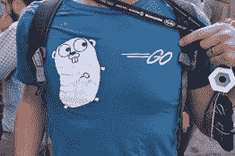](https://hackaday.com/2016/11/09/visual-guide-to-the-best-hacker-t-shirts/re_dsc_0469/)  [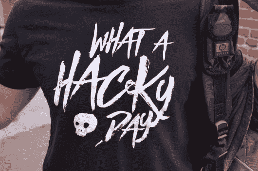](https://hackaday.com/2016/11/09/visual-guide-to-the-best-hacker-t-shirts/re_dsc_0377/)  [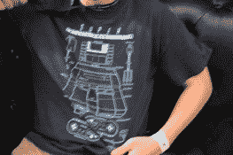](https://hackaday.com/2016/11/09/visual-guide-to-the-best-hacker-t-shirts/re_dsc_0388/)  [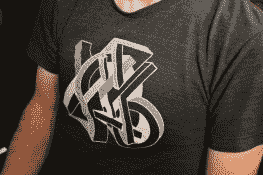](https://hackaday.com/2016/11/09/visual-guide-to-the-best-hacker-t-shirts/re_dsc_0391/)  [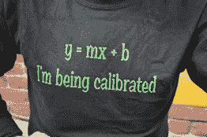](https://hackaday.com/2016/11/09/visual-guide-to-the-best-hacker-t-shirts/re_dsc_0471/) 

在我心中，只有一种墨水颜色的衬衫有着特殊的位置。我已经看到了大量可怕的照片，但我在这里看到的所有伟大的产品都给我留下了深刻的印象。然而，我确实需要有人给我解释一下这个公式，有人知道这个涂鸦式的标志是怎么来的吗？

 [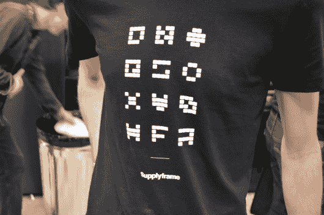](https://hackaday.com/2016/11/09/visual-guide-to-the-best-hacker-t-shirts/re_dsc_0374/)  [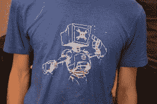](https://hackaday.com/2016/11/09/visual-guide-to-the-best-hacker-t-shirts/re_dsc_0385/)  [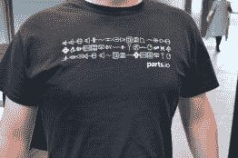](https://hackaday.com/2016/11/09/visual-guide-to-the-best-hacker-t-shirts/re_dsc_0373/)  [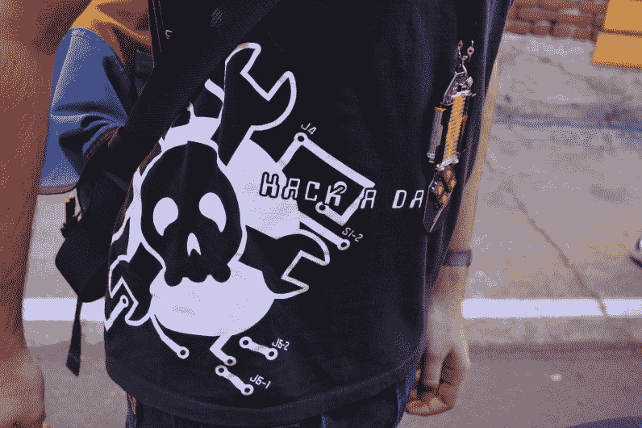](https://hackaday.com/2016/11/09/visual-guide-to-the-best-hacker-t-shirts/re_dsc_0382/) A shirt only an Editor Emeritus would have, perhaps.

有一系列供应品框架和休闲衬衫。十二个徽标的网格在会议徽章的背面，并在加密挑战赛中播放。这里看到的大头骨和扳手设计可以追溯到很久以前。

 [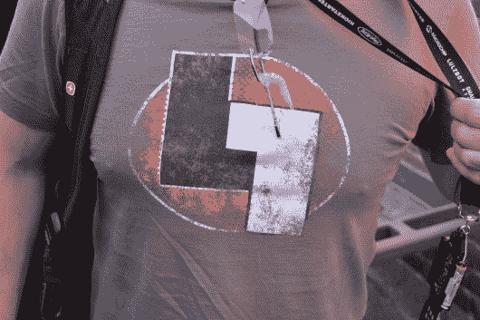](https://hackaday.com/2016/11/09/visual-guide-to-the-best-hacker-t-shirts/re_dsc_0381/) LayerOne Conference  ToorCon [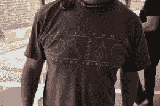](https://hackaday.com/2016/11/09/visual-guide-to-the-best-hacker-t-shirts/re_dsc_0475/)  [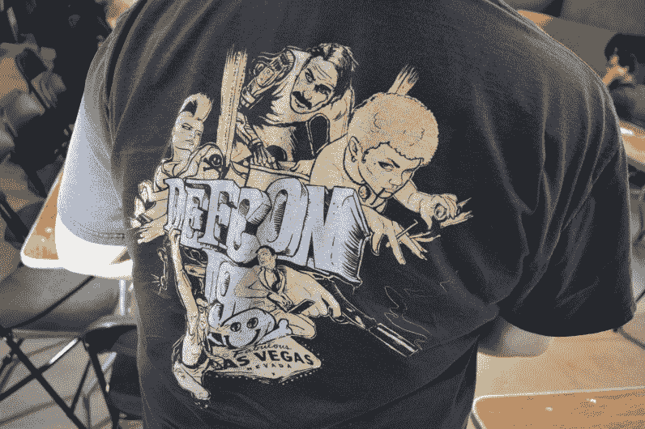](https://hackaday.com/2016/11/09/visual-guide-to-the-best-hacker-t-shirts/re_dsc_0480/) 

当然，还有什么地方比在另一个骗局中穿你的黑客骗局衬衫更合适呢？

很高兴能对上周末的 SuperCon 有一个总体的了解。但如果你没有机会参加，我们还是想看看你最喜欢的衬衫。使用 img 标签将其嵌入下面的评论中。