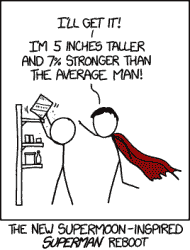

# 超级月亮？或者只是另一个近地点朔望？

> 原文：<https://hackaday.com/2016/11/14/supermoon-or-just-another-perigee-syzygy/>

月球的轨道不是圆形的。根据维基百科，月球最近约 357，000 公里，最远约 406，000 公里:相差约 13%。例如，与地球围绕太阳的轨道相比，这是一个畸形的蛋形轨道。它每个月都在这两个极端之间移动。

今晚，近地点(近距离)相当于满月(朔望——地球、月亮和太阳都在一条线上)。那是什么意思？一轮比平均水平更亮的满月！如果你看到了 2011 年的最后一次“超级月亮”，你会听说这是自 1992 年以来最接近/最亮的一次[，或者别的什么。嗯，这个比较亮。](http://www.popsci.com/science/article/2011-03/biggest-full-moon-20-years-almost-certainly-wont-cause-huge-natural-disaster)

但是无论你住在哪里，如果天上挂着云，也不要大惊小怪；每 411.8 天就有一次近地点满月，明年也会有一次。除非你用同一个镜头重复拍摄[，否则无论如何你都无法用你现在的湿巾察觉到大小的差异，这是由于被恰如其分地命名为](http://www.moonconnection.com/apogee_perigee.phtml)[的月亮幻觉](https://en.wikipedia.org/wiki/Moon_illusion)。当月亮在地平线上时，你已经感觉到它的大小是悬挂在头顶上时的 1.5 倍，所以额外的百分之几将会在本底噪声中丢失。朦胧的夜晚和晴朗的夜晚之间的差异很容易淹没亮度的差异。

 照例， [XKCD](https://xkcd.com/1394/) 总结得很好。“超级月亮”是一个近地点，此时月亮恰好是圆的。以天体的标准来看，这是一个相当频繁的事件，而且并不引人注目。如果你想看到一些真正怪异的东西，请睁大眼睛关注 2017 年 8 月的[日全食](http://eclipse.gsfc.nasa.gov/SEgoogle/SEgoogle2001/SE2017Aug21Tgoogle.html)。

不要误会，我们认为月亮是超级的！去外面看一眼也没什么不对。只是拜托，在今年的近地点朔望期间，不要夸张了。

“超级月亮”与“微月亮”对比图片由[ [斯蒂芬·夏帕蒂](http://apod.nasa.gov/apod/ap140121.html) ]提供。