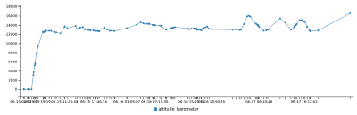

# 气球飞行新纪录:高空持续时间

> 原文：<https://hackaday.com/2016/11/19/new-record-for-balloon-duration-aloft/>

如今，高空气球飞行多少已经成为一种已知的数量。虽然这仍然是一个有趣的项目，可以让你的黑客空间一起应对复杂的挑战，但在第一个或两个气球之后，每个人都开始想知道“接下来会发生什么？”。更高？更快？进一步？便宜？更多的科学？外面有各种不同的挑战。

一群斯坦福大学的学生刚刚创造了飞行时间最长的新纪录，他们的 SSI-41 任务是 T1。除了从一个海岸飞到另一个海岸，在一条进入加拿大领空的轨道上，他们记录了 79 个小时的飞行时间。

 这个秘密？瓦尔-巴尔。一个“阀门压载”气体排放阀和压载分配器系统，防止气球飞得太高(和弹出)或掉回地面。这种平衡看起来几乎完美——检查高度剖面图。我们希望看到更多关于这个系统的细节。如果队里有人写报告，请告诉我们？

有多少黑客，就有多少进入高空气球的有趣方式。我们喜欢微型太空气球项目的极端经济性，这个项目已经环游了世界(两次！)在太阳能派对气球上。我们会把最佳名字奖和荒谬概念奖都颁给 [Tetroon](https://hackaday.com/2015/01/31/solar-tetroon-spooks-albuquerque/) 。但是现在，大部分时间都属于斯坦福团队。恭喜你。

[通过[班戈每日新闻](http://bangordailynews.com/2016/11/12/news/state/across-the-continent-in-80-hours-bangor-grads-high-altitude-balloon-lands-near-maine-border/)，如果你能相信的话]