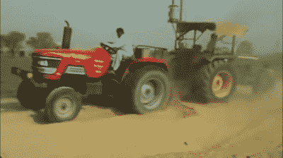

# 福特 B 型无马农业

> 原文：<https://hackaday.com/2016/11/25/retrotechtacular-horseless-farming-with-the-ford-model-b/>

是不是每个人都在 YouTube 上观看大量不可接受的极客视频？在我的情况下，我可能不在乎承认我的时间线中有很多以拖拉机为特色的视频。强大的俄罗斯 Kirovets 拖着货物穿过针叶林带难以穿越的地形，小型超载的 2WD 拖拉机在印度拉着车轮，JCB Fastracs 在英国的 Fenland 到处跑。你可以把女孩带离农场，但你不能把农场带离女孩。

[Tractor versus Tractor](https://www.youtube.com/watch?v=6wcGmu1QFk8); a guilty pleasure but not Retrotechtacular

所以我的建议有点农业的味道。就像下面的视频一样，这是一部 1917 年的无声电影，宣传福特 B 型拖拉机。这辆车很引人注目，因为它是我以前从未见过的机器，是一种相当不寻常的三轮设计，前部有两个驱动轮，后部只有一个方向盘。

在 20 世纪早期，现代拖拉机的形状开始演变，这一定是一种替代的晚期尝试。从一个在她那个时代操作过一些拖拉机的人的观点来看，它看起来不是最容易控制的机器，驾驶员周围的废气云不会令人愉快，并且悬挂在后部的工具联结器上方的操作位置看起来不是特别舒适或安全。

这部电影有一种迷人的时代感，讲述了一个农民的儿子厌倦了繁重的体力劳动，前往城市的故事。他在拖拉机厂找到了一份工作，并最终成为一名拖拉机销售员，在此过程中，他遇到并娶了一位满意的顾客的女儿。他带着他的新娘和一辆崭新的拖拉机回家，让他的父亲从无休止的劳动中解脱出来。一路上，我们看到了处于大规模机械化边缘的农业，以及当时拖拉机工厂内部的组装顺序，其中似乎没有使用紧固件。

![[Image Source: Tractor Industry Fraud on Farm Collector]](img/9cbc2d87ec5ecc84cbdace16a32640f1.png)

【图片来源: [*拖拉机行业造假*](http://www.farmcollector.com/tractors/tractor-industry-fraud) 农场收藏家】

这一切都很有趣，但故事中真正的金块在于它的制造商。这是一辆福特 B 型拖拉机。但不是福特 b 型困惑？所以，看起来是顾客。我们都知道的福特是总部设在密歇根的亨利·福特汽车公司，他在 1917 年就已经是个响当当的名字了。然而，这辆福特来自南达科他州的福特拖拉机公司，一个可疑商人为了利用福特品牌赚钱而成立的企业，制造一台已经过时的劣质机器，其性能受到可疑声明的支持。

一位名叫福特的工程师是公司的职员，他把自己的名字借给了公司，但他与亨利·福特没有任何关系。该公司没有持续很长时间，在这部电影上映后不久就倒闭了，它的产品很少存活下来。不过它确实有一个遗产，它的一台拖拉机的糟糕质量被认为是建立[内布拉斯加州拖拉机测试实验室](http://tractortestlab.unl.edu/)的动力，在那里如果你在美国卖一台拖拉机，你必须对它进行测试，以确保它能发挥应有的性能。在他们的博物馆[里，他们收藏了为数不多的幸存的福特 B 型拖拉机](http://www.farmcollector.com/collections/ford-model-b-zm0z13janzbea)。

与此同时，密歇根州的福特公司生产了他们自己的非常成功的拖拉机系列，同年生产的福特森 F 型拖拉机显然是今天机器的祖先。但正如下面的视频所示，假货并不是什么新鲜事。

 [https://www.youtube.com/embed/Q2rZehE3kVY?version=3&rel=1&showsearch=0&showinfo=1&iv_load_policy=1&fs=1&hl=en-US&autohide=2&wmode=transparent](https://www.youtube.com/embed/Q2rZehE3kVY?version=3&rel=1&showsearch=0&showinfo=1&iv_load_policy=1&fs=1&hl=en-US&autohide=2&wmode=transparent)

如果你对拖拉机感兴趣，也许你会想看看另一种早期的机械化农业产品，那就是[手控拖拉机](http://hackaday.com/2016/04/08/retrotechtacular-rein-operated-tractors/)。与此同时，今天我们也为您带来了[，一辆在加拿大草原上行驶的自动拖拉机](http://hackaday.com/2016/04/05/autonomous-tractor-brings-in-the-harvest/)。