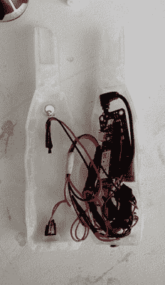

# 给我们所有麻瓜的智能魔杖

> 原文：<https://hackaday.com/2016/11/26/a-smart-wand-for-all-us-muggles/>

亚瑟·C·克拉克说“任何足够先进的技术都和魔法没什么区别。”尽管我们知道有些东西并不“神奇”，但看到我们能如此接近还是很开心的。[Dofl]和他的朋友，哈利波特魔法的忠实粉丝，也有同样的想法，并决定[创造一根他们自己可以使用的魔杖](http://www.boredpanda.com/we-made-a-smart-wand-for-muggles/)。

 魔杖本身是 3D 打印的，内部填充了微控制器和 WiFi 板、语音识别板、麦克风和振动电机。魔杖将声音转换成命令，由于魔杖连接到 WiFi，这些命令可以用来与你的 WiFi 连接的灯(或你的 WiFi 连接的任何东西，真的。)识别五个语音命令来打开和关闭音乐、灯，以及在视频中用于向 delivery.com 要汉堡的“召唤”命令。对于反馈，当命令被识别时，电机振动。

原始文章中没有太多的技术信息，但我相信我们的读者可以找出所用的电路板，并提出一些替代方案，以使魔杖的形状系数下降一点。这些年来，其他的[魔杖](http://hackaday.com/2009/05/17/magic-wands-for-disney/)出现在我们的页面上，使用了一些[不同的技术](http://hackaday.com/2011/11/07/hacking-a-magic-wand-to-remotely-control-light-displays/)。这是一种与周围环境互动的有趣方式，即使你知道所涉及的“魔法”只是无聊的旧技术。

[https://player.vimeo.com/video/192495619](https://player.vimeo.com/video/192495619)