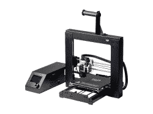

# 迎接 1 KB 挑战

> 原文：<https://hackaday.com/2016/11/21/step-up-to-the-1-kb-challenge/>

1 千字节。今天，这听起来像是一个极小的数字。计算机配有数十千兆字节的内存和数兆兆字节的存储空间。你可以买一台拥有 1g 内存和 SD 卡大小的二级存储的 Linux 电脑。甚至微控制器也加快了游戏速度，兆字节的闪存通常可用于程序存储。

快速增长的内存和存储是技术向摩尔定律前进的最好证明。但是，我们应该小心不要忘记过去的黑客技术，他们没有这么多的喘息空间。那是用汇编语言编写代码的时代。调试是通过一个昂贵的 ICE(一个在线仿真器……如果你为一家大公司工作),或者几个发光二极管(如果你在地下室工作)来完成的。

为了让这些技能和技术发挥作用，我们创建了[1 kB 挑战](https://hackaday.io/contest/18215-the-1kb-challenge)，这是一个竞赛，唯一的限制是你能用 1kb 的程序内存做什么。许多黑客日竞赛有相当宽松的限制——任何人都可以参加，至少可以通过评审。这次 1 kB 是一个硬限制。如果你的项目不合适，你就会被取消资格，这是一个值得去迎接的挑战。

也就是说，这是黑客日，我们希望人们有创造力，并遵守规则。重要的是要记住设计约束的精神:这是关于用 1 kB 的程序空间做你能做的一切。搜索出古老而明智的技巧，比如压缩你的代码，并在你的 1 kB 中包含一个解压缩程序。狡猾的黑客可以用更少的资源获得更多的东西。使用 1 kB 作为引导加载程序从 SD 卡加载更多代码是不好的。

### 奖赏

任何黑客大赛都需要一些令人敬畏的奖品，这次也不例外。

*   大奖是来自 EMSL 的 Digi-Comp II 套件
*   一等奖是 V2 制造商选择 3D 打印机
*   二等奖是一套来自 EMSL 的球形钟
*   三等奖是来自 Blinkinlabs 的 Blinkytile 套件

完整规则和更多信息可在 [1 kB 挑战赛页面](https://hackaday.io/contest/18215-the-1kb-challenge)上找到。检查一下，然后戴上你的思考帽，开始黑客！