# 自制设计、制造和装配结构框架系统的指南

> 原文：<https://hackaday.com/2016/12/14/a-how-to-in-homebrew-design-fab-and-assembly-with-extruded-profiles/>

在这一点上，互联网上充斥着用挤压型材制成的家酿 3D 打印机，但人们很容易低估实现这一目标的难度。当然，大多数供应商出售一套互锁连接器，但当处理亚毫米公差的建筑时，这些结构框架系统实际上表现如何？

我已经摆弄这些部件大约两年了。我发现，是的，精确和准确的结果是可能的。然而，这些结果是在我失败后才出现的——擦干，冲洗，重复——再次失败！只有在我了解了材料和组装过程的限制之后，我才能够制造出方形的、尺寸精确的台架，它可以在半平方米的工作台上传送激光束。也就是说，我写了一个驯服这些野兽的快速指南。他们是谁？他们有什么口味的？我们如何实现这些精确的结果？亲爱的读者，请继续读下去。

## 但首先是一堂简短的历史课

从大学光学实验室到工厂车间，很容易让这些挤压物落入只是“一直在那里”的次要角色的角色中在多年认为它们理所当然之后，我开始怀疑:它们是从哪里来的？

我们的故事要追溯到 1797 年，约瑟夫·布拉马提出了通过精确成型的模具挤压预热金属块的概念。看哪——[第一个挤压物诞生了！](http://vsctools.com/aluminum-extrusion/)如今，与过去一样，挤压型材是由成熟的工艺制成的。(干得好，[乔！[英语背诵文选你的概念设法保留了两百年。)然而，从这里开始，我们所钟爱的 X 形轮廓的起源变得更加模糊了。

 [https://www.youtube.com/embed/iiGlq7408ME?version=3&rel=1&showsearch=0&showinfo=1&iv_load_policy=1&fs=1&hl=en-US&autohide=2&wmode=transparent](https://www.youtube.com/embed/iiGlq7408ME?version=3&rel=1&showsearch=0&showinfo=1&iv_load_policy=1&fs=1&hl=en-US&autohide=2&wmode=transparent)

从过去五十年到现在，我翻遍了一个又一个专利，仍然找不到一个明确的发明者，他发明了我们现在看到的最常见的结构框架系统。(同为工程历史学家的 HALP！)相反，我发现的是一个缓慢、成熟的联锁系统，在没有标准的情况下发展了多年，直到它们最终演变成像力士乐和 80/20 这样的现代系统。

阅读专利，实际上看到这些年来被重新发明和改进的常见技巧是相当令人兴奋的。从 60 年代中期开始，我们开始看到在拐角处互锁的基本挤压元件。它们的横截面相当复杂，但是互锁元件的基本概念是存在的。60 年代后期，我们开始看到开槽镶块和衍生产品。在 80 年代，我们看到了成熟的丁字裤，尽管是在一个陌生的侧面。到了 90 年代，我们有了更成熟的东西:在各种几何形状上复制的简单、可重复的槽图案。

 [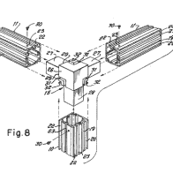](https://hackaday.com/2016/12/14/a-how-to-in-homebrew-design-fab-and-assembly-with-extruded-profiles/patent_us3143165/) US Patent No. 3143165 [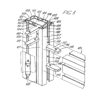](https://hackaday.com/2016/12/14/a-how-to-in-homebrew-design-fab-and-assembly-with-extruded-profiles/patent_us3592493/) US Patent No. 3592493 [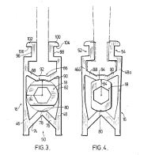](https://hackaday.com/2016/12/14/a-how-to-in-homebrew-design-fab-and-assembly-with-extruded-profiles/patent_us4572694/) US Patent No. 4572694 [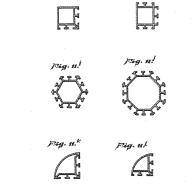](https://hackaday.com/2016/12/14/a-how-to-in-homebrew-design-fab-and-assembly-with-extruded-profiles/patent_us4907338/) US Patent No. 4907338

没有一个人可以称“结构框架系统”为自己的成名之作，对此我们应该感到惊讶吗？那鸿竞争者一次又一次地重复着彼此的话。托马斯·爱迪生发明灯泡的灵感来自于前发明家约瑟夫·斯旺，他是第一个将灯丝放入真空中以防止其快速烧尽的人。亚历山大·格雷厄姆·贝尔是电话众多发明者中最令人难忘的一位，他的大部分研究都是基于赫尔曼·赫尔姆霍茨进行的实验，以及有争议的由伊莉莎·格雷申请的[专利。像许多发明一样，甚至那些归功于一个人的发明，结构框架系统很可能是许多好奇的人几十年来的创造性努力。在这一点上，我们可以感谢我们的前辈将一个曾经粗糙的系统提炼为我们今天所知道的久经考验的要素。](https://en.wikipedia.org/wiki/Elisha_Gray_and_Alexander_Bell_telephone_controversy)

## 竞争性预算方案

[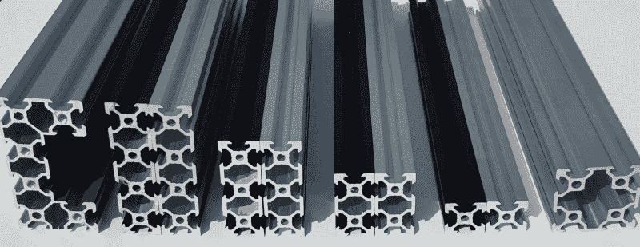](https://hackaday.com/wp-content/uploads/2016/12/20150813-160615.jpg) 挤压型材过去价格昂贵，但最近一些 Kickstarter 活动通过几条更便宜的线路压低了价格，即 [OpenBeam](https://www.kickstarter.com/projects/ttstam/openbeam-an-open-source-miniature-construction-sys) 、 [MakerBeam](https://www.kickstarter.com/projects/mnemnion/makerbeam-an-open-source-building-kit) 和 [VSlot](https://www.kickstarter.com/projects/openrail/openbuilds-v-slot) 。这些挤压件中的每一个都能够满足业余爱好者的日常挤压需求。不过，我们不要太自鸣得意。诚然，当我第一次发现这些更便宜的替代品时，我记得当时的想法是:“那些可怜的工业设计工程师——他们都被企业合作伙伴关系所奴役，向一些定价过高的大牌人物支付大量费用；与此同时，我可以半价买一件同样好用的东西！”说实话，这些制造商品种是根本不同的，所以当我们选择一个预算方案时，最好理解我们在支付什么。

Nothing says feature-complete quite like Bosch Rexroth

那么，是什么让这些闪亮的行业标准配置文件有别于这些预算方案呢？首先，我们大多数友好的商业领袖都已经在这个行业工作了十多年，所以可以很有把握地假设他们已经咬紧牙关做了足够长的时间来做好一些事情。因此，他们已经解决了几十个挤压及其各种互连的用例，从洁净室级别的配置文件到“这里，[拿着我的咖啡](http://www13.boschrexroth-us.com/framing_shop/Product/View_Product.aspx?category=11009&subcategory=3)”的一切仅力士乐一家就有一百多种不同的挤压类型和大量的支架和连接器，可以满足我们在工厂地板上可能遇到的各种各样的需求。我们从库存中得到的是便利。

其次，这些公司有时间和资源来描述他们的材料库。这意味着我们可以快速找到这些型材的材料特性，例如它们的截面模量和惯性矩，以帮助我们在使用它们之前更好地估计我们材料的极限。(巨型 PDF 警告:[力士乐结构框架元素目录](http://www.boschrexroth.ch/country_units/america/united_states/en/Documentation_and_Resources/a_downloads/AluminumStructuralFraming_Catalog.pdf))最后，大多数重型行业参与者都用 6061-T6(又名:good-ol’飞机级铝)制造挤压件。每个对黑客友好的制造商替代品都是由 [6063 级](https://www.makerbeam.com/blogs/makerbeam/specifications-makerbeam-and-openbeam/)铝制成的。至于差别，6061 的屈服强度和硬度是 6063 的两倍。这些结构差异对你来说重要吗？对于小型机架，可能不会。另一方面，6063 明显比它的 6061 表亲**更软*，所以要保证那些角落的安全！只是为了强调*软*部分，这里是最近一次无意的“撞击测试”的效果，它发生在我的车库周围的运输过程中。*

 *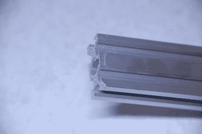

同样，这里没有什么太严重的，但如果同样的凹痕落在[滚轮](http://openbuildspartstore.com/delrin-v-wheel-kit/)滑动的内部通道之一上，整个轮廓将被冲洗，至少是为了在滚动的车厢周围引导。

尽管大多数小型构建永远不需要考虑行业领导者获得的一些好处，但当我们用价格标签来换取预算替代方案时，了解其含义对我们是有益的。

# 在现实世界中设计

对于没有受过训练的人来说，CAD 可能听起来像工程奇才，但是建模零件的实际过程实际上非常简单。当然，每个软件包都有它的缺陷，但是，像任何有能力的用户一样，我们可以学习绕过它们来得到我们想要的结果。至于让现实生活中的模型精确匹配 CAD 模型的尺寸？这就有点棘手了。在下一节中，让我们来看看这些零件背后的一些原理，以及如何使用它们来保持我们最初放入 CAD 模型中的尺寸。

## 结构框架系统不是乐高积木

结构框架系统带来了一系列经典的支架和互连，帮助我们快速建造大型结构。然而，虽然零件看起来似乎很容易到位，但事实是它们有点松散，所以确定重要的尺寸需要更多的努力。

在一个完美的世界中，这些挤压型材和支架的行为就像我们年轻时代的乐高积木一样。在那种情况下，轮廓和支架只能在有限的配置范围内组合在一起——每种配置都保证了这些部分之间的某种约束关系。更好地说，正如麻省理工学院媒体实验室的创始人 Gershenfeld 教授]所说，“计量来自于零件”。[Gershenfeld]这个概念的最好例子是乐高积木。由于每个砖块都有适当的尺寸，并且只接受其他砖块可以连接到它的特定配置，我们可以通过跟踪我们使用的所有部件以及每个部件如何连接到另一个部件来预测我们的乐高配置*的大小。(当然，这个概念假设砖块是“理想地”制造的，对于玩乐高的人的所有意图和目的，我们会假设这是真的。)在那个世界里，我们不会*需要*来测量任何东西，或者，正如【格申菲尔德】会说的，“你不需要一把尺子来玩乐高。”为什么？因为简单地根据零件计量的固有性质，将零件组装在一起将保持它们之间的理想几何关系。因此，我们将获得两个好处:首先，我们的组件将只在有限的配置中*装配在一起*；第二，一旦我们组装了组件，它们的尺寸将直接反映 CAD 模型。*

好吧，我们实际上并不生活在那个世界里，所以我们的每个支架和配件都有某种形式的溢出物。在每一种情况下，我们都需要了解这些污水来自哪里以及如何处理。

## 理解“摆动”

让我们从常见互连技术中的 slop 开始。

注意:我在这些例子中使用了 VSlot 组件，因为 OpenBuilds 的人已经很友好地向社区提供了他们的 [CAD 模型](http://www.openbuilds.com/projectresources/solidworks-2014-parts-library.160/)。如果您没有使用 OpenBuilds 组件，请不要担心。大多数结构框架系统都有一组支架和互连，看起来就像这些例子中的一样。

### 共面斜坡

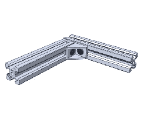

角撑是以 90 度连接两个型材的最简单方法之一，但它们因其斜度而臭名昭著。左边描绘的是在我们拧紧这些螺丝之前，我们的活动范围有多大。这种运动范围从何而来？在这种情况下，我们假设了理想的组件，因此溢出来自滑入挤压型材的每个 T 形螺母连接器之间的四个间隙。

然而，一旦我们拧紧这些螺丝，那两根横梁将在那个大范围的运动中的某个地方刚性地连接在一起。

### 倾斜角度

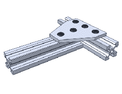

板是连接转角和其他直角延伸的另一种选择。就像角支架一样，当安装在型材的四个槽中的一个槽中时，板连接器也是 T 型螺母间距溢出的受害者。在这里，板限制了两个轮廓之间的共面关系，但是它们给我们留下了一些回旋的空间来尝试在它们之间建立正确的角度。

### 沥青泥浆

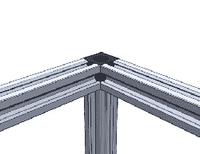

最常见的型材末端都有孔，可以攻丝以容纳一个角锥。只需将立方体拧入新形成的螺纹中，即可享受坚如磐石的转角连接。然而，这种方法也容易受到轮廓相对于立方体的最终角度倾斜的影响。

## 保证装配关系

早些时候，我提到过，尽管有一系列好的连接件，结构框架系统不是乐高积木！与乐高不同，这些连接器有溢出或“回旋空间”，不能保证我们想要的组装关系。简而言之，我们不能保证将两个连接器连接起来就能获得乐高积木的自测特性。

好吧，老鼠，既然我们知道“扭动”会一直困扰我们，如何摆脱它们呢？不要害怕，亲爱的读者，你的前辈已经为你解决了这个问题！要在 CAD 模型中保持零件关系的严格公差，我们可以做三件事之一。我们可以用更好的设计技术解决 CAD 模型中的“倾斜”问题，用更好的工具解决零件制造过程中的“倾斜”问题，或者用更好的测量工具解决装配过程中的“倾斜”问题。我将带你参观每一个。

### 1.完全约束零件

到目前为止，我们解决“摆动”的最佳选择是在设计中。原则上，我们需要确保关系的关系*受到实施这些约束的部件的约束。从现在开始，我们将两个或多个概要文件之间的任何连接点称为*连接点*。对于任何结，如果我们已经找到了一种方法来锁定“摆动”的所有可能选项，我们就可以说我们的结是“完全受限的”。*

让我们从上面看一下第一个 90 度连接。这里，我们可以说，我们的角括号处理 90 度约束，但不处理共面约束。因此，当我们拧紧这些螺钉时，我们的两个轮廓可以落在上述上下运动范围内的任何位置。要解决这个问题——很简单——我们只需添加一个角板！现在，我们的接头不仅保证了 90 度角，因为有了转角连接器，还保证了有两个共面的轮廓。

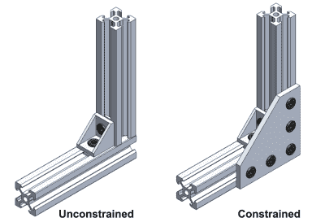

转眼间。我们可以使用同样的技术来确保 T 形交叉点也是完全受限的。

不太难，嗯？让我们试试另一个。在下一个实例中，我们试图防止轮廓相对于立方体旋转。两个额外的角括号处理这个问题。安装后，它们保证所有三个挤出都以与立方体表面共面的方式从角立方体中伸出。

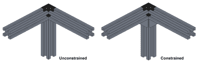

### 2.救援用的测量工具

冗余连接器方法并不太难，对吗？不幸的是，这种约束连接点的方法需要额外的连接器。此外，这些额外的连接器实际上是多余的。在上述两种情况下，第一个连接器，一旦拧紧，将保持型材在适当的位置。所有额外的连接器都是多余的，因为它们不会比最初的连接器更多地阻止接合点移动。使用冗余连接器的好处是，在我们拧紧它们之前，我们不需要找到“甜蜜点”，在那里轮廓展示我们想要的所有几何关系。冗余连接器使用它们的几何属性强制轮廓进入正确的位置。

然而，有了合适的测量工具，我们就可以不再需要冗余连接器，而是依靠我们的工具来寻找“最佳点”。

#### 整理边角

让我们从锁定我们的直角开始。对于我们正在建造的大部分东西来说，我们大部分的交叉点都是以直角相交的。这种情况很可能发生，因为大多数供应商已经有了一系列的连接器设置来实现这一目的:使我们的配置文件相互保持直角。

假设我们希望在一个漂亮的 T 形交叉板上将我们的配置文件连接在一起。天真地，我们可以把它们拧进去，但是我们让自己有可能错位。解决办法？我们需要某种类型的参考资料。对我们来说，那个参照物是一个[机械师广场](https://en.wikipedia.org/wiki/Machinist_square)。

这些机械师广场基本上是美化直角举行一个非常严格的公差，在 0.0001 至 0.0008 英寸(0.00254 至 0.02032 毫米)之间的某处为[一个适度的设置](http://littlemachineshop.com/products/product_view.php?ProductID=2549)不会打破银行。使用这些没有什么魔力。只需将它与我们想要保持直角的角落齐平；然后，轻轻拧紧紧固件。不需要太多的努力，我们就可以保证在过弯时有非常高的精确度。到目前为止，将角摆正是我们能够执行的最简单的操作之一，以使我们的龙门框架与设计保持一致。如果我们可以重新调整我们的连接器设定点，用一个机械师广场几分钟可以节省我们几个小时的潜在重新设计时间。

#### 关闭粗略切割的循环

当我组装我的第一个[激光切割机框架](http://www.doublejumpelectric.com/projects/60w_laser_cutter/2016-03-15-16-sixty-watt-laser-cutter/)时，我注意到切割有问题。直角*不是*直角！就像一些残酷的笑话一样，当我意识到我的测量工具不够好时，我不知道我在做什么的现实开始蔓延。我的身体已经扭曲到我的眼睛无法察觉的程度。

几个星期后，我骄傲地拥有了一套 Ebay 上的 40 英寸卡尺。有了这个漂亮的工具，我可以快速测量两个平行的龙门框架组件之间 0.4 毫米的差异，这两个组件被*认为*长度相同。井 snap 我的龙门框架是一个巨大的平行四边形；我就是看不出来！

购买一套 40 英寸的卡钳并不一定是方形龙门框架的解决方案。事实上，一个机械师广场从上述部分应该绰绰有余，找到帧错位，然后纠正它。尽管如此，一套巨大的卡尺*将*使我们能够完成我们的粗略切割，并以高精度实际测量我们最长的轮廓。对我来说，用更好的测量工具找到并解决这个问题是一个很有说服力的教训，我们得到的机器并不比我们用来测量和校准它的工具更精确。

### 3.升级我们的晶圆厂设备

在我们离开这一部分之前，还有最后一个威胁我们设计准确性的罪魁祸首:我们的制造工具。现在，网上的许多人会告诉我们，减少挤压型材有点像劈柴——这是真的！因此，使用合适的刀片，人们用锯子将这些型材切割成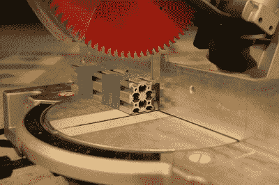大小是很常见的。
对于我那些拿着剁锯的同伴，我必须提醒他们注意切割出来的型材边缘的质量。首先，用正确的刀片，切口，无可否认，非常干净。然而，风险在于假设切割是方形的。如果你的剁锯不能让你调整锯片的倾斜和偏航角度，那么很有可能那些轮廓末端不是方形的。

所以我们的剁锯在错误的角度切割我们的部分；有什么大不了的，对吧？当我们在拧紧紧固件之前将型材的对接端作为参考时，这种方法的问题就出现了。我强烈建议避免这种做法，除非剖面末端与机械师方尺成直角。如果它们不是方形的，那么如果截断端平贴在轮廓的任何其他部分上，则产生的角度也不会是方形的。

为了清晰起见，我在下图中这样做了:我用我的剁锯砍下一个挤压件，将其与另一个轮廓平齐，并用 T 形板连接器将其固定。你能发现任何问题吗？(提示:放大)

这里，这个轮廓是用锯子切割的。不幸的是，由于我不能控制我的剁锯的倾斜角度，用这个工具剁的所有零件都会在它们的剁端稍微偏离 90 度。如果我将轮廓末端固定到底部轮廓的表面，我就有效地使用了切割末端作为参考。因为我的参考稍微偏离了名义上的 90 度，所以当它以这种方式固定时，我的轮廓也会偏离。

为了解决这个问题，如果我们*必须*以这种方式将我们的型材组合在一起，我们最好的办法是用铣床完成末端。

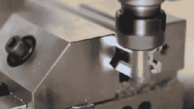

假设机器被正确对准，并且轮廓被正确固定，我们将得到一个我们能测量的最接近正方形的角度。我用 Taig micro mill 对同一挤压件的末端进行了修整，就我的测量工具而言，它非常完美。

请记住，如果我们使用轮廓的末端作为装配参考，这个解决方案*只有*才重要。说到底，并不是每个人都可以使用像完全成熟的铣床这样的高档设备，我们也不一定需要它们。在大多数情况下，我们可以像在第一节中所做的那样，通过在设计中适应它们来处理轻微的缺陷。本着这种精神，我可以通过*用一个多余的角撑完全约束*轮廓来轻松解决这个问题。或者，我们可以依靠测量工具在组装零件时为我们提供必要的参考。在这里，我可以很容易地松开 T 型板连接器，并在拧紧它们之前，使剖面与我的正方形齐平。

我已经尽了最大努力让这个指南列出了从这些概要文件中获得精确构建的技巧和诀窍，但是它还远远没有完成。如果你有关于精确建造的故事，让我们知道我们在评论中遗漏了什么。黑客快乐！*